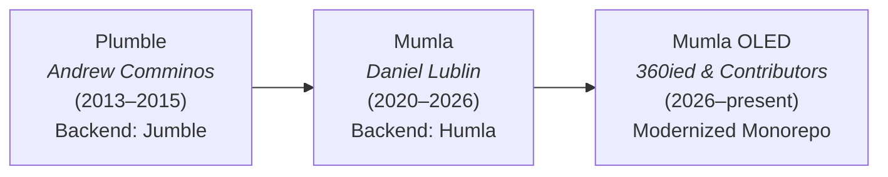

# Mumla OLED

```text
       ⠀⠀⠀⠀⠀⠀⣀⣤⣤⣶⣶⣤⣤⣀⠀⠀⠀⠀⠀⠀
       ⠀⠀⠀⠀⣴⣿⣿⠿⢿⣿⣿⣿⣿⣿⣿⣦
       ⠀⠀⠀⠀⠟⣩⣶⣶⣶⣄⣸⣿⣿⣿⣿⣿⠀⠀⠀⠀
       ⠀⠀⣴⣿⠼⠿⠿⠿⠿⠿⠿⠿⠿⠿⠿⠿⣿⣦⠀⠀
       ⠀⠀⢻⣿⢺⣿⣿⣿⣿⣿⣿⣿⣿⣿⣿⡷⣿⡟
       ⠀⠀⠀⠉⠉⢿⣿⣩⣿⣿⣿⣿⣍⣿⡿⠉⠁⠀⠀⠀
       ⠀⠀⠀⠀⠀⠀⢹⡿⠿⢿⡿⠿⢿⡏
       ⠀⠀⠀⠀⠀⠀⠛⠁⠀⠀⠀⠀⠈⠛
```

[](LICENSE)
[-green.svg)](https://developer.android.com)
[-orange.svg)](https://developer.android.com)
[](#building-from-source)

**Mumla OLED** is a native, low-latency, privacy-conscious [Mumble](https://www.mumble.info) voice chat client for Android. Tailored for OLED/AMOLED displays and gaming/multitasking workloads, it combines a battery-saving true black interface with an overhauled C++ native audio DSP pipeline, real-time neural noise suppression (RNNoise), Mumble 1.5 protocol features, and a redesigned non-intrusive floating voice HUD.

> [!NOTE]
> *"Mumla OLED"* is the working project name for this modernization fork. A comprehensive rebranding and permanent identity are planned for a future milestone.

---

## Lineage & History

Mumla OLED is the latest evolution in a lineage of open-source Android Mumble clients:



1. **[Plumble](https://github.com/acomminos/Plumble)** (by Andrew Comminos): The original open-source Android Mumble client and its standalone protocol engine, **Jumble**.
2. **[Mumla](https://gitlab.com/quite/mumla)** (by Daniel Lublin): Forked from Plumble (renaming Jumble to **Humla**) to keep the client alive, migrating to newer Android SDKs and modern Gradle plugin versions.
3. **Mumla OLED**: A modernization fork created to tackle a decade of accumulated technical debt. It brings the client up to parity with modern Mumble 1.5 protocol features, replaces legacy Java audio processing with high-performance native C++ DSP, optimizes the interface for modern OLED screens, hardens user privacy, and strips unmaintained legacy bloat.

---

## Core Capabilities: What Does the App Do?

Mumla OLED connects your Android device directly to self-hosted or public Mumble voice servers:

- **Low-Latency Voice Communication**: Communicate in real-time with full support for Opus (as well as legacy Speex and CELT codecs for backwards compatibility with older servers).
- **Flexible Transmission Modes**:
  - **Voice Activity Detection (VAD)**: Dual-threshold hysteresis VAD with adaptive voice leveling and pre-speech ring buffering.
  - **Push-to-Talk (PTT)**: Ultra-responsive on-screen button, volume key triggers, or a persistent hot corner overlay.
  - **Continuous Transmission**: For dedicated microphones and streaming environments.
- **Full Channel Tree Navigation**: Browse channel hierarchies, drag/move users (with appropriate ACL permissions), access linked channels, and inspect user information and ping statistics.
- **Rich Text Chat & Inline Media**: Receive and send channel and direct messages with embedded images, hyperlinks, and density-scaled emojis.
- **Strong Cryptographic Authentication**: Generate, export, and import PKCS#12 / X.509 client certificates to authenticate securely without passwords.
- **Persistent Foreground Service**: Maintain voice connectivity while running games, navigating GPS, or with the screen turned off, with interactive lockscreen controls.

---

## How It Differs from Upstream Mumla ("The Modernization")

Mumla OLED is not merely a reskin; it represents an extensive overhaul across protocol parity, native audio engineering, UI/UX responsiveness, privacy, and dependency modernizations.

### 1. Protocol Parity & Mumble 1.5 Features

- **Channel Listening**: Upstream Mumla only supported being in a single channel. Mumla OLED introduces full support for Mumble 1.5 channel listening—listen to multiple channels simultaneously without leaving your active channel, with independent listening volume and visual ear indicator icons.
- **UDP Netcode & Serialization Fixes**: Fixed negative varint serialization bugs in Protobuf UDP packets (`HumlaUDP`), eliminated mode switch chat log spam, and suppressed false-alarm UDP ping warnings.
- **Privacy-First Protocol Handshake**: Client operating system and platform version strings are intentionally omitted during the initial server version handshake, preventing device fingerprinting and server-side tracking.
- **De-Bloated Network Stack**: Removed defunct legacy Tor / Orbot SOCKS plumbing (which was prone to socket descriptor leaks and connection hangs) and removed the unmaintained public server browser in favor of fast, reliable direct connections.

### 2. Ground-Up Native Audio Pipeline & DSP Overhaul

Upstream Mumla relied on legacy Java-side audio preprocessing and Speex DSP routines that caused garbage collector pauses, audio dropouts, and JNI lock contention. Mumla OLED replaced this with a dedicated C++ native DSP engine inside `:libraries:humla`:

- **RNNoise Deep Learning Noise Suppression**: Embedded recurrent neural network (RNN) trained for real-time speech enhancement. Uses memory-mapped quantized model weights loaded directly from Android assets at runtime for near-zero CPU and battery overhead.
- **Adaptive Voice Leveler (AGC)**: Native automatic gain leveler (`AdaptiveLeveler.cpp`) providing smooth volume normalization. Voice leveler gain is decoupled from VAD energy calculation, preventing loud background sounds or sudden gain increases from triggering accidental transmissions.
- **2nd-Order Biquad High-Pass Filter**: Cleanly rolls off low-frequency desk vibrations, mic handling rustle, and room HVAC rumble before speech reaches the encoder.
- **Hysteresis VAD with Pre-Speech Ring Buffer**: Dual-threshold VAD with a 250 ms hangover hold prevents stuttering and word clipping. An 80 ms native lookahead ring buffer captures pre-trigger speech syllables so the beginnings of sentences are never cut off. Audio transmit settings are un-gated for independent threshold calibration.
- **Audiophile Transmission Bitrate**: Raised the audio quality slider cap from legacy limits up to **192 kbps** Opus, displayed dynamically in kbps.
- **Hardware AEC Removal**: Completely purged Android hardware Acoustic Echo Cancellation (AEC) plumbing. Hardware AEC implementations on modern Android OEMs frequently caused distorted or silent microphone inputs; removing it resolved severe compatibility bugs.
- **Native Test Suite**: Comprehensive C++ audio DSP test suite (`run_audio_tests.cpp`) verifying leveler dynamics, filter responses, and VAD thresholds.

### 3. Modernized User Interface & OLED Optimization

- **True OLED Black Theme**: Native UI reimagined with absolute `#000000` backgrounds, maximizing battery savings on OLED/AMOLED displays and reducing eye strain in dark environments.
- **Minimalist Floating Voice HUD (Overlay)**:
  - Rebuilt from scratch using compact, text-hugging "pills" displaying active speakers.
  - **Corner Pinning**: Snaps the HUD cleanly to any screen corner with non-intrusive layout and touch pass-through to background apps and games.
  - **Instant Responsiveness**: Removed slow legacy window animations for instant frame updates during intense gaming.
  - **Persistent State & Quick Toggle**: Overlay state survives app restarts, with a dedicated instant toggle action directly in the persistent notification.
- **Re-Engineered PTT Hot Corner**: Latency-optimized push-to-talk corner with soft-keyboard awareness (automatically hides when typing) and vivid visual state feedback.
- **Resilient Chat & Inline Media**:
  - Chat history persists seamlessly through server reconnects and network transitions instead of clearing.
  - Overhauled `MumbleImageGetter` with asynchronous background decoding, LRU in-memory caching, SSRF security guards against malicious intranet endpoints, responsive display-width scaling (preventing horizontal image overflows), robust percent-encoded base64 handling, and high-resolution image uploads up to 1600x1600.
  - Replaced the legacy clear chat cross icon with a theme-consistent trash can action.

### 4. Resiliency, Security & Platform Modernization

- **Wakeful Auto-Reconnect Engine**: Exponential backoff reconnect manager with active network callbacks (`ConnectivityManager.NetworkCallback`), socket connect timeouts, and leak-free wake lock management that survives airplane mode and Wi-Fi/cellular handovers.
- **Lockscreen & Media Notifications**: Modern Android foreground notification with synchronized mute, deafen, and overlay action buttons that stay in lockstep with the audio service.
- **Configurable TTS Engine**: Choose your preferred Text-To-Speech engine in settings; automatically suppresses annoying TTS speech floods on manual disconnects.
- **Modern Cryptography**: Migrated from outdated, unmaintained SpongyCastle to standard BouncyCastle (`bcprov-jdk18on`) with tuned R8 ProGuard rules and PKCS#12 stream error handling.
- **Protobuf JavaLite & APK Shrinking**: Migrated from full Java Protobuf to `protobuf-javalite`, stripped post-quantum cryptographic tables, and enabled aggressive R8 minification and resource shrinking for a compact, lightweight APK.
- **Target Android 16 (API 36)**: Fully compliant with modern Android requirements: Android 13+ runtime notification permissions (`POST_NOTIFICATIONS`), explicit `RECEIVER_NOT_EXPORTED` broadcast flags, and modern Storage Access Framework file handling.

---

## Architectural Layout

The repository is organized as an integrated monorepo:

```text
mumla-oled/
├── app/                              # Android client UI (:app)
│   ├── src/main/java/se/lublin/mumla/ # Activities, fragments, overlay HUD, preferences
│   └── src/main/res/                 # Layouts, themes (OLED Black), drawables
├── libraries/humla/                  # Core protocol & audio library (:libraries:humla)
│   ├── src/main/java/se/lublin/humla/ # Mumble protocol, Netty/TCP/UDP, service state
│   ├── src/main/jni/                 # Native C/C++ audio subsystem
│   │   ├── audio_engine/             # RNNoise wrapper, Adaptive Leveler, Biquad filter, VAD
│   │   ├── opus/                     # Submodule: Xiph.Org Opus codec
│   │   ├── rnnoise/                  # Submodule: Mozilla RNNoise neural network
│   │   ├── celt-0.7.0-src/           # Submodule: CELT 0.7.0 legacy codec
│   │   ├── celt-0.11.0-src/          # Submodule: CELT 0.11.0 legacy codec
│   │   └── speex/                    # Submodule: Speex legacy codec & resampler
│   └── src/test/cpp/                 # Native C++ DSP unit test harness
├── scripts/                          # Automated development & verification tooling
│   ├── worktree.py                   # Isolated Git worktree manager
│   ├── check.sh                      # Pre-commit & pre-completion verification suite
│   ├── commit.py                     # Git 50/72 commit message formatter & validator
│   └── test_native_audio.sh          # Standalone native C++ DSP test runner
└── flake.nix                         # Hermetic, reproducible Nix development environment
```

---

## Building from Source

### Prerequisites

Mumla OLED is built exclusively as a **100% FOSS** client without proprietary Google Play dependencies.

- **JDK**: Java 21 (OpenJDK recommended)
- **Android SDK**: Compile SDK 36, Min SDK 21
- **Android NDK**: Version `25.1.8937393`
- **Submodules**: Git submodules must be checked out for native codecs (`opus`, `rnnoise`, `celt`, `speex`).

### Option A: Hermetic Build with Nix (Recommended)

If you use [Nix](https://nixos.org/) with flakes enabled, the repository includes a complete dev shell with the exact JDK, Android SDK/NDK, Python, and build dependencies:

```bash
# Enter the dev shell
nix develop

# Build Debug APK
./gradlew assembleFossDebug

# Build Release APK
./gradlew assembleFossRelease
```

Or run directly without entering the interactive shell:

```bash
nix develop --command ./gradlew assembleFossRelease
```

Release APK output will be located at:
`app/build/outputs/apk/foss/release/mumla-foss-release.apk`

### Option B: Conventional Build with Gradle

1. Clone the repository and initialize native submodules:

   ```bash
   git clone --recursive https://github.com/360ied/mumla-oled.git
   cd mumla-oled
   ```

   *(If already cloned, run `git submodule update --init --recursive`)*

2. Set your environment variables:

   ```bash
   export JAVA_HOME=/path/to/jdk-21
   export ANDROID_SDK_ROOT=/path/to/android-sdk
   ```

3. Build the FOSS debug or release variant:

   ```bash
   ./gradlew assembleFossDebug
   ```

### Running Tests & Verification

Before testing or verifying changes, ensure all unit tests and native checks pass:

```bash
# Fast pre-commit test suite (Python tests, native C++ audio tests, Gradle unit tests)
./scripts/check.sh

# Full test suite
./scripts/check.sh --full
```

---

## Installing & Running

You can install and launch the debug build directly on an attached device or emulator via ADB:

```bash
# Install Debug APK
adb install -r app/build/outputs/apk/foss/debug/mumla-foss-debug.apk

# Launch Application
adb shell am start -n se.lublin.mumla.oled15/se.lublin.mumla.app.MumlaActivity
```

---

## Acknowledgments & Credits

Mumla OLED stands on the shoulders of the open-source community:

- **[Andrew Comminos](https://github.com/acomminos)**: Original creator of **Plumble** and **Jumble**.
- **[Daniel Lublin](https://lublin.se)**: Creator and maintainer of **Mumla** and **Humla**.
- **The [Mumble](https://www.mumble.info) Team**: For developing and maintaining the Mumble protocol and server architecture.
- **[Jean-Marc Valin](https://jmvalin.ca/) & the Xiph.Org / Mozilla Teams**: For the Opus codec, Speex DSP, and the RNNoise deep learning noise suppression project.

---

## License

Mumla OLED is free and open-source software licensed under the **GNU General Public License v3.0 or later** ([GPL-3.0-or-later](LICENSE)).
