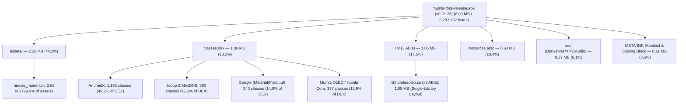
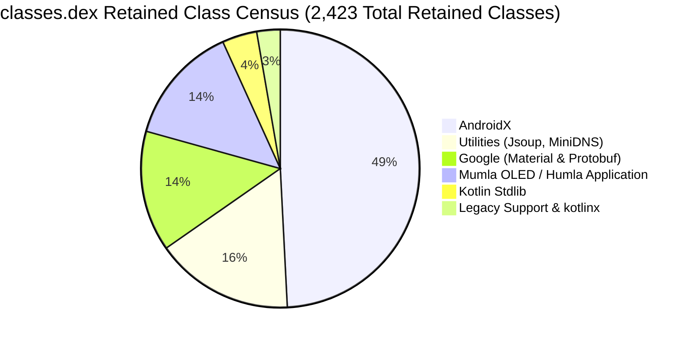
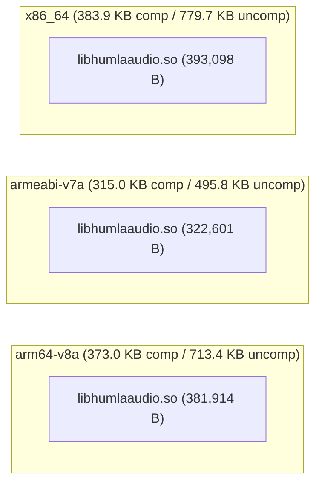

# Mumla OLED Release APK Size Analysis & Binary Footprint Report (0.21.23)

This report provides a comprehensive, quantitative analysis of the binary footprint, package composition, Dalvik bytecode structure, native shared libraries, asset payloads, and resource overhead in the production release APK of **Mumla OLED 0.21.23** ([`mumla-foss-release.apk`](../../app/build/outputs/apk/foss/release/mumla-foss-release.apk)). It is the successor to the [0.18.4 analysis](./README.md) and follows the same methodology so the two reports can be compared section by section.

> [!NOTE]
> **Version skew**: the analyzed APK was built from tag `0.21.23` (`versionCode 3070300`). `HEAD` sits three documentation-only commits ahead of the tag (two prior plus this report), so the binary is representative of the latest release version.

---

## 1. Executive Summary & Top-Level Metrics

The production release artifact is built under the `foss` flavor with ProGuard/R8 minification and resource shrinking enabled.



### Global Artifact Metrics

| Metric | Measured Value | Human Readable | Notes |
| :--- | :--- | :--- | :--- |
| **Analyzed Version** | `0.21.23` (`versionCode 3070300`) | — | Version analyzed in this report |
| **Download / On-Disk Size (Compressed)** | `6,287,152 bytes` | **6.00 MiB** (~6.3 MB) | Exact byte count of the signed release APK |
| **ZIP Content Payload (Compressed)** | `6,163,650 bytes` | **5.88 MiB** | Sum of compressed entry streams (excludes signing block) |
| **APK Signing Block & ZIP Central Directory** | `123,502 bytes` | **120.6 KiB** (1.96%) | APK v1/v2/v3 signatures plus archive index overhead |
| **Installed / Unpacked Size (Uncompressed)** | `9,700,152 bytes` | **9.25 MiB** (~9.7 MB) | Sum of all internal uncompressed payload streams |
| **Overall Compression Ratio** | `63.54%` | — | Ratio of compressed content to uncompressed contents |
| **Total Files Inside Archive** | `985 files` | — | Includes classes, shared objects, resources, metadata |
| **Target Application ID** | `se.lublin.mumla.oled15` | — | Configured in [`app/build.gradle`](../../app/build.gradle#L102) |
| **DEX Compilation Strategy** | Single DEX (`classes.dex`) | — | Single DEX 035 archive; no multidex split |
| **Target ABIs** | `arm64-v8a`, `armeabi-v7a`, `x86_64` | — | Multi-architecture universal FOSS APK |

### Delta vs 0.18.4

| Metric | 0.18.4 | 0.21.23 | Delta |
| :--- | :--- | :--- | :--- |
| **APK on-disk size** | `7,311,002 B` | `6,287,152 B` | **`−1,023,850 B` (−14.0%)** |
| **Unpacked size** | `12,723,793 B` | `9,700,152 B` | **`−3,023,641 B` (−23.8%)** |
| **File count** | 1,003 | 985 | −18 files |
| **`classes.dex`** | `2,207,865 B` | `1,144,365 B` | **−48.2%** (BouncyCastle removed) |
| **`lib/` native** | `1,159,475 B` (6 files) | `1,097,613 B` (3 files) | **−5.3%** (`libjniopus.so` folded in) |
| **`assets/`** | `2,781,718 B` | `2,782,035 B` | +317 B (flat) |
| **`resources.arsc`** | `654,304 B` | `656,140 B` | +0.3% (flat) |
| **`res/`** | `376,127 B` | `386,074 B` | +2.6% (PTT audio cues added) |
| **Meta / signatures** | `131,513 B` (incl. signing overhead) | `97,423 B` (+ `123,502 B` overhead split out in §2) | Scope change — genuine leak removal is ~32 KB (see §6) |

Three changes explain effectively all of the ~1 MB reduction: the BouncyCastle-to-platform-crypto migration, the single-library native layout that absorbed `libjniopus.so`, and the disappearance of BouncyCastle/JavaCPP classpath baggage. (The meta-row delta above is not like-for-like: the 0.18.4 bucket included signing-block overhead that §2 now splits into its own row.) Details follow in §§4–6.

---

## 2. Global Archive Composition Breakdown

The archive contents break down across seven functional categories (percentages of the on-disk APK file):

| Category | Compressed Size | % of Total APK | Uncompressed Size | % of Uncompressed | File Count |
| :--- | :--- | :--- | :--- | :--- | :--- |
| **Assets (`assets/`)** | `2,782,035 B` | **44.25%** | `3,546,565 B` | **36.56%** | 3 |
| **Bytecode (`classes.dex`)** | `1,144,365 B` | **18.20%** | `2,507,436 B` | **25.85%** | 1 |
| **Native Libraries (`lib/`)** | `1,097,613 B` | **17.46%** | `2,036,628 B` | **21.00%** | 3 |
| **Compiled Table (`resources.arsc`)** | `656,140 B` | **10.44%** | `656,140 B` | **6.76%** | 1 |
| **App Resources (`res/`)** | `386,074 B` | **6.14%** | `725,054 B` | **7.47%** | 908 |
| **Signatures, Manifest & Meta** | `97,423 B` | **1.55%** | `228,329 B` | **2.35%** | 69 |
| **Signing Block & ZIP Index Overhead** | `123,502 B` | **1.96%** | — | — | — |
| **Total (on-disk APK)** | **`6,287,152 B`** | **100.00%** | **`9,700,152 B`** | **100.00%** | **985** |

*Shares are rounded to two decimals; the uncompressed column totals 99.99% before rounding.*

The headline structural shift since 0.18.4: assets grew from 38.0% to 44.3% of the APK **without growing in absolute terms** — the RNNoise model is unchanged in kind while DEX bytecode collapsed by nearly half, so the (incompressible, §3) model now dominates the package even more.

### Breakdown by File Extension

| Extension | Compressed Size | % APK | Uncompressed Size | File Count | Primary Contents |
| :--- | :--- | :--- | :--- | :--- | :--- |
| `.bin` | `2,781,315 B` | 44.24% | `3,547,368 B` | 3 | RNNoise model weights, coroutine debug probes |
| `.dex` | `1,144,365 B` | 18.20% | `2,507,436 B` | 1 | Application and dependency Dalvik bytecode |
| `.so` | `1,097,613 B` | 17.46% | `2,036,628 B` | 3 | Humla native audio engine (Opus + RNNoise + OCB2) |
| `.arsc` | `656,140 B` | 10.44% | `656,140 B` | 1 | Compiled resource string & ID lookup table |
| `.xml` | `234,725 B` | 3.73% | `582,204 B` | 637 | Binary Android layouts and vector drawables (+ manifest) |
| `.png` | `145,522 B` | 2.31% | `145,522 B` | 270 | Legacy channel/status icons and splash graphics |
| `.SF` / `.MF` / `.RSA` | `81,122 B` | 1.29% | `182,757 B` | 3 | APK v1/v2/v3 signing manifests and certificates |
| `.kotlin_builtins` | `10,164 B` | 0.16% | `28,940 B` | 7 | Kotlin runtime reflection metadata |
| `.ogg` | `8,588 B` | 0.14% | `8,588 B` | 2 | Push-to-talk on/off auditory cues (**new**) |
| `.prof` / `.profm` | `2,245 B` | 0.04% | `2,245 B` | 2 | ART AOT baseline execution profile |
| Other (`.version`, `.properties`, `.textproto`, `LICENSE`) | `1,851 B` | 0.03% | `2,324 B` | 56 | AndroidX version markers, build metadata |

Notable absences versus 0.18.4: the ~25.5 KB of BouncyCastle `CertPathReviewerMessages*.properties` and the ~6.2 KB of JavaCPP desktop-platform descriptors are completely gone — optimization #3 from the previous report was realized as a side effect of dependency removal rather than `packaging.resources.excludes` rules. The `.properties` extension total is now a single 53-byte Gradle metadata file.

---

## 3. Deep Dive: Asset Storage & RNNoise Model Payload

The single largest entry inside the entire APK remains [`assets/rnnoise_model.bin`](../../libraries/humla/src/main/assets/rnnoise_model.bin), now accounting for **44.2%** of the entire APK file size — up in share purely because everything else shrank.

```math
\text{Asset Footprint Ratio} = \frac{\text{Compressed Size of } \texttt{assets/rnnoise\_model.bin}}{\text{Total Compressed APK Size}} = \frac{2,779,790}{6,287,152} \approx 44.22\%
```

### Detailed Asset File Census

| Path | Compressed Size | Uncompressed Size | Compression % | Purpose |
| :--- | :--- | :--- | :--- | :--- |
| `assets/rnnoise_model.bin` | `2,779,790 B` (2.65 MiB) | `3,544,320 B` (3.38 MiB) | 78.43% | Quantized neural network weights for RNNoise |
| `assets/dexopt/baseline.prof` | `1,985 B` (1.94 KiB) | `1,985 B` (1.94 KiB) | 100.00% | ART AOT baseline execution profile |
| `assets/dexopt/baseline.profm` | `260 B` (0.25 KiB) | `260 B` (0.25 KiB) | 100.00% | ART baseline profile metadata |

The model blob is 64 bytes larger uncompressed than in 0.18.4 (3,544,320 vs 3,544,256 — exactly one 64-byte alignment block), consistent with a regeneration of the weights blob; the `DNNw` container format, tensor inventory (42 tensors), and the GRU/convolution/index-table breakdown documented in the 0.18.4 report are unchanged.

### Architectural Synergy with Native Shared Libraries

- **The Multi-ABI Duplication Problem (still solved)**:
  The `-DUSE_WEIGHTS_FILE` build flag in [`libraries/humla/src/main/jni/Android.mk`](../../libraries/humla/src/main/jni/Android.mk) continues to strip static weights from the compiled `.so` binaries. Had the weights been statically linked, they would now be triplicated inside the single `libhumlaaudio.so` across all 3 ABIs:

```math
\text{Static Multi-ABI Weight Bloat} = 3 \times 3,544,320\text{ bytes} \approx 10,632,960\text{ bytes} \quad (\approx 10.14\text{ MiB uncompressed})
```

- **Runtime Loading**:
  [`NativeAudioInputEngine.loadRnnoiseModel()`](../../libraries/humla/src/main/java/se/lublin/humla/audio/NativeAudioInputEngine.java) still reads `rnnoise_model.bin` from Android assets once into a cached byte buffer, passing it across JNI during `AudioInputEngine` initialization. This remains the single most significant size optimization in the project, saving over **7 MB** of compressed APK overhead.

---

## 4. Deep Dive: Dalvik Executable Bytecode (`classes.dex`)

[`classes.dex`](../../app/build/intermediates/dex/fossRelease/minifyFossReleaseWithR8/classes.dex) is now only the second largest component at **1.09 MiB** compressed (18.20%) and **2.39 MiB** uncompressed (25.85%) — down 48.2% compressed from 0.18.4. The era of BouncyCastle-dominated bytecode is over.



### Low-Level DEX Header Metrics

Extracted directly from the binary DEX 035 header:

| DEX Header Field | Measured Value | 0.18.4 Value | Android 64K Limit | Margin Remaining |
| :--- | :--- | :--- | :--- | :--- |
| **Class Definitions (`class_defs_size`)** | `2,238` | `5,321` | Unlimited | — |
| **Method References (`method_ids_size`)** | `21,413` | `34,514` | 65,536 | **44,123 methods (67.3% headroom)** |
| **Field References (`field_ids_size`)** | `8,477` | `14,523` | 65,536 | **57,059 fields (87.1% headroom)** |
| **Type IDs (`type_ids_size`)** | `3,290` | `6,611` | 65,536 | 62,246 types |
| **String IDs (`string_ids_size`)** | `14,142` | `27,759` | 65,536 | 51,394 strings |
| **Prototype IDs (`proto_ids_size`)** | `5,029` | `7,344` | 65,536 | 60,507 prototypes |

Method-reference headroom grew from 47.3% to 67.3%. The application still comfortably fits within a single primary DEX.

### Class Retention Census by Dependency Package

R8 minification and tree shaking (`minifyEnabled = true`) reduced the codebase to **2,423 mapped classes** (2,238 class definitions in the final DEX header) and **152,936 method mappings** — down from 5,303 classes and 245,428 methods. Method mappings are counted as indented `mapping.txt` entries carrying a `->` arrow, excluding 7,124 R8 `#` diagnostic comment lines; the 0.18.4 figure was counted with comment lines included, so the raw method-count drop slightly overstates the like-for-like reduction:

| Package Prefix | Retained Classes | % of Retained Classes | Mapped Methods | % of Mapped Methods | Dominant Role / Purpose |
| :--- | :--- | :--- | :--- | :--- | :--- |
| **`androidx.*`** | **1,192** | **49.20%** | **86,424** | **56.51%** | AppCompat widgets, core shims, fragments, recycler, lifecycle |
| `com.google.android.*` | 244 | 10.07% | 22,104 | 14.45% | Material design components, layout widgets |
| **`se.lublin.humla.*`** | **199** | **8.21%** | **9,236** | **6.04%** | Core Mumble protocol engine, audio bridge, crypto |
| `org.jsoup.*` | 187 | 7.72% | 9,538 | 6.24% | HTML sanitization and message rendering |
| **`se.lublin.mumla.*`** | **138** | **5.70%** | **9,425** | **6.16%** | Android activities, fragments, overlay, preferences |
| `org.minidns.*` | 203 | 8.38% | 3,381 | 2.21% | DNS SRV record lookup for Mumble server discovery |
| `com.google.protobuf.*` | 96 | 3.96% | 8,681 | 5.68% | Mumble protocol protobuf runtime serialization |
| `kotlin.*` | 98 | 4.04% | 1,031 | 0.67% | Kotlin standard library runtime helpers |
| `android.support.v4.*` | 64 | 2.64% | 3,116 | 2.04% | Legacy support interfaces |
| `kotlinx.*` | 2 | 0.08% | 0 | 0.00% | Coroutine version markers |
| **Total** | **2,423** | **100.00%** | **152,936** | **100.00%** | |

Sub-package detail (largest groups): `androidx.appcompat.widget` (153), `androidx.core.view` (125), `org.jsoup.parser` (115), `androidx.fragment.app` (75), `androidx.recyclerview.widget` (74), `androidx.appcompat.app` + `androidx.appcompat.view` (102 combined), `androidx.emoji2.text` (43).

### Where BouncyCastle Went

In 0.18.4, `org.bouncycastle.*` accounted for 3,066 classes (57.8% of DEX) purely to generate X.509 client certificates and parse PKCS#12 keystores. Commit `a0e22fd0` (*crypto: replace BouncyCastle with standard crypto*) removed the `bcprov`/`bcpkix` dependencies entirely:

- [`HumlaCertificateGenerator`](../../libraries/humla/src/main/java/se/lublin/humla/net/HumlaCertificateGenerator.java) now contains a lightweight in-tree X.509 v3 DER encoder (RSA-2048, SHA256withRSA, BasicConstraints, KeyUsage, ClientAuth EKU, SubjectKeyIdentifier) built on standard `java.security` APIs.
- `HumlaConnection` and `CertificateImportActivity` use platform `KeyStore.getInstance("PKCS12")` instead of `BouncyCastleProvider`-qualified lookups.
- The broad `-keep class org.bouncycastle.**` ProGuard rules are gone from [`app/proguard-rules.pro`](../../app/proguard-rules.pro); the remaining keeps cover only JNI entry points, Protobuf Lite messages, MiniDNS, Parcelable creators, and Preference XML references.

This single migration removed ~3,000 classes and over 1 MB of compressed DEX. The menagerie of dead weight called out last time (PQC, Camellia, GOST engines) shipped out with it.

### The New Over-Retention Candidate: MiniDNS

Note the surviving wildcard in [`app/proguard-rules.pro`](../../app/proguard-rules.pro):

```pro
# MiniDNS
-keep class org.minidns.** { *; }
```

All 203 MiniDNS classes are retained — including DNSSEC validation, DANE, and iterative-resolver machinery (`org.minidns.dnssec`, `org.minidns.iterative`, `org.minidns.dane`) that a stub-resolver client almost certainly never touches. This is the same reflection-driven over-retention pattern BouncyCastle exhibited, now at ~1/15th the scale. See optimization #2 in §7.

---

## 5. Deep Dive: Native Shared Libraries (`lib/`)

Native binaries represent **1.05 MiB** compressed (17.46%) and **1.94 MiB** uncompressed (21.00%). The headline change: **there is no more `libjniopus.so`**. Commit `012608e9` (*opus: rebase to v1.6.1, drop jniopus*) folded the Opus codec into the single-library layout — `humlaopus` and `humlarnnoise` static libraries now link into `libhumlaaudio.so`, the JavaCPP `jniopus` shim (and its unbounded array-copy attack surface) is deleted, and only `"humlaaudio"` is ever loaded.



### Detailed Native Library Metrics

| Architecture (ABI) | Library Name | Compressed Size | Uncompressed Size | Deflate Savings | Key Functionality |
| :--- | :--- | :--- | :--- | :--- | :--- |
| **`arm64-v8a`** | `libhumlaaudio.so` | `381,914 B` (373.0 KB) | `730,488 B` (713.4 KB) | 47.7% | Opus 1.6.1 + RNNoise + OCB2 + engines (ARM64) |
| **`armeabi-v7a`** | `libhumlaaudio.so` | `322,601 B` (315.0 KB) | `507,716 B` (495.8 KB) | 36.5% | Opus 1.6.1 + RNNoise + OCB2 + engines (ARMv7) |
| **`x86_64`** | `libhumlaaudio.so` | `393,098 B` (383.9 KB) | `798,424 B` (779.7 KB) | 50.8% | Opus 1.6.1 + RNNoise + OCB2 + engines (x86-64) |
| **Total Native (`lib/`)** | **3 files** | **`1,097,613 B` (1.05 MB)** | **`2,036,628 B` (1.94 MB)** | **46.1%** | |

### Component Analysis

1. **Opus 1.6.1, statically linked** (was: Opus 1.5.2 in a separate `libjniopus.so` via JavaCPP):
   - Sources come from the pinned upstream submodule ([`libraries/humla/src/main/jni/opus`](../../libraries/humla/src/main/jni/opus)) via `celt_sources.mk` / `silk_sources.mk` / `opus_sources.mk`, compiled with `-DVAR_ARRAYS -DFIXED_POINT -DHAVE_LRINTF=1 -O3` (deep PLC/DRED `lpcnet_sources.mk` intentionally excluded as it conflicts with fixed-point).
   - Per-ABI totals are ~62 KB *smaller* than the old two-library sum despite the major-version codec bump — whole-archive linking with `--gc-sections` / `--exclude-libs=ALL` plus the removal of the JavaCPP JNI shim more than paid for the newer codec.
2. **`libhumlaaudio.so` contents**:
   - Opus codec (static `humlaopus`), RNNoise runtime (static `humlarnnoise`, weights externalized per §3), the C++ audio pipeline (`AudioInputEngine`, `OpusVoiceEncoder`, `RnnoiseProcessor`, `PreSpeechRingBuffer`, `HysteresisVad`, `SoftLimiter`, `AdaptiveLeveler`), the Speex-derived adaptive jitter buffer, the native output mix engine, and native OCB2 crypto (`crypto/`, hardened in the `feature/native-ocb2-crypto` branch).
   - Built with `-ffunction-sections -fdata-sections -fvisibility=hidden -fstack-protector-strong -D_FORTIFY_SOURCE=2`, 16 KiB page alignment (`-Wl,-z,max-page-size=16384`), and safe auto-vectorization; x86_64 remains the largest ABI (+3% over arm64) as in 0.18.4.

---

## 6. Deep Dive: Resources, Assets & Packaging Overhead

### Compiled Resource Table (`resources.arsc`)

- **Size**: `656,140 bytes` (640.76 KiB), stored uncompressed ($10.44\%$ of total APK) — effectively unchanged from 0.18.4 (`654,304 B`, +0.3%).
- **Language Pruning Effect (unchanged)**:
  [`app/build.gradle`](../../app/build.gradle#L82) still defines:
  ```groovy
  resourceConfigurations += ["en", "fr", "zh-rCN"]
  ```
  Restricting compiled localization strings to English, French, and Simplified Chinese continues to save an estimated **450–600 KB** against the unpruned dependency string pool.

### Application Resource Files (`res/`)

- **Total Payload**: `386,074 bytes` compressed (6.14% of APK), `725,054 bytes` uncompressed across **908 files** (+4 files vs 0.18.4).

| Resource Sub-Type | File Count | Compressed Size | Uncompressed Size | Characteristics |
| :--- | :--- | :--- | :--- | :--- |
| **Compiled XML (`.xml`)** | 636 | `~227 KB` | `~558 KB` | Binary XML layouts, vector drawables, state lists, res-only (excl. manifest) (+2 vs 0.18.4) |
| **Bitmaps (`.png`)** | 270 | `145,522 B` (142.1 KB) | `145,522 B` (142.1 KB) | Legacy notification icons, channel emblems (unchanged count) |
| **Audio cues (`.ogg`)** | 2 | `8,588 B` (8.4 KB) | `8,588 B` (8.4 KB) | PTT on/off earcons, stored uncompressed (**new**) |

The two new files are [`ptt_on.ogg`](../../app/src/main/res/raw/ptt_on.ogg) / [`ptt_off.ogg`](../../app/src/main/res/raw/ptt_off.ogg) (~4.3 KB each), added with the push-to-talk audio feedback work — they play on speech onset/offset and cost a mere 8.6 KB thanks to already-compressed OGG streams being stored rather than re-deflated. The 270 legacy PNGs are unchanged in count and identical in aggregate footprint (145,522 B) and are still vector-drawable migration candidates (row 5).

### Classpath Baggage & Cross-Platform Metadata Leaks (Mostly Resolved)

The 0.18.4 report flagged ~40 KB compressed (~235 KB uncompressed) of leaked dependency metadata. Status in 0.21.23:

1. **Bouncy Castle localization bundles — GONE** (`−25,540 B` compressed). Removed with the dependency itself.
2. **JavaCPP desktop platform descriptors — GONE** (`−6,183 B` compressed). Removed with the `javacpp` dependency and the `jniopus` shim.
3. **Surviving / new trivia** (all individually < 2 KB):
   - `DebugProbesKt.bin`: `782 B` comp (`1,738 B` uncomp) — Kotlin coroutine debugger probe dictionary (unchanged).
   - `core/java_features_proto-descriptor-set.proto.bin`: `743 B` comp (`1,310 B` uncomp) — Protobuf descriptor binary (unchanged).
   - `META-INF/jsoup/LICENSE`: `661 B` comp — arrived with the jsoup 1.21 → 1.23.2 bump; a candidate for the existing `packaging.resources.excludes` list.
   - 52 AndroidX/coroutines `.version` markers: `995 B` comp (unchanged pattern).
   - `META-INF/version-control-info.textproto`: `118 B` — AGP build provenance stamp (**new**, negligible).

---

## 7. Actionable Size Optimization Matrix

Updated from the 0.18.4 report: two recommendations are now **done**, a third is partially done (item 4's `jsoup/LICENSE` micro-exclusion remains open), and one new item (MiniDNS) replaces BouncyCastle as the DEX-side target.

| Optimization Strategy | Target Component | Estimated Savings (Compressed) | Status since 0.18.4 | Complexity | Technical Risk & Trade-offs |
| :--- | :--- | :--- | :--- | :--- | :--- |
| **1. Per-ABI APK Splitting** | `lib/` | **~715 KB** (~11.4%) | Open (unchanged) | Low | Low risk. Requires publishing multiple APK artifacts (or AAB) rather than a single universal FOSS APK.Largest remaining lever. |
| **2. MiniDNS Class Stripping** | `classes.dex` | **~30–60 KB** (~0.5–1.0%) | **New** (replaces BouncyCastle item) | Medium | Moderate risk. Audit dynamic DNS-record lookups to replace `-keep class org.minidns.**` with granular rules for SRV resolution; same reflection hazard pattern as the old BC rule, at 1/15th the scale. |
| **3. BouncyCastle Removal** | `classes.dex` | **~1,060 KB realized** | ✅ **Done** (`a0e22fd0`) | — | Realized via in-tree X.509 DER encoder + platform PKCS#12. |
| **4. Dependency-Baggage Removal** | `org/`, `com/` | **~32 KB realized** | ✅ **Done** (BC + JavaCPP deps dropped) | — | Zero residual risk. Follow-up micro-item: add `META-INF/jsoup/LICENSE` to `packaging.resources.excludes` (~0.7 KB). |
| **5. Vector Drawable Migration** | `res/` | **~60–90 KB** (~1.0–1.4%) | Open (PNG count still 270) | Medium | Low risk. Convert the 270 legacy PNG icons and drawables to Android vector XML drawables. |
| **6. Model Weight FP16 / Pruning** | `assets/` | **~300–600 KB** (~4.8–9.5%) | Open (model +64 B regen only) | High | High risk. Requires re-training or fine-tuning the RNNoise GRU layers to verify denoising PESQ/POLQA voice quality does not regress. Now an even larger *share* (44.2%) of a smaller APK. |

---

## 8. Summary Conclusion

The Mumla OLED 0.21.23 release package at **6.0 MB** is a full megabyte leaner than 0.18.4 (7.1 MB) — a 14.0% on-disk and 23.8% installed-footprint reduction achieved while *upgrading* the Opus codec (1.5.2 → 1.6.1), adding native OCB2 crypto and a native output engine, and shipping new PTT audio cues. The binary footprint is still dominated by the same two specialized components, with bytecode no longer dominated by a single crypto provider:

```math
\text{Dominant Payloads} = \underbrace{44.3\%}_{\text{RNNoise Weights}} + \underbrace{18.2\%}_{\text{Dalvik Bytecode}} + \underbrace{17.5\%}_{\text{Native (3 ABIs)}} = 80.0\% \text{ of Total APK}
```

The defining architectural event between the two reports is the **BouncyCastle excision** (`a0e22fd0`): 3,066 classes deleted, DEX nearly halved, and the ProGuard configuration permanently de-risked. Complementing it, the **single-library native layout** (`012608e9`) absorbed the entire Opus codec into `libhumlaaudio.so` at *negative* marginal size while eliminating the JavaCPP attack surface. With bytecode tamed, the optimization frontier moves down the stack: per-ABI splitting (~715 KB, the largest remaining lever), RNNoise weight quantization (now 44% of the package), and MiniDNS keep-rule refinement — the last surviving wildcard-retention hotspot in an otherwise tightly-shaken DEX.
