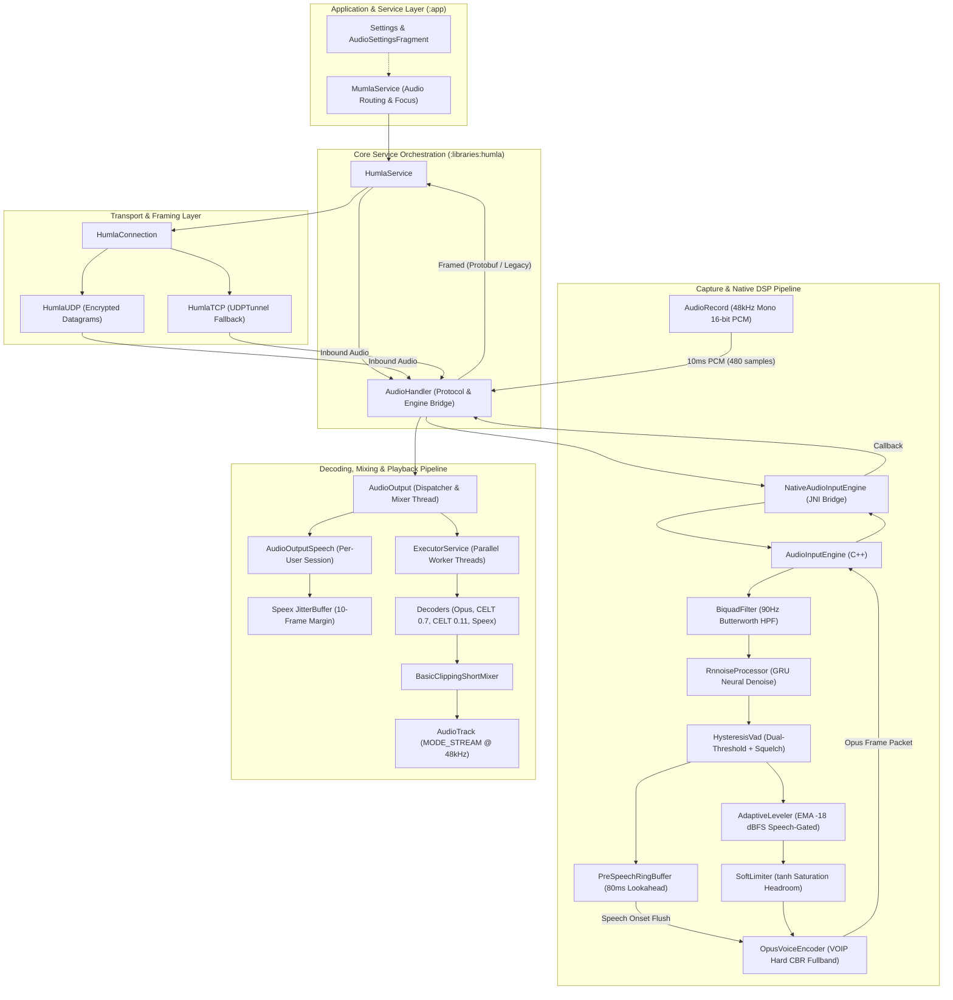

# Audio System Architecture

This directory provides comprehensive documentation of the audio architecture in **Mumla OLED** (comprising the application layer in [`app/`](file:///home/bualy/files/devel/mumla_dev/mumla-oled/app) and the core protocol library in [`libraries/humla/`](file:///home/bualy/files/devel/mumla_dev/mumla-oled/libraries/humla)).

---

## 1. Executive Summary & Topology

The Mumla audio subsystem is an asynchronous, multi-threaded, low-latency voice pipeline designed for real-time interactive communication over the Mumble protocol. It handles full-duplex VoIP at 48,000 Hz, with 10ms frame quantization (480 samples), deep neural noise suppression (RNNoise), pre-speech lookahead buffering, dual-threshold hysteresis voice activity detection (VAD), speech-gated adaptive leveling, soft-knee saturation limiting, mandatory constant bitrate (CBR) Opus encoding, Speex jitter buffering, parallelized multi-user decoding, and audio track mixing.

---

## 2. Directory & Component Inventory

| Subsystem / Layer | Key Source Files | Primary Role & Description |
|---|---|---|
| **Capture Layer** | [`AudioInput.java`](file:///home/bualy/files/devel/mumla_dev/mumla-oled/libraries/humla/src/main/java/se/lublin/humla/audio/AudioInput.java) | Captures 16-bit PCM mono at 48kHz on a dedicated urgent audio thread (`THREAD_PRIORITY_URGENT_AUDIO`) via Android's `AudioRecord`. Configures platform `NoiseSuppressor` and `AutomaticGainControl` hardware effects if available. |
| **Native Input Engine (JNI)** | [`NativeAudioInputEngine.java`](file:///home/bualy/files/devel/mumla_dev/mumla-oled/libraries/humla/src/main/java/se/lublin/humla/audio/NativeAudioInputEngine.java) [`NativeAudioInputEngineJni.cpp`](file:///home/bualy/files/devel/mumla_dev/mumla-oled/libraries/humla/src/main/jni/audio_engine/NativeAudioInputEngineJni.cpp) | Zero-allocation JNI wrapper managing engine lifecycle, passing 10ms frame slices to C++, and receiving encoded Opus packets and talk-state updates via pre-allocated global references. |
| **C++ Audio Input Engine** | [`AudioInputEngine.h`](file:///home/bualy/files/devel/mumla_dev/mumla-oled/libraries/humla/src/main/jni/audio_engine/AudioInputEngine.h) [`AudioInputEngine.cpp`](file:///home/bualy/files/devel/mumla_dev/mumla-oled/libraries/humla/src/main/jni/audio_engine/AudioInputEngine.cpp) | Native orchestrator (`libhumlaaudio.so`) executing filtering, neural denoising, VAD, leveling, lookahead buffering, packet accumulation, and Opus CBR encoding. |
| **High-Pass Filter** | [`BiquadFilter.h`](file:///home/bualy/files/devel/mumla_dev/mumla-oled/libraries/humla/src/main/jni/audio_engine/BiquadFilter.h) | 2nd-order Direct Form II Transposed Butterworth filter (cutoff 90Hz, Q=0.7071) stripping sub-audible mic pops and handling infrasonic rumble before DSP. |
| **Neural Denoising** | [`RnnoiseProcessor.h`](file:///home/bualy/files/devel/mumla_dev/mumla-oled/libraries/humla/src/main/jni/audio_engine/RnnoiseProcessor.h) [`RnnoiseProcessor.cpp`](file:///home/bualy/files/devel/mumla_dev/mumla-oled/libraries/humla/src/main/jni/audio_engine/RnnoiseProcessor.cpp) | Recurrent neural network (GRU) speech enhancement operating on 480-sample frames. Evaluates band energies and yields clean audio and neural speech probability $P_{\text{speech}} \in [0.0, 1.0]$. Fixes upstream memory deallocation bug on teardown. |
| **Dual-Threshold VAD** | [`HysteresisVad.h`](file:///home/bualy/files/devel/mumla_dev/mumla-oled/libraries/humla/src/main/jni/audio_engine/HysteresisVad.h) [`HysteresisVad.cpp`](file:///home/bualy/files/devel/mumla_dev/mumla-oled/libraries/humla/src/main/jni/audio_engine/HysteresisVad.cpp) | Evaluates neural speech probability against upper threshold (`vadMax` default 0.35) and lower threshold (`vadMin` default 0.25) with a -65 dBFS hard squelch floor and 25-frame (250ms) hangover counter to eliminate stutter. |
| **Adaptive RMS Leveler** | [`AdaptiveLeveler.h`](file:///home/bualy/files/devel/mumla_dev/mumla-oled/libraries/humla/src/main/jni/audio_engine/AdaptiveLeveler.h) [`AdaptiveLeveler.cpp`](file:///home/bualy/files/devel/mumla_dev/mumla-oled/libraries/humla/src/main/jni/audio_engine/AdaptiveLeveler.cpp) | Speech-gated automatic gain control targeting -18 dBFS RMS ($4125$ peak amplitude) with $[-12\text{ dB}, +12\text{ dB}]$ boundaries. Employs EMA ($\alpha=0.004$) and per-frame slew rate limiting ($0.006$/frame) with sample-by-sample linear interpolation. |
| **Soft Limiter** | [`SoftLimiter.h`](file:///home/bualy/files/devel/mumla_dev/mumla-oled/libraries/humla/src/main/jni/audio_engine/SoftLimiter.h) [`SoftLimiter.cpp`](file:///home/bualy/files/devel/mumla_dev/mumla-oled/libraries/humla/src/main/jni/audio_engine/SoftLimiter.cpp) | Replaces hard clipping distortion with a $C^1$-continuous hyperbolic tangent ($\tanh$) saturation curve above knee threshold ($\frac{2}{3} \times 32767 = 21844.67$). |
| **Pre-Speech Lookahead** | [`PreSpeechRingBuffer.h`](file:///home/bualy/files/devel/mumla_dev/mumla-oled/libraries/humla/src/main/jni/audio_engine/PreSpeechRingBuffer.h) [`PreSpeechRingBuffer.cpp`](file:///home/bualy/files/devel/mumla_dev/mumla-oled/libraries/humla/src/main/jni/audio_engine/PreSpeechRingBuffer.cpp) | 8-frame (80ms) circular FIFO buffer storing pre-speech silence frames. Flushes in chronological order upon speech onset to preserve quiet initial consonants and unvoiced plosives. |
| **Opus Encoder** | [`OpusVoiceEncoder.h`](file:///home/bualy/files/devel/mumla_dev/mumla-oled/libraries/humla/src/main/jni/audio_engine/OpusVoiceEncoder.h) [`OpusVoiceEncoder.cpp`](file:///home/bualy/files/devel/mumla_dev/mumla-oled/libraries/humla/src/main/jni/audio_engine/OpusVoiceEncoder.cpp) | Mandatory Hard Constant Bitrate (CBR, `VBR=0`, `VBR_CONSTRAINT=0`) Opus voice encoder (VOIP mode, fullband, complexity 10, in-band FEC, 10% loss adaptation, `DTX=0`) eliminating side-channel packet-length leakage. |
| **Protocol Audio Handler** | [`AudioHandler.java`](file:///home/bualy/files/devel/mumla_dev/mumla-oled/libraries/humla/src/main/java/se/lublin/humla/protocol/AudioHandler.java) | Mediates between network packet listeners and local input/output engines. Manages dynamic bandwidth capping, talk-state broadcast, half-duplex stream muting, and packet serialization (MumbleUDP Protobuf vs legacy UDP). |
| **Playback & Dispatcher** | [`AudioOutput.java`](file:///home/bualy/files/devel/mumla_dev/mumla-oled/libraries/humla/src/main/java/se/lublin/humla/audio/AudioOutput.java) | Maintains user speech streams in `Map<Integer, AudioOutputSpeech>`. Runs dedicated playback thread feeding Android `AudioTrack`, dispatching parallel decode tasks across available CPU cores. |
| **User Stream & Jitter** | [`AudioOutputSpeech.java`](file:///home/bualy/files/devel/mumla_dev/mumla-oled/libraries/humla/src/main/java/se/lublin/humla/audio/AudioOutputSpeech.java) | Manages Speex `JitterBuffer` for a single talker session. Handles average packet availability tracking (underrun prevention), packet loss concealment (PLC), sine-window fade-in/out, and codec decoding. |
| **Software Mixer** | [`BasicClippingShortMixer.java`](file:///home/bualy/files/devel/mumla_dev/mumla-oled/libraries/humla/src/main/java/se/lublin/humla/audio/BasicClippingShortMixer.java) [`IAudioMixer.java`](file:///home/bualy/files/devel/mumla_dev/mumla-oled/libraries/humla/src/main/java/se/lublin/humla/audio/IAudioMixer.java) | Sums float PCM sources from concurrent talkers into 16-bit short output buffer with clipping to $[-1.0, 1.0]$. |
| **Network Framing & Varints** | [`PacketBuffer.java`](file:///home/bualy/files/devel/mumla_dev/mumla-oled/libraries/humla/src/main/java/se/lublin/humla/net/PacketBuffer.java) [`HumlaConnection.java`](file:///home/bualy/files/devel/mumla_dev/mumla-oled/libraries/humla/src/main/java/se/lublin/humla/net/HumlaConnection.java) | Handles variable-length 64-bit integer packing/unpacking, Protobuf UDP tunnel encapsulation, and UDP-to-TCP fallback. |
| **Audio Routing & Settings** | [`HumlaService.java`](file:///home/bualy/files/devel/mumla_dev/mumla-oled/libraries/humla/src/main/java/se/lublin/humla/HumlaService.java) [`MumlaService.java`](file:///home/bualy/files/devel/mumla_dev/mumla-oled/app/src/main/java/se/lublin/mumla/service/MumlaService.java) [`Settings.java`](file:///home/bualy/files/devel/mumla_dev/mumla-oled/app/src/main/java/se/lublin/mumla/Settings.java) | Controls handset vs loudspeaker routing (`STREAM_VOICE_CALL` vs `STREAM_MUSIC`), proximity sensor wake locks, Bluetooth SCO state, PTT hot corners, and user audio preferences. |

---

## 3. Detailed Subsystem Reports

For deep technical analysis, mathematical formulas, state machine tables, and protocol specifications, refer to the following documents:

1. **[Input Pipeline & DSP Architecture](file:///home/bualy/files/devel/mumla_dev/mumla-oled/docs/audio-architecture/input-pipeline.md)**
   - Capture timing and hardware abstraction (`AudioRecord`)
   - Biquad Butterworth high-pass filtering ($fc = 90\text{ Hz}$)
   - RNNoise neural network model integration and lifecycle management
   - Dual-threshold hysteresis VAD and hard squelch floor logic
   - Speech-gated adaptive RMS voice leveling (EMA and slew-rate limiting)
   - Soft-knee hyperbolic tangent saturation limiter
   - Pre-speech lookahead ring buffering (80ms lookahead)
   - Mandatory Hard Constant Bitrate (CBR) Opus voice encoding
2. **[Output Pipeline, Jitter & Mixing Architecture](file:///home/bualy/files/devel/mumla_dev/mumla-oled/docs/audio-architecture/output-pipeline.md)**
   - Inbound packet demuxing and per-session routing
   - Speex Jitter Buffer configuration and margin control
   - Buffer underrun prevention and robotic "twang" suppression
   - Multi-threaded parallel decoding pool (`ExecutorService`)
   - Packet Loss Concealment (PLC) and sine fade-in/fade-out
   - Software mixing, saturation clipping, and `AudioTrack` streaming
3. **[Protocol Framing, Routing & Control Architecture](file:///home/bualy/files/devel/mumla_dev/mumla-oled/docs/audio-architecture/protocol-and-routing.md)**
   - Mumble UDP packet framing (Protobuf `MumbleUDP.Audio` vs Legacy Varint)
   - Dynamic bandwidth capping and frame-per-packet throttling
   - Audio routing (Handset Mode vs Loudspeaker Mode, Proximity Sensor)
   - Half-duplex stream muting and acoustic loop prevention
   - Codec support matrix (Opus, CELT 0.7, CELT 0.11 status, Speex)
