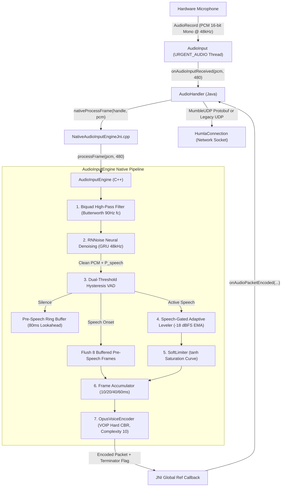

# Audio Input & DSP Pipeline

This document details the capture and native digital signal processing (DSP) pipeline in **Mumla OLED**, tracing the path of audio from the hardware microphone to the generation of encoded Opus network packets.

---

## 1. Pipeline Overview & Data Flow

Audio capture and transmission operate on a strict 10ms (480 samples at 48,000 Hz) frame quantization. The sequence of transformations applied to every incoming audio block is shown below:



---

## 2. Audio Capture Layer (`AudioInput.java`)

Audio capture is implemented in [`AudioInput.java`](file:///home/bualy/files/devel/mumla_dev/mumla-oled/libraries/humla/src/main/java/se/lublin/humla/audio/AudioInput.java).

### Sampling Configuration
- **Sample Rate:** 48,000 Hz (`SAMPLE_RATE`). Mumble is standardized on 48kHz.
- **Channel Configuration:** Mono (`AudioFormat.CHANNEL_IN_MONO`).
- **Encoding:** 16-bit Linear PCM (`AudioFormat.ENCODING_PCM_16BIT`).
- **Frame Size:** 480 samples per 10ms slice (`SAMPLE_RATE / 100`).

### Buffer Allocation & Thread Scheduling
- `AudioRecord.getMinBufferSize()` is queried. The allocated buffer size is enforced to at least 4x the 10ms frame size:
  ```java
  int bufferSize = Math.max(minBufferSize, FRAME_SIZE * 2 * 4);
  ```
- The capture loop runs on an isolated background thread (`MumlaAudioInput`) with native Linux realtime thread priority:
  ```java
  Process.setThreadPriority(Process.THREAD_PRIORITY_URGENT_AUDIO);
  ```
- The loop calls `mAudioRecord.read(buffer, 0, FRAME_SIZE)` synchronously and dispatches complete 480-sample blocks to [`AudioInputListener.onAudioInputReceived()`](file:///home/bualy/files/devel/mumla_dev/mumla-oled/libraries/humla/src/main/java/se/lublin/humla/audio/AudioInput.java#L230-L232).

### Hardware Platform Audio Effects
Upon initialization of `AudioRecord`, [`AudioInput.java`](file:///home/bualy/files/devel/mumla_dev/mumla-oled/libraries/humla/src/main/java/se/lublin/humla/audio/AudioInput.java#L101-L128) checks availability and enables hardware-accelerated effects using the audio session ID:
- **`android.media.audiofx.NoiseSuppressor`**: Enables hardware DSP noise reduction if supported by the device SoC.
- **`android.media.audiofx.AutomaticGainControl`**: Enables hardware automatic gain control if supported.

---

## 3. JNI Bridge & Memory Safety (`NativeAudioInputEngine`)

The JNI bridge connects Java to the native C++ engine via [`NativeAudioInputEngine.java`](file:///home/bualy/files/devel/mumla_dev/mumla-oled/libraries/humla/src/main/java/se/lublin/humla/audio/NativeAudioInputEngine.java) and [`NativeAudioInputEngineJni.cpp`](file:///home/bualy/files/devel/mumla_dev/mumla-oled/libraries/humla/src/main/jni/audio_engine/NativeAudioInputEngineJni.cpp).

### Zero-Allocation Hot Path
To prevent garbage collector (GC) pauses during real-time speech processing, the JNI bridge avoids allocating new `byte[]` arrays or callback objects on each frame:
1. `EngineContext` allocates a single global reference to a direct Java byte array (`cachedBufferGlobalRef`) of size `MAX_OPUS_BUFFER_BYTES` (1024 bytes).
2. When the native encoder emits an Opus packet, `SetByteArrayRegion` copies the bytes into `cachedBufferGlobalRef`.
3. The cached buffer is passed directly to `onAudioPacketEncoded` with the payload length, avoiding dynamic memory allocations on the JVM heap.

### Thread Attachment Handling
Because native callbacks can originate from different execution threads, the JNI callback lambda checks `jvm->GetEnv()`:
- If `JNI_EDETACHED`, it attaches the thread using `jvm->AttachCurrentThread()` and ensures `jvm->DetachCurrentThread()` is called upon return.
- If already attached, it calls the method directly.

### RNNoise Model Asset Management
[`NativeAudioInputEngine.loadRnnoiseModel()`](file:///home/bualy/files/devel/mumla_dev/mumla-oled/libraries/humla/src/main/java/se/lublin/humla/audio/NativeAudioInputEngine.java#L47-L62) reads `rnnoise_model.bin` from Android assets into a static byte array (`sCachedRnnoiseModel`). This byte array is passed across JNI during engine creation, allowing native C++ to initialize the neural weights directly from RAM.

---

## 4. Infrasonic High-Pass Filtering (`BiquadFilter.h`)

Implemented in [`BiquadFilter.h`](file:///home/bualy/files/devel/mumla_dev/mumla-oled/libraries/humla/src/main/jni/audio_engine/BiquadFilter.h).

Mobile device microphones frequently pick up infrasonic energy from wind buffeting, breath pops, finger friction on the device chassis, and vehicle engine vibrations. These low-frequency components (<90 Hz) corrupt RMS energy calculations and distort neural feature extraction.

### Filter Topology
- **Type:** 2nd-order Direct Form II Transposed Biquad Filter.
- **Characteristic:** Butterworth High-Pass ($Q = \frac{1}{\sqrt{2}} \approx 0.70710678$).
- **Cutoff Frequency ($f_c$):** 90 Hz ($f_s = 48000\text{ Hz}$).

### Coefficient Equations
Given $\omega_0 = 2\pi \frac{f_c}{f_s}$ and $\alpha = \frac{\sin(\omega_0)}{2Q}$:

$$\begin{aligned}
b_0 &= \frac{1 + \cos(\omega_0)}{2}, & b_1 &= -(1 + \cos(\omega_0)), & b_2 &= \frac{1 + \cos(\omega_0)}{2} \\
a_0 &= 1 + \alpha, & a_1 &= -2\cos(\omega_0), & a_2 &= 1 - \alpha
\end{aligned}$$

The normalized filter coefficients stored in C++ member variables (`m_b0`, `m_b1`, etc.) are:
$$b_0' = \frac{b_0}{a_0}, \quad b_1' = \frac{b_1}{a_0}, \quad b_2' = \frac{b_2}{a_0}, \quad a_1' = \frac{a_1}{a_0}, \quad a_2' = \frac{a_2}{a_0}$$

### Direct Form II Transposed Difference Equations
For each sample $x[n]$:
$$\begin{aligned}
y[n] &= b_0' \cdot x[n] + z_1[n-1] \\
z_1[n] &= b_1' \cdot x[n] - a_1' \cdot y[n] + z_2[n-1] \\
z_2[n] &= b_2' \cdot x[n] - a_2' \cdot y[n]
\end{aligned}$$

The output $y[n]$ is clamped to $[-32768, 32767]$ and written back in place to the frame buffer.

---

## 5. Neural Noise Suppression (`RnnoiseProcessor`)

Implemented in [`RnnoiseProcessor.h`](file:///home/bualy/files/devel/mumla_dev/mumla-oled/libraries/humla/src/main/jni/audio_engine/RnnoiseProcessor.h) and [`RnnoiseProcessor.cpp`](file:///home/bualy/files/devel/mumla_dev/mumla-oled/libraries/humla/src/main/jni/audio_engine/RnnoiseProcessor.cpp).

RNNoise combines classical signal processing (Bark-scale filterbanks, pitch prediction) with a deep Gated Recurrent Unit (GRU) recurrent neural network running at 48kHz with 10ms (480-sample) quanta.

### Model Loading & Upstream Bug Fix
Upstream `rnnoise` provides `rnnoise_model_from_buffer()`. However, that function leaves the internal `FILE*` member of `struct RNNModel` uninitialized. During engine teardown on disconnect, `rnnoise_model_free()` invokes `fclose()` on the uninitialized garbage pointer, causing a fatal crash (`__FILE_close` segfault) or an indefinite freeze on a corrupt lock.

Mumla resolves this via [`ModelFromBuffer()`](file:///home/bualy/files/devel/mumla_dev/mumla-oled/libraries/humla/src/main/jni/audio_engine/RnnoiseProcessor.cpp#L50-L63):
```cpp
struct RNNModel {
    const void *const_blob;
    void *blob;
    int blob_len;
    FILE *file;
};

static RNNModel *ModelFromBuffer(const uint8_t *data, size_t size) {
    RNNModel *model = static_cast<RNNModel *>(malloc(sizeof(*model)));
    model->const_blob = data;
    model->blob = nullptr;
    model->blob_len = static_cast<int>(size);
    model->file = nullptr; // Explicit null prevents invalid fclose()
    return model;
}
```

### Processing & Speech Probability
1. 16-bit PCM samples are converted to `float` in `m_floatIn`.
2. `rnnoise_process_frame(m_state, m_floatOut.data(), m_floatIn.data())` processes the frame in place.
3. The function returns a scalar neural speech probability:
   $$P_{\text{speech}} \in [0.0, 1.0]$$
4. Output float samples are clamped and converted back to 16-bit PCM in `outPcm`.

---

## 6. Dual-Threshold Hysteresis VAD (`HysteresisVad`)

Implemented in [`HysteresisVad.h`](file:///home/bualy/files/devel/mumla_dev/mumla-oled/libraries/humla/src/main/jni/audio_engine/HysteresisVad.h) and [`HysteresisVad.cpp`](file:///home/bualy/files/devel/mumla_dev/mumla-oled/libraries/humla/src/main/jni/audio_engine/HysteresisVad.cpp).

Standard single-threshold voice activation causes rapid flickering (chatter) at speech boundaries and clips quiet word endings. Mumla implements a state machine utilizing dual thresholds and a hard squelch floor.

### Acoustic Energy & Squelch Gate
1. **RMS Energy Calculation:**
   $$x_{\text{rms}} = \sqrt{\frac{1}{N}\sum_{i=0}^{N-1} x[i]^2}$$
   $$E_{\text{dBFS}} = 20 \log_{10}\left(\frac{x_{\text{rms}}}{32768.0}\right)$$
2. **Hard Squelch Floor (`squelchMinDb`, default -65.0 dBFS):**
   - If $E_{\text{dBFS}} < -65.0\text{ dBFS}$, the signal is deemed absolute silence/ambient room noise, and $\text{score} = 0.0$.
   - If $E_{\text{dBFS}} \ge -65.0\text{ dBFS}$, the score is taken directly from RNNoise's neural speech probability $P_{\text{speech}}$:
     $$\text{score} = P_{\text{speech}}$$
     *(If RNNoise is disabled, score falls back to normalized logarithmic peak energy: $1.0 + \frac{E_{\text{dBFS}}}{96.0}$)*.

### Hysteresis State Machine

| Current State | Condition | Next State | Hangover Counter Action |
|---|---|---|---|
| **Passive** | `score` $\ge$ `vadMax` ($0.35$) | **Speaking** | Set `currentHold = holdFrames` ($25$) |
| **Passive** | `score` < `vadMax` ($0.35$) | **Passive** | `currentHold = 0` |
| **Speaking** | `score` $\ge$ `vadMin` ($0.25$) | **Speaking** | Reset `currentHold = holdFrames` ($25$) |
| **Speaking** | `score` < `vadMin` and `currentHold` > 0 | **Speaking** | Decrement `currentHold--` |
| **Speaking** | `score` < `vadMin` and `currentHold` == 0 | **Passive** | `currentHold = 0` |

- **`vadMax` (default 0.35):** Upper threshold required to trigger voice transmission from silence.
- **`vadMin` (default 0.25):** Lower threshold required to sustain voice transmission once speaking.
- **`holdFrames` (default 25 frames = 250ms):** Hangover timer maintaining transmission during natural speech pauses and unvoiced plosives.

---

## 7. Speech-Gated Adaptive RMS Leveler (`AdaptiveLeveler`)

Implemented in [`AdaptiveLeveler.h`](file:///home/bualy/files/devel/mumla_dev/mumla-oled/libraries/humla/src/main/jni/audio_engine/AdaptiveLeveler.h) and [`AdaptiveLeveler.cpp`](file:///home/bualy/files/devel/mumla_dev/mumla-oled/libraries/humla/src/main/jni/audio_engine/AdaptiveLeveler.cpp).

The adaptive leveler automatically normalizes conversational loudness so users whispering or speaking far from the microphone are clearly heard, while loud speakers are brought down without clipping.

### Operational Parameters
- **Target RMS:** $4125.0$ (-18 dBFS relative to 32767 full-scale peak).
- **Gain Boundaries:** $[-12\text{ dB}, +12\text{ dB}]$ ($0.25\times$ minimum to $4.0\times$ maximum).
- **Speech Gate:** Only adapts when $P_{\text{speech}} \ge 0.30$ (or fallback RMS $\ge 400.0$) **AND** frame RMS $\ge 150.0$. This prevents the leveler from boosting background noise during pauses.

### Exponential Moving Average (EMA)
When speech is detected, the long-term speech loudness $R_{\text{smoothed}}$ is updated via EMA:
$$R_{\text{smoothed}} = (1 - \alpha) \cdot R_{\text{smoothed}} + \alpha \cdot R_{\text{frame}}$$
Where $\alpha = 0.004$ corresponds to a $\sim 2.5$-second time constant over 100 frames/second.

The raw target gain $G_{\text{raw}}$ and bounded target gain $G_{\text{target}}$ are calculated as:
$$G_{\text{raw}} = \frac{R_{\text{target}}}{R_{\text{smoothed}}}$$
$$G_{\text{target}} = \text{clamp}(G_{\text{raw}}, 0.25, 4.0)$$

### Slew Rate Limiter & Sample Interpolation
To avoid sudden gain jumps that cause audible clicks or breathing artifacts:
- **Maximum Gain Slew:** $\pm 0.006$ per 10ms frame ($\approx 0.05\text{ dB/frame}$ or $\approx 5\text{ dB/second}$).
- **Linear Sample Interpolation:** Across the 480 samples ($N = 480$) of a frame, gain transitions linearly:
  $$\Delta G = \frac{G_{\text{current}} - G_{\text{prev}}}{N - 1}$$
  $$G[i] = (G_{\text{prev}} + i \cdot \Delta G) \times \text{amplitudeBoost}$$

---

## 8. Soft-Knee Saturation Limiter (`SoftLimiter`)

Implemented in [`SoftLimiter.h`](file:///home/bualy/files/devel/mumla_dev/mumla-oled/libraries/humla/src/main/jni/audio_engine/SoftLimiter.h) and [`SoftLimiter.cpp`](file:///home/bualy/files/devel/mumla_dev/mumla-oled/libraries/humla/src/main/jni/audio_engine/SoftLimiter.cpp).

When user amplitude boost ($>100\%$) or adaptive leveling pushes samples beyond 16-bit PCM range, conventional hard clipping produces harsh square-wave odd-harmonic distortion. `SoftLimiter` replaces hard clipping with a smooth $C^1$-continuous hyperbolic tangent ($\tanh$) saturation curve.

### Saturation Curve
- **Maximum Amplitude ($M$):** $32767.0$
- **Knee Threshold ($K$):** $\frac{2}{3} \times M \approx 21844.67$
- **Headroom ($H$):** $M - K \approx 10922.33$

For amplified sample $v = x \times \text{boostMultiplier}$:
$$\text{out}(v) = \begin{cases}
v & \text{if } |v| \le K \\
\text{sign}(v) \cdot \left(K + H \cdot \tanh\left(\frac{|v| - K}{H}\right)\right) & \text{if } |v| > K
\end{cases}$$

At $|v| = K$, the function value is $K$ and its first derivative is $1.0$, guaranteeing smooth transition without slope discontinuity.

---

## 9. Pre-Speech Lookahead Ring Buffer (`PreSpeechRingBuffer`)

Implemented in [`PreSpeechRingBuffer.h`](file:///home/bualy/files/devel/mumla_dev/mumla-oled/libraries/humla/src/main/jni/audio_engine/PreSpeechRingBuffer.h) and [`PreSpeechRingBuffer.cpp`](file:///home/bualy/files/devel/mumla_dev/mumla-oled/libraries/humla/src/main/jni/audio_engine/PreSpeechRingBuffer.cpp).

Voice activity detectors inevitably suffer from a brief onset detection latency while energy integrates across the initial phoneme. Without lookahead, unvoiced plosives and quiet initial consonants (e.g., "p", "t", "s", "c") are clipped off.

### Mechanics
- **Capacity:** 8 frames $\times$ 480 samples = 80ms lookahead audio.
- **Storage:** Pre-allocated circular array `m_storage` (zero dynamic allocations during runtime).
- **Silence State:** Every 10ms frame processed during non-transmission is pushed into the circular FIFO.
- **Onset Trigger:** When VAD transitions from Passive to Speaking:
  ```cpp
  m_ringBuffer.flush([this, &packetsToDispatch](const int16_t* bufferedPcm, size_t len) {
      std::memcpy(&m_accumulatedPcm[m_accumulatedFrames * SAMPLES_PER_10MS], bufferedPcm, len * sizeof(int16_t));
      m_accumulatedFrames++;
      m_frameCounter++;
      if (m_accumulatedFrames >= m_framesPerPacket) {
          flushAccumulatorLocked(false, packetsToDispatch);
      }
  });
  ```
  All 8 pre-speech frames are flushed into the packet accumulator in chronological order, seamlessly prepending the onset consonants to the Opus transmission.

---

## 10. Native Opus Voice Encoder (`OpusVoiceEncoder`)

Implemented in [`OpusVoiceEncoder.h`](file:///home/bualy/files/devel/mumla_dev/mumla-oled/libraries/humla/src/main/jni/audio_engine/OpusVoiceEncoder.h) and [`OpusVoiceEncoder.cpp`](file:///home/bualy/files/devel/mumla_dev/mumla-oled/libraries/humla/src/main/jni/audio_engine/OpusVoiceEncoder.cpp).

Mumla configures native `libopus` strictly for real-time conversational voice.

### Mandatory Hard Constant Bitrate (CBR)
> [!IMPORTANT]
> Variable Bitrate (VBR) is strictly prohibited in Mumla. Under VBR, audio packet byte lengths fluctuate based on phonetic complexity. Passive network observers can analyze encrypted packet length distributions to reconstruct spoken words and identify phrases (packet length side-channel attack).

The encoder explicitly enforces Hard CBR:
```cpp
opus_encoder_ctl(m_encoder, OPUS_SET_VBR(0));
opus_encoder_ctl(m_encoder, OPUS_SET_VBR_CONSTRAINT(0));
```

### Voice Tuning & Error Resilience
- **Application Mode:** `OPUS_APPLICATION_VOIP` (optimizes SILK and hybrid modes for conversational speech).
- **Signal Hint:** `OPUS_SET_SIGNAL(OPUS_SIGNAL_VOICE)`
- **Audio Bandwidth:** `OPUS_SET_BANDWIDTH(OPUS_BANDWIDTH_FULLBAND)` (up to 20kHz acoustic bandwidth).
- **Complexity:** `OPUS_SET_COMPLEXITY(10)` (maximum psychoacoustic modeling precision).
- **In-Band FEC:** `OPUS_SET_INBAND_FEC(1)` (embeds redundant low-bitrate data for lost preceding packets).
- **Packet Loss Estimation:** `OPUS_SET_PACKET_LOSS_PERC(10)` (tunes FEC redundancy assuming 10% network loss).
- **DTX:** `OPUS_SET_DTX(0)` (disabled; silence suppression is handled by our native VAD and accumulator).

### Packet Accumulation & Termination
Audio packets accumulate frames according to user configuration:
- 1 frame (10ms = 480 samples)
- 2 frames (20ms = 960 samples, default)
- 4 frames (40ms = 1920 samples)
- 6 frames (60ms = 2880 samples)

When speech ceases, `flushAccumulatorLocked(true, ...)` zero-pads any partially filled packet and emits the final packet with `isTerminator = true`, signaling to remote clients that transmission has completed.
