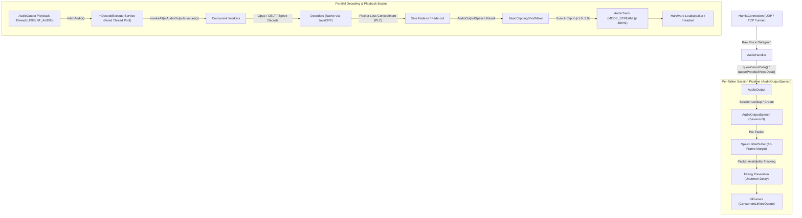

# Audio Output, Jitter & Mixing Pipeline

This document details the receiving, jitter buffering, decoding, mixing, and playback architecture in **Mumla OLED**.

---

## 1. Output Pipeline Overview

The audio playback subsystem is an asynchronous multi-user engine that receives encoded datagrams, buffers them against network jitter, parallelizes decoding across multi-core CPU threads, mixes audio from multiple talkers, and streams PCM to Android's `AudioTrack`.



---

## 2. Inbound Packet Dispatch (`AudioOutput.java`)

Implemented in [`AudioOutput.java`](file:///home/bualy/files/devel/mumla_dev/mumla-oled/libraries/humla/src/main/java/se/lublin/humla/audio/AudioOutput.java).

Audio packets arrive asynchronously over the network via two ingestion endpoints:
1. **[`queueVoiceData(byte[] data, HumlaUDPMessageType messageType)`](file:///home/bualy/files/devel/mumla_dev/mumla-oled/libraries/humla/src/main/java/se/lublin/humla/audio/AudioOutput.java#L207-L247)**: Legacy UDP format.
2. **[`queueProtobufVoiceData(MumbleUDP.Audio audioMsg)`](file:///home/bualy/files/devel/mumla_dev/mumla-oled/libraries/humla/src/main/java/se/lublin/humla/audio/AudioOutput.java#L249-L299)**: Mumble 1.4/1.5 Protobuf UDP format.

### Packet Ingestion Lifecycle
1. **Session Resolution & Mute Check:**
   Extracts the sender session ID. The listener queries [`getUser(session)`](file:///home/bualy/files/devel/mumla_dev/mumla-oled/libraries/humla/src/main/java/se/lublin/humla/audio/AudioOutput.java#L215). If the user is locally muted (`user.isLocalMuted()`), the packet is discarded immediately.
2. **Session Pipeline Creation / Swapping:**
   Under `mPacketLock`, `mAudioOutputs` is queried. If no pipeline exists for that session, or if the incoming packet uses a different codec than the existing pipeline, the old pipeline is destroyed and a new [`AudioOutputSpeech`](file:///home/bualy/files/devel/mumla_dev/mumla-oled/libraries/humla/src/main/java/se/lublin/humla/audio/AudioOutputSpeech.java) is initialized:
   ```java
   AudioOutputSpeech aop = mAudioOutputs.get(session);
   if (aop != null && aop.getCodec() != targetCodec) {
       aop.destroy();
       aop = null;
   }
   if (aop == null) {
       aop = new AudioOutputSpeech(user, targetCodec, mBufferSize, this);
       mAudioOutputs.put(session, aop);
   }
   ```
3. **Protobuf Adapter Framing:**
   Protobuf audio packets (`MumbleUDP.Audio`) provide raw Opus payload without legacy bitstream headers. `queueProtobufVoiceData` wraps the bytes into a legacy-compatible header format (`size` in lower 13 bits, bit 13 set for `isTerminator`) so the downstream jitter buffer and decoder can consume them identically.
4. **Playback Thread Wakeup:**
   If the playback thread is sleeping on silence, `queueVoiceData` pulses `mInactiveLock`:
   ```java
   synchronized (mInactiveLock) {
       mInactiveLock.notify();
   }
   ```

---

## 3. Jitter Buffering & Twang Prevention (`AudioOutputSpeech.java`)

Implemented in [`AudioOutputSpeech.java`](file:///home/bualy/files/devel/mumla_dev/mumla-oled/libraries/humla/src/main/java/se/lublin/humla/audio/AudioOutputSpeech.java).

Each active talker owns an independent instance of Speex's native jitter buffer (`Speex.JitterBuffer`).

### Buffer Initialization & Margin
- **Frame Granularity:** 480 samples (10ms).
- **Margin Configuration:**
  ```java
  mJitterBuffer = new Speex.JitterBuffer(AudioHandler.FRAME_SIZE);
  IntPointer margin = new IntPointer(1);
  margin.put(10 * AudioHandler.FRAME_SIZE); // 100ms margin
  mJitterBuffer.control(Speex.JitterBuffer.JITTER_BUFFER_SET_MARGIN, margin);
  ```

### Underrun Mitigation ("Twang" Prevention)
When network packets experience jitter, beginning playback immediately upon receiving the first packet often results in buffer underrun after 1–2 frames, producing a harsh metallic stutter or robotic "twang".

To eliminate this:
1. `AudioOutputSpeech` tracks the running average of available packets for each talker (`mUser.getAverageAvailable()`).
2. At the onset of speech (timestamp `ts == 0`):
   ```java
   int want = (int) Math.ceil(mUser.getAverageAvailable());
   if (availPackets < want) {
       mMissCount++;
       if (mMissCount < 20) {
           Arrays.fill(mOut, 0);
           System.arraycopy(mOut, 0, mBuffer, mBufferFilled, decodedSamples);
           mBufferFilled += decodedSamples;
           continue; // Wait for jitter buffer to accumulate desired packets
       }
   }
   ```
3. The average available packets is dynamically smoothed:
   - If `availPackets >= mUser.getAverageAvailable()`: `mUser.setAverageAvailable(availPackets)`
   - If less: `mUser.setAverageAvailable(mUser.getAverageAvailable() * 0.99f)`

---

## 4. Multi-Codec Decoding & Loss Concealment

Each [`AudioOutputSpeech`](file:///home/bualy/files/devel/mumla_dev/mumla-oled/libraries/humla/src/main/java/se/lublin/humla/audio/AudioOutputSpeech.java) instantiates a decoder conforming to [`IDecoder`](file:///home/bualy/files/devel/mumla_dev/mumla-oled/libraries/humla/src/main/java/se/lublin/humla/audio/IDecoder.java):

| Codec Message Type | Native Implementation | JavaCPP Wrapper Class | Typical Frame Sizes |
|---|---|---|---|
| `UDPVoiceOpus` | `libopus` (`jniopus`) | [`Opus.OpusDecoder`](file:///home/bualy/files/devel/mumla_dev/mumla-oled/libraries/humla/src/main/java/se/lublin/humla/audio/javacpp/Opus.java) | 10ms, 20ms, 40ms, 60ms @ 48kHz |
| `UDPVoiceCELTBeta` | `libcelt` 0.11.0 (`jnicelt11`) | [`CELT11.CELT11Decoder`](file:///home/bualy/files/devel/mumla_dev/mumla-oled/libraries/humla/src/main/java/se/lublin/humla/audio/javacpp/CELT11.java) | 10ms (480 samples) @ 48kHz |
| `UDPVoiceCELTAlpha` | `libcelt` 0.7.0 (`jnicelt7`) | [`CELT7.CELT7Decoder`](file:///home/bualy/files/devel/mumla_dev/mumla-oled/libraries/humla/src/main/java/se/lublin/humla/audio/javacpp/CELT7.java) | 10ms (480 samples) @ 48kHz |
| `UDPVoiceSpeex` | `libspeex` (`jnispeex`) | [`Speex.SpeexDecoder`](file:///home/bualy/files/devel/mumla_dev/mumla-oled/libraries/humla/src/main/java/se/lublin/humla/audio/javacpp/Speex.java) | Narrowband / Wideband |

### Packet Loss Concealment (PLC)
When the jitter buffer cannot supply a packet for the current tick (`mFrames.isEmpty()`), the pipeline invokes the decoder with a null buffer:
```java
decodedSamples = mDecoder.decodeFloat(null, 0, mOut, AudioHandler.FRAME_SIZE);
```
Both Opus and CELT utilize native PLC algorithms (interpolating pitch periods and extrapolating spectral envelopes) to smoothly fill packet loss gaps without audible clicks.

### Windowed Smooth Transitions (Fade-In / Fade-Out)
To prevent step-function DC pops when speech streams start or stop, decoded samples are windowed using quarter-sine curves across the 10ms frame (where $N = 480$ is `AudioHandler.FRAME_SIZE`):

```math
\begin{aligned}
\text{Fade-In } (ts = 0): \quad & w_{\text{in}}[i] = \sin\left(\frac{i \pi}{2 N}\right), \quad 0 \le i < N \\
\text{Fade-Out } (!\text{nextAlive}): \quad & w_{\text{out}}[i] = \sin\left(\frac{(N - 1 - i) \pi}{2 N}\right), \quad 0 \le i < N
\end{aligned}
```

In the code, these curves are precomputed into `mFadeIn` and `mFadeOut` arrays during initialization.

---

## 5. Parallel Multi-Core Decoding Pool

Implemented in [`AudioOutput.fetchAudio()`](file:///home/bualy/files/devel/mumla_dev/mumla-oled/libraries/humla/src/main/java/se/lublin/humla/audio/AudioOutput.java#L171-L205).

Decoding multiple concurrent voice streams sequentially on a single thread causes latency spikes and buffer underruns on mobile devices. Mumla parallelizes decoding across all available CPU cores using a fixed thread pool:
```java
mDecodeExecutorService = Executors.newFixedThreadPool(Runtime.getRuntime().availableProcessors());
```

### Execution Flow
1. During each buffer fill cycle, `AudioOutput` locks `mPacketLock`.
2. Submits all active talkers simultaneously:
   ```java
   List<Future<AudioOutputSpeech.Result>> futureResults =
           mDecodeExecutorService.invokeAll(mAudioOutputs.values());
   ```
3. Awaits completion:
   - If `result.isAlive()` is true: the talker's decoded floating-point buffer is added to the active mixer sources list.
   - If `result.isAlive()` is false: the talker has ceased speaking; the pipeline calls `speech.destroy()` and removes the session from `mAudioOutputs`.

---

## 6. Software Mixing & Playback

### Mixing Layer (`BasicClippingShortMixer.java`)
Implemented in [`BasicClippingShortMixer.java`](file:///home/bualy/files/devel/mumla_dev/mumla-oled/libraries/humla/src/main/java/se/lublin/humla/audio/BasicClippingShortMixer.java).

Active decoded float sources are combined into the target 16-bit short PCM buffer:
```java
for (int i = 0; i < bufferLength; i++) {
    float mix = 0;
    for (IAudioMixerSource<float[]> source : sources) {
        mix += source.getSamples()[i];
    }
    // Hard clip to [-1.0, 1.0]
    if (mix > 1.0f) mix = 1.0f;
    else if (mix < -1.0f) mix = -1.0f;
    buffer[i + bufferOffset] = (short) (mix * Short.MAX_VALUE);
}
```

### AudioTrack Streaming & Idle Power Optimization
The playback thread runs [`AudioOutput.run()`](file:///home/bualy/files/devel/mumla_dev/mumla-oled/libraries/humla/src/main/java/se/lublin/humla/audio/AudioOutput.java#L129-L162) with realtime priority (`THREAD_PRIORITY_URGENT_AUDIO`).

```java
while (mRunning) {
    if (fetchAudio(mix, 0, mBufferSize)) {
        mAudioTrack.write(mix, 0, mBufferSize);
    } else {
        // No active talkers: pause hardware track to conserve battery
        synchronized (mInactiveLock) {
            mAudioTrack.flush();
            mAudioTrack.pause();
            mInactiveLock.wait(); // Sleeps until queueVoiceData() receives packets
            mAudioTrack.play();
        }
    }
}
```
When no audio is playing, pausing and waiting on `mInactiveLock` shuts down audio DMA transfers and CPU wakeups, significantly conserving mobile battery life during quiet sessions.
