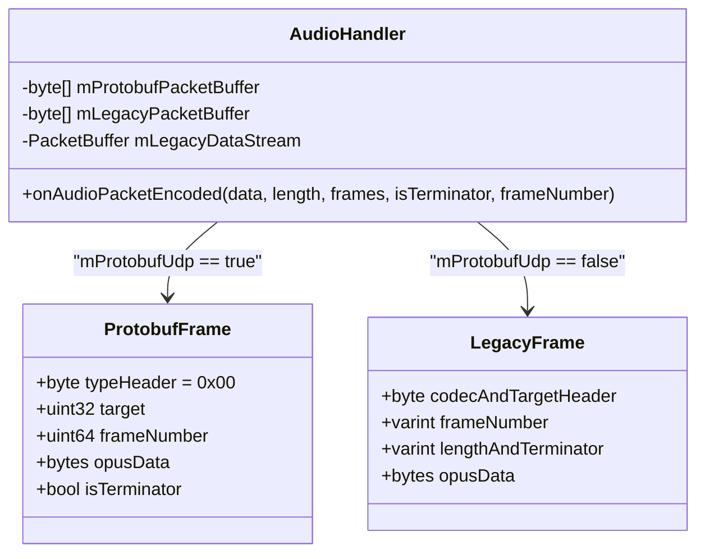
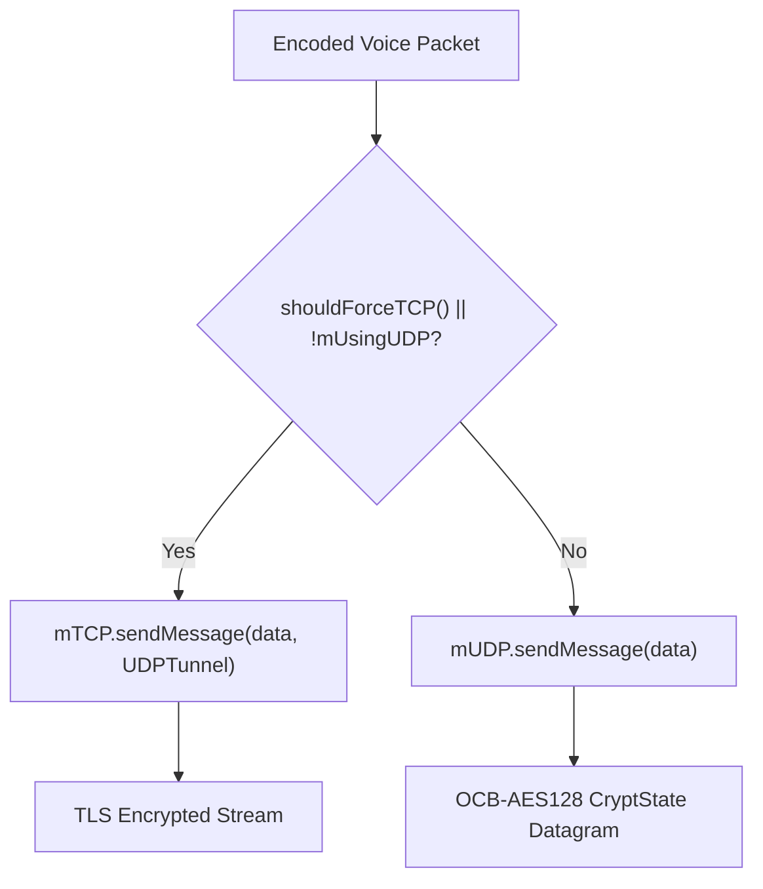

# Protocol Framing, Routing & Audio Control

This document details network packet serialization, transport tunneling, dynamic bandwidth negotiation, hardware stream routing, and acoustic feedback prevention in **Mumla OLED**.

---

## 1. Network Audio Framing Formats

Mumla supports two distinct Mumble voice packet framing protocols: modern **Protobuf UDP Audio** (Mumble 1.4/1.5+) and **Legacy Varint UDP Audio**.



### Modern Protobuf UDP Framing (`MumbleUDP.Audio`)
When connected to modern servers with Protobuf UDP negotiated (`mProtobufUdp == true`), voice packets are formatted using the schema defined in [`libraries/humla/src/MumbleUDP.proto`](file:///home/bualy/files/devel/mumla_dev/mumla-oled/libraries/humla/src/MumbleUDP.proto):

```protobuf
message Audio {
    optional uint32 target = 1;
    optional uint32 context = 2;
    optional uint32 sender_session = 3;
    optional uint64 frame_number = 4;
    optional bytes opus_data = 5;
    repeated float positional_data = 6;
    optional float volume_adjustment = 7;
    optional bool is_terminator = 8;
}
```

#### Serialization in `AudioHandler.java`
To prevent dynamic memory allocation, [`AudioHandler.onAudioPacketEncoded()`](file:///home/bualy/files/devel/mumla_dev/mumla-oled/libraries/humla/src/main/java/se/lublin/humla/protocol/AudioHandler.java#L396-L440) builds the message into a pre-allocated static buffer:
1. `mProtobufPacketBuffer[0] = 0x00`: Packet type `0x00` denotes `MumbleUDP.Audio` (type `0x01` denotes `MumbleUDP.Ping`).
2. Populates `target`, `frame_number`, `opus_data`, and `is_terminator`.
3. Serializes protobuf bytes directly following the type byte into `mProtobufPacketBuffer`.

---

### Legacy UDP Voice Framing
For older servers or when Protobuf UDP is not negotiated, Mumla uses Mumble's legacy datagram format:

1. **Header Byte (8 bits):**
   - Bits `[7..5]`: Codec Type (`UDPVoiceOpus = 4`, `UDPVoiceCELTBeta = 3`, `UDPVoiceCELTAlpha = 2`, `UDPVoiceSpeex = 0`).
   - Bits `[4..0]`: Target ID (`0` = normal channel speech, `1..31` = whisper target list).
2. **Sequence / Frame Counter (Varint):**
   Variable-length integer containing the monotonically increasing frame number.
3. **Payload Header (Varint):**
   - Bits `[0..12]`: Opus payload byte size ($< 8192\text{ bytes}$).
   - Bit `13` (`1 << 13`): Terminator flag (`isTerminator = true`).
4. **Opus Encoded Bytes:**
   Raw compressed audio bitstream.

---

### Variable-Length Integer Encoding (`PacketBuffer.java`)
Implemented in [`PacketBuffer.java`](file:///home/bualy/files/devel/mumla_dev/mumla-oled/libraries/humla/src/main/java/se/lublin/humla/net/PacketBuffer.java#L132-L250).

Mumble utilizes a custom variable-length integer encoding optimized for 64-bit quantities:

| Lead Byte Bits | Value Range | Encoded Size | Extraction Bitmask / Formula |
|---|---|---|---|
| `0xxxxxxx` | $0 \dots 127$ | 1 byte | $v \ \& \ 0x7F$ |
| `10xxxxxx` | $128 \dots 16383$ | 2 bytes | $((v \ \& \ 0x3F) \ll 8) \mid \text{byte}_1$ |
| `110xxxxx` | $16384 \dots 2097151$ | 3 bytes | $((v \ \& \ 0x1F) \ll 16) \mid (\text{byte}_1 \ll 8) \mid \text{byte}_2$ |
| `1110xxxx` | $2097152 \dots 268435455$ | 4 bytes | $((v \ \& \ 0x0F) \ll 24) \mid \dots \mid \text{byte}_3$ |
| `11110000` | $0 \dots 2^{32}-1$ | 5 bytes | 32-bit big-endian integer following lead byte `0xF0` |
| `11110100` | $0 \dots 2^{64}-1$ | 9 bytes | 64-bit big-endian integer following lead byte `0xF4` |
| `11111000` | Negative integer | Recursive | Recursive `readLong()`, bitwise inverted ($\sim i$) |
| `111111xx` | Negative $-1 \dots -4$ | 1 byte | Inverted two lower bits: $\sim(v \ \& \ 0x03)$ |

---

## 2. Transport & Fallback Tunneling (`HumlaConnection.java`)

Implemented in [`HumlaConnection.java`](file:///home/bualy/files/devel/mumla_dev/mumla-oled/libraries/humla/src/main/java/se/lublin/humla/net/HumlaConnection.java).



### Datagram Path (Primary)
- Voice packets are encrypted via [`CryptState.java`](file:///home/bualy/files/devel/mumla_dev/mumla-oled/libraries/humla/src/main/java/se/lublin/humla/net/CryptState.java) using OCB-AES128 with client/server nonce synchronization.
- Transmitted over connectionless UDP sockets via [`HumlaUDP.java`](file:///home/bualy/files/devel/mumla_dev/mumla-oled/libraries/humla/src/main/java/se/lublin/humla/net/HumlaUDP.java).

### TCP Fallback & Tunneling (`UDPTunnel`)
1. **Network Liveness Detection:**
   [`HumlaConnection.java`](file:///home/bualy/files/devel/mumla_dev/mumla-oled/libraries/humla/src/main/java/se/lublin/humla/net/HumlaConnection.java#L305-L320) sends regular UDP pings. If no UDP ping responses are received from the server within the timeout window, `mUsingUDP` transitions to `false`.
2. **Encapsulation:**
   When UDP fails, or when the user enables **Force TCP** in settings, [`sendUDPMessage()`](file:///home/bualy/files/devel/mumla_dev/mumla-oled/libraries/humla/src/main/java/se/lublin/humla/net/HumlaConnection.java#L608-L620) encapsulates the exact voice datagram into a TCP frame tagged with `HumlaTCPMessageType.UDPTunnel` over the TLS connection.
3. **Protocol Workarounds:**
   For legacy Mumble servers (`mServerVersion == 0x10202`), an explicit codec workaround bitmask is applied to prevent connection drops.

---

## 3. Dynamic Bandwidth Negotiation

Implemented in [`AudioHandler.setMaxBandwidth()`](file:///home/bualy/files/devel/mumla_dev/mumla-oled/libraries/humla/src/main/java/se/lublin/humla/protocol/AudioHandler.java#L250-L282).

Mumble servers enforce maximum allowed client bandwidth in the `ServerSync` protocol message (`max_bandwidth` in bits per second).

### Bandwidth Calculation Formula
Total transmission bandwidth includes codec payload and network overhead:
$$\text{packetsPerSecond} = \frac{100}{\text{framesPerPacket}}$$
$$\text{overheadBps} = \text{packetsPerSecond} \times 8 \times (\text{IP\_UDP\_OVERHEAD} + \text{MUMBLE\_HEADER\_OVERHEAD})$$
$$\text{totalBandwidth} = \text{codecBitrate} + \text{overheadBps}$$

### Adaptation Algorithm
When the calculated bandwidth exceeds `maxBandwidth`:
1. **Increase Frames Per Packet (Packet Coalescing):**
   Coalescing multiple 10ms frames into larger packets drastically reduces IP/UDP/Mumble header overhead:
   - If `maxBandwidth <= 32000 bps`: Increase `framesPerPacket` up to 4 (40ms).
   - If `maxBandwidth <= 48000 bps`: Increase `framesPerPacket` up to 4 (40ms).
   - If `maxBandwidth <= 64000 bps` and `fpp == 1`: Increase `framesPerPacket` to 2 (20ms).
2. **Bitrate Throttling:**
   While total bandwidth still exceeds `maxBandwidth` and `bitrate > 8000 bps`, the algorithm decrements bitrate by $1000\text{ bps}$ per step.
3. **Engine Reconfiguration:**
   Updates the native C++ engine dynamically without interrupting audio capture:
   ```java
   mNativeEngine.setBitrate(mBitrate);
   mNativeEngine.setFramesPerPacket(mFramesPerPacket);
   ```

---

## 4. Hardware Audio Routing & Acoustic Feedback Prevention

### Audio Stream & Source Mapping
Audio routing modes are configured between [`Settings.java`](file:///home/bualy/files/devel/mumla_dev/mumla-oled/app/src/main/java/se/lublin/mumla/Settings.java), [`ServerConnectTask.java`](file:///home/bualy/files/devel/mumla_dev/mumla-oled/app/src/main/java/se/lublin/mumla/app/ServerConnectTask.java), and [`MumlaService.java`](file:///home/bualy/files/devel/mumla_dev/mumla-oled/app/src/main/java/se/lublin/mumla/service/MumlaService.java):

| Operational Mode | Android Audio Stream (`AudioTrack`) | Audio Capture Source (`AudioRecord`) | Proximity Sensor State |
|---|---|---|---|
| **Loudspeaker Mode** (Default) | `AudioManager.STREAM_MUSIC` | `MediaRecorder.AudioSource.MIC` | Disabled |
| **Handset Mode** | `AudioManager.STREAM_VOICE_CALL` | `MediaRecorder.AudioSource.DEFAULT` | Enabled (turns screen off near ear) |

### Half-Duplex Transmission (Acoustic Loop Prevention)
Implemented in [`AudioHandler.onTalkingStateChanged()`](file:///home/bualy/files/devel/mumla_dev/mumla-oled/libraries/humla/src/main/java/se/lublin/humla/protocol/AudioHandler.java#L443-L454).

When communicating over speakerphone without headset hardware, sound from the phone's speaker feeds directly back into the microphone, creating an acoustic feedback howling loop.

In Push-To-Talk mode, Mumla provides **Half-Duplex mode**:
```java
if (mHalfDuplex) {
    mAudioManager.setStreamMute(getAudioStream(), isTalking);
}
```
Whenever the user presses the PTT button to transmit, incoming playback audio is muted at the OS level. Releasing the PTT button immediately un-mutes playback audio.

---

## 5. Codec Compatibility Matrix

| Codec | Bitstream Identifier | Encoding Support | Decoding Support | Operational Status & Notes |
|---|---|---|---|---|
| **Opus** | `UDPVoiceOpus` (`0x04`) | **Yes** (Native C++ Hard CBR) | **Yes** (Native via JavaCPP) | **Primary production codec.** Mandatory for all modern servers. |
| **CELT 0.7.0** | `UDPVoiceCELTAlpha` (`0x02`) | No (Deprecated) | **Yes** (Native via JavaCPP) | Backward compatibility for legacy Mumble 1.2.x servers. |
| **CELT 0.11.0** | `UDPVoiceCELTBeta` (`0x03`) | No (Deprecated) | Disabled in auth | Submodule built (`libjnicelt11.so`), but commented out in `HumlaService` auth due to historical "robot voice" decoding bug (see [`broken-features/celt-11-robot-voices-disabled.md`](file:///home/bualy/files/devel/mumla_dev/mumla-oled/docs/broken-features/celt-11-robot-voices-disabled.md)). |
| **Speex** | `UDPVoiceSpeex` (`0x00`) | No (Deprecated) | **Yes** (Native via JavaCPP) | Legacy fallback. `libspeex` also provides the native `JitterBuffer` implementation used across all incoming audio streams. |
