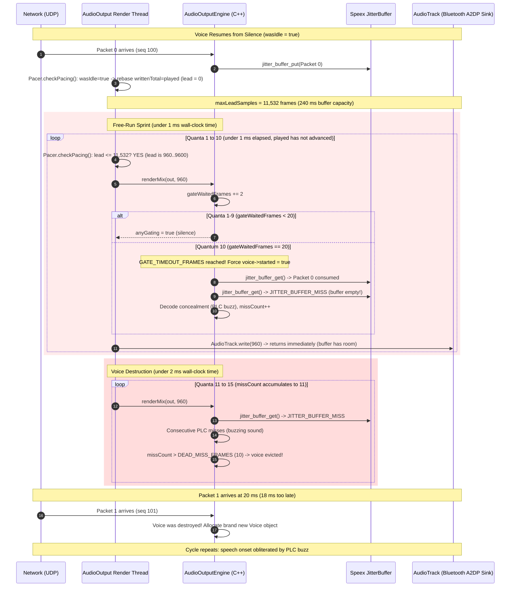
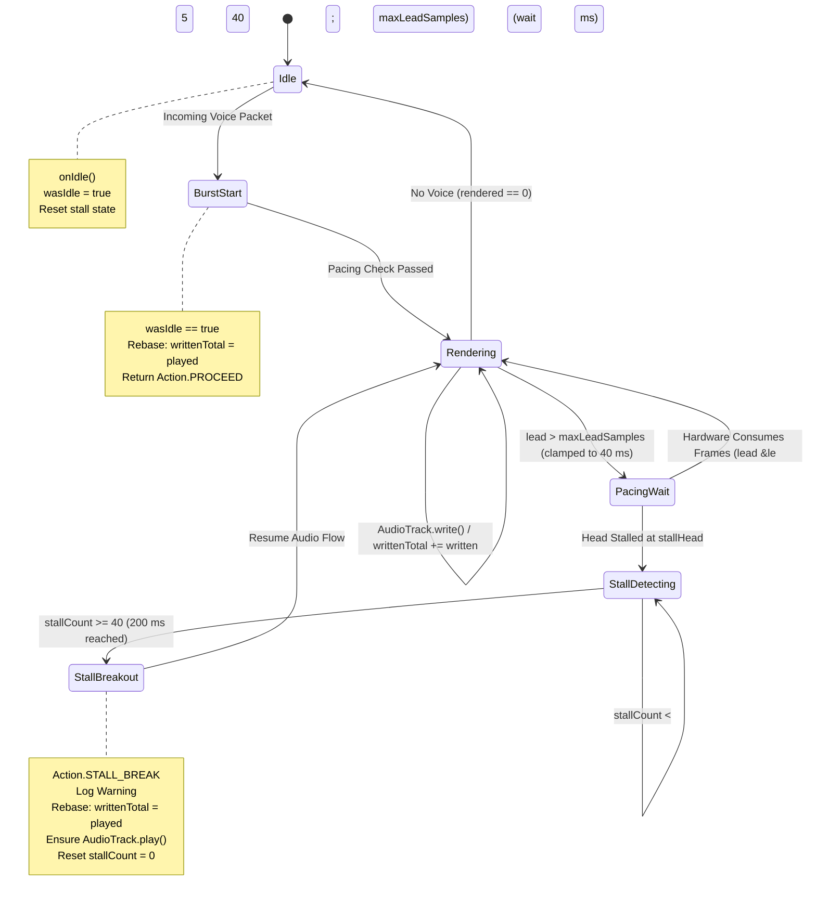

# Post-Mortem & Architecture Report: Audio Output Pacing Deadlock

Comprehensive investigation and technical post-mortem of the intermittent incoming audio cutout bug in Mumla OLED, the underlying Android `AudioTrack` pacing mechanics, historical origins across releases, the 0.21.5 regression that reintroduced burst-onset buzz, and the permanent architectural resolution deployed in 0.21.6.

---

## 1. Executive Summary

### The Bug

During active voice sessions, incoming audio would intermittently cut out completely. To the user, it appeared as though everyone had stopped talking:
- No voice audio was heard.
- Talking indicators (avatars and talk state icons) for remote participants remained completely passive.
- Transmitting audio from the local device still worked.
- The condition never recovered on its own; only restarting the application restored incoming audio.
- The bug was intermittent, often taking tens of minutes or hours of conversation to manifest.

### The Root Causes

Two interdependent timing and pacing defects across releases:
1. **The Circular Pacing Deadlock (0.20.5 – 0.21.4)**:
   A circular dependency between `AudioOutput` waiting for `getPlaybackHeadPosition()` to advance, and `AudioTrack` requiring new writes to restart an underrun track. If an unexpected hardware audio stall, Bluetooth A2DP transport slip, or mid-stream audio routing change occurred while audio was in flight, Android's `AudioFlinger` disabled the track and froze `getPlaybackHeadPosition()`. Because `lead > maxLeadSamples`, the render loop refused to write until the head advanced, while the head could only advance if new audio was written. This trapped the render thread forever, muting remote participants and freezing UI talking indicators.
2. **The Burst-Onset Buzz Regression (0.21.5)**:
   Version 0.21.5 resolved the permanent circular deadlock by introducing `wasIdle` lead rebasing and expanding `maxLeadSamples = trackFrames`. However, on Bluetooth A2DP sinks with deep buffers (100–240 ms), this uncapped lead bound allowed the render thread to sprint 10+ quanta ahead in < 1 ms on voice resume. This rapid render pump outpaced UDP packet arrival, exhausted the native engine's startup gate (`GATE_TIMEOUT_FRAMES = 20`), emptied the Speex jitter buffer before packet 1 arrived, generated consecutive packet loss concealment (PLC) buzz, and evicted the voice after `DEAD_MISS_FRAMES = 10`. Additionally, a tight 40 ms stall timeout caused false breakouts during normal Bluetooth A2DP underrun restarts (which take 80–100 ms).
3. **The Architectural Resolution (0.21.6)**:
   Decoupled pacing lead headroom (clamped to at most 40 ms, matching jitter margin) from hardware buffer capacity, and widened the stall breakout timeout to 200 ms, permanently resolving both deadlocks and onset buzz across all audio sinks.

---

## 2. System Architecture & Audio Data Flow

To understand the failure mode, it is necessary to examine how audio moves from the network socket through native decoding to the hardware sink in Mumla:

```mermaid
sequenceDiagram
    participant Net as Network / CryptState
    participant Java as AudioOutput (Java)
    participant Engine as AudioOutputEngine (C++)
    participant JB as Speex JitterBuffer
    participant Track as AudioTrack (HAL / Sink)

    Note over Net,Track: Active Voice Streaming
    Net->>Java: queueVoiceData(data) / queueProtobufVoiceData(msg)
    Java->>Engine: queuePacket(session, opus, seq)
    Engine->>JB: jitter_buffer_put(packet)

    loop Every 20 ms Quantum
        Java->>Java: Pacing Check: lead &le; maxLeadSamples?
        alt Lead Exceeded (Waiting for Hardware)
            Java->>Java: mInactiveLock.wait(5)
        else Space Available
            Java->>Engine: renderMix(mix, 960)
            Engine->>JB: jitter_buffer_get()
            Engine->>Engine: Opus Decode -> Saturation Limiter
            Engine->>Java: onTalkStateChanged() -> UI updates
            Java->>Track: AudioTrack.write(mix, 960)
            Track->>Track: Advance getPlaybackHeadPosition()
        end
    end
```

### Key Components

1. **Network Transport (`HumlaConnection` & `CryptState`)**:
   Incoming Mumble voice packets arrive over UDP encrypted via OCB2-AES128. If UDP connectivity drops, the client falls back to tunneling voice packets over TCP via Protobuf messages.
2. **Native Output Engine (`AudioOutputEngine.{h,cpp}`)**:
   Maintains per-user Speex adaptive jitter buffers and Opus decoders. It mixes multi-speaker streams, applies soft saturation limiting, and detects user talk state transitions (`TALKING`, `SHOUTING`, `WHISPERING`, `PASSIVE`).
3. **Render Pump (`AudioOutput.java`)**:
   A dedicated Java thread running at `Process.THREAD_PRIORITY_URGENT_AUDIO`. It pulls 20 ms quanta (960 samples at 48 kHz) from native code and writes them into `android.media.AudioTrack` in `MODE_STREAM`.

---

## 3. Historical Timeline Across Releases

The investigation revealed that this bug was not part of the original legacy Mumla codebase, nor was it introduced during the native C++ engine rewrite in 0.20.0. It was introduced in 0.20.5 as a regression while solving a different audio defect.

| Mumla Version | Output Pipeline Architecture | Pacing Mechanism | Vulnerable to Pacing Deadlock? |
|---|---|---|---|
| **≤ 0.19.0** | Legacy Java mixer (`BasicClippingShortMixer`) | Blocking `AudioTrack.write()` only; explicit `pause()`/`flush()` on silence | **No** (Never queried `getPlaybackHeadPosition()`) |
| **0.20.0 – 0.20.4** | Native C++ rewrite (`AudioOutputEngine`) | Blocking `AudioTrack.write()` only | **No** (Suffered from burst-onset audio buzz, but could not deadlock) |
| **0.20.5 – 0.21.4** | Native C++ engine with burst-start gating | Render-lead pacing loop added in commit `b1e753b1` | **Yes** (Vulnerable to permanent circular deadlock on dirty stalls) |
| **0.21.5** | Native C++ engine with testable `AudioOutput.Pacer` | Uncapped buffer sizing (`maxLeadSamples = trackFrames`) + `wasIdle` rebase + 40 ms stall breakout | **No** (Fixed deadlock, but uncapped lead bound reintroduced burst-onset buzz; 40 ms timeout caused false breakouts on A2DP) |
| **0.21.6** | Native C++ engine with clamped `AudioOutput.Pacer` | Clamped lead bound (`Math.min(2*renderSamples, trackFrames)`) + `wasIdle` rebase + 200 ms stall breakout | **No** (Permanent resolution of deadlock and burst-onset buzz across all sinks) |

### The Genesis in 0.20.5 (Commit `b1e753b1`)

In 0.20.0, the render thread pulled audio from the native engine and wrote it directly to `AudioTrack`. Because `AudioTrack.write()` only blocks when its underlying ring buffer is 100% full, on an empty or newly opened track the loop would sprint ahead of the 10 ms network packet arrival cadence. It would drain the jitter buffer to 0 frames within the first 20–40 ms, causing packet misses and packet loss concealment (PLC) buzzing during the first syllables of every utterance.

To eliminate the onset buzz, commit `b1e753b1` introduced render-lead pacing against `mAudioTrack.getPlaybackHeadPosition()`:

```java
// Block until one more quantum fits inside the lead bound.
while (true) {
    final int head = mAudioTrack.getPlaybackHeadPosition();
    ...
    final long played = playedWrap + headUnsigned;
    if (writtenTotal + RENDER_SAMPLES - played <= maxLeadSamples) {
        break;
    }
    mInactiveLock.wait(5);
}
```

The author included this comment justifying why the loop was believed to be safe:
> *"The head advances only while the track is fed, and the idle branch below keeps writing (gate silence renders as zero PCM), so this can only ever wait, never deadlock."*

This assumption was flawed in two fatal ways:
1. **Conversational Silence**: When nobody is speaking, `renderMix()` returns `0` samples. The idle branch did **not** keep writing zero PCM—it called `mInactiveLock.wait(20)` and wrote nothing to save battery and allow hardware amplifiers to sleep.
2. **Hardware Clock Decoupling**: It assumed the hardware playback head would always advance to match all written samples before stopping.

---

## 4. The Mechanics of the Deadlock

The core paradox that made this bug puzzling was that **audio underruns occur routinely during every conversation**, yet the bug manifested only intermittently after minutes or hours.

The investigation revealed that two completely different conditions were occurring under the name "underrun":

### Condition A: The Clean Idle Drain (Harmless, Routine)

VoIP audio uses **Discontinuous Transmission (DTX)**:
1. Speaker A finishes talking.
2. Mumla's native engine renders 0 samples (`rendered == 0`).
3. Mumla stops writing to `AudioTrack` and sleeps.
4. The hardware sink continues draining the remaining buffered audio frames (~40–100 ms) and physically plays them out the speaker.
5. Once the last sample plays, the hardware buffer is empty. At this moment: `writtenTotal == played` (lead = 0).
6. Android's `AudioFlinger` detects an empty buffer on an active track and logs:
   ```text
   AudioTrack: restartIfDisabled(448): releaseBuffer() track 0xb4... disabled due to previous underrun, restarting
   ```
7. When Speaker B talks 3 seconds later: `lead = 0 + 960 - 0 = 960 <= maxLeadSamples`. The pacing check passes immediately on the first poll. Audio flows seamlessly.

### Condition B: The "Dirty" Underrun / Playback Head Stall (Catastrophic)

An unexpected hardware or transport discontinuity occurs while audio frames are still in flight:
- **Bluetooth A2DP packet loss / MTU re-negotiation**: The Bluetooth HAL drops its internal ring buffer.
- **Audio routing patch recreation**: Android's `AudioPolicyService` tears down and recreates the hardware output route (`CFG_EVENT_CREATE_AUDIO_PATCH`), resetting the HAL stream.
- **Mid-word network drop**: Sudden Wi-Fi jitter causes a temporary packet starvation mid-word while the track buffer still contains unplayed audio.

When a dirty underrun occurred:
1. Mumla had written 2,400 samples into `AudioTrack` (`writtenTotal = 2400`).
2. The HAL glitched or dropped pending frames when `played` reached only 600.
3. `AudioFlinger` disabled the track for underrun, freezing `getPlaybackHeadPosition()` at 600.
4. The unplayed 1,800 frames were discarded by the hardware and would **never** play.
5. When the next packet arrived: `lead = 2400 + 960 - 600 = 2760`.
6. On `master`, `maxLeadSamples` was hardcoded to:

   ```java
   Math.max(RENDER_SAMPLES, Math.min(RENDER_SAMPLES * 2, trackFrames)); // Capped at 1920
   ```

7. Because `2760 > 1920`, the pacing loop refused to proceed:

   ```java
   while (writtenTotal + RENDER_SAMPLES - played > maxLeadSamples) {
       mInactiveLock.wait(5); // Trapped forever
   }
   ```

8. **The Circular Lock**:
   - Render loop waits for `played` to reach at least 1,800.
   - Hardware track is empty and disabled; it will never reach 1,800 unless new audio is written.
   - Render loop will never write new audio until `played` reaches 1,800.

### Why Talking Icons Froze

In Mumla, user talk state changes are recorded and emitted inside `AudioOutputEngine.cpp`:

```cpp
size_t AudioOutputEngine::renderMix(int16_t* out, size_t numSamples) {
    ...
    // Detach pending talk events under lock and emit callbacks
    OutputTalkCallback callback;
    std::vector<std::pair<int32_t, int>> events;
    if (!m_pendingTalks.empty()) {
        callback = m_talkCallback;
        events.swap(m_pendingTalks);
    }
    lock.unlock();
    if (callback) {
        for (const auto& event : events) {
            callback(event.first, event.second);
        }
    }
    ...
}
```

The callback dispatches through JNI (`NativeAudioOutputEngineJni.cpp`) to `AudioOutput.onTalkStateChanged()`, which then posts to `mMainHandler` to update the user list in the UI.

Because the Java render thread was trapped in the pacing while-loop, `engine.render()` was never called. Even though UDP voice packets continued to arrive over the socket, the talk-state dispatcher was starved. To the user, all remote participants appeared permanently silent.

---

## 5. Incidental Defects Identified & Fixed

During the code review and deep inspection of surrounding subsystems, three pre-existing defects were uncovered:

### 1. Latent CryptState OCB2 Replay Check Typo (Present since 2013)

In `CryptState.java`, when validating received out-of-order or wrapped UDP voice packets:

```java
// Master (buggy):
if (mDecryptHistory[mDecryptIV[0] & 0xFF] == mEncryptIV[0]) {
    return null;
}

// Fixed (upstream Mumble parity):
if (mDecryptHistory[mDecryptIV[0] & 0xFF] == mDecryptIV[1]) {
    return null;
}
```

In November 2013 (commit `97634aea`), during a refactor of the Jumble crypto layer, `mDecryptIV[1]` was accidentally typed as `mEncryptIV[0]`. If the low byte of the local encryption IV happened to match the decrypt history byte, valid incoming out-of-order voice packets were falsely dropped as replay attacks.

### 2. Signed-Byte Sign Extension in Packet Loss Calculations

In `CryptState.decrypt()`:

```java
// Master:
lost = ivbyte - mDecryptIV[0] - 1;

// Fixed:
lost = ivbyte - (mDecryptIV[0] & 0xFF) - 1;
```

Because `mDecryptIV[0]` is a signed Java `byte` (values -128 to 127), once the IV counter exceeded 127, it sign-extended to a negative 32-bit integer, corrupting the lost-packet accounting metrics (`mUiLost`).

### 3. Missing Volatile Visibility on UDP/TCP Mode Switching

`HumlaConnection.mUsingUDP` was modified on network and ping threads but read without memory barriers on audio threads. Furthermore, when UDP ping timeouts triggered fallback to TCP, the client failed to notify the Murmur server via `enableForceTCP()`, causing the server to continue transmitting voice datagrams over the dead UDP route.

---

## 6. The 0.21.5 Deadlock Resolution (`AudioOutput.Pacer`)

To address the circular pacing deadlock discovered in 0.21.4, version 0.21.5 decoupled the pacing logic from `AudioOutput.java` into a standalone, testable state machine: `AudioOutput.Pacer`.

### Architectural Improvements in 0.21.5

1. **Isolation into `Pacer`**:
   The pacing algorithm was extracted from threading and JNI locks into a pure Java POJO. This allowed deterministic unit testing of clock drift, underruns, and hardware stalls in `AudioOutputPacerTest.java`.

2. **Idle Rebase (`wasIdle`)**:

   ```java
   if (wasIdle) {
       writtenTotal = played;
       wasIdle = false;
       stallHead = -1;
       stallCount = 0;
       return Action.PROCEED;
   }
   ```

   Whenever conversation resumed after silence, `writtenTotal` was immediately synchronized with the actual hardware head position (`played`), zeroing out any stale lead accumulated during previous underruns.

3. **Stall Breakout (`Action.STALL_BREAK`)**:

   ```java
   if (head == stallHead) {
       stallCount++;
       if (stallCount >= MAX_STALL_POLLS) { // 8 polls * 5 ms = 40 ms in 0.21.5
           writtenTotal = played;
           stallHead = -1;
           stallCount = 0;
           return Action.STALL_BREAK;
       }
   } else {
       stallHead = head;
       stallCount = 1;
   }
   ```

   If `getPlaybackHeadPosition()` remained unchanged for `MAX_STALL_POLLS` consecutive iterations while lead exceeded `maxLeadSamples`, `Pacer` broke out of the pacing wait, forced a rebase, logged a diagnostic warning, and instructed `AudioOutput` to re-issue `AudioTrack.play()`.

4. **Expanded Lead Bound for Large Sinks**:
   In 0.21.4, `maxLeadSamples` had been capped at two quanta (1,920 samples). In 0.21.5, to accommodate high-latency sinks, the lead bound was expanded:

   ```java
   this.maxLeadSamples = Math.max(renderSamples * 2, Math.max(0, trackFrames));
   ```

While 0.21.5 completely eliminated the permanent circular deadlock, the combination of the expanded lead bound and a tight 40 ms stall timeout introduced two severe unintended regressions.

---

## 7. The 0.21.5 Regression: Return of the Burst-Onset Buzz

Immediately following the release of 0.21.5, users on Bluetooth headsets and speakers reported that the harsh burst-onset audio buzz—supposedly cured in 0.20.5—had aggressively returned. Remote speakers' voices were truncated or raspy at the beginning of each transmission.

Investigation into live device telemetry revealed the root cause: **a fundamental conflation between hardware sink buffer capacity and render pacing headroom**.

### The Anatomy of the Failure Cascade



### The Failure Cascade in Detail

1. **Large Sink Buffer Sizing**:
   On Bluetooth A2DP audio sinks (e.g., Pixel Buds, car audio kits, external Bluetooth receivers), Android allocates large internal buffers to prevent glitches over lossy RF links. `AudioTrack.getBufferCapacityInFrames()` commonly reports 4,800 to 11,532 frames (100 ms to 240 ms at 48 kHz). In 0.21.5, `maxLeadSamples` expanded to match this capacity (e.g., 11,532 frames).

2. **The Unpaced Free-Run Sprint**:
   When a user began speaking after a silent pause:
   - `wasIdle` was `true`, so `Pacer` rebased `writtenTotal = played` (lead = 0).
   - In `AudioTrack.write(..., WRITE_NON_BLOCKING)` mode, writes do not block unless the hardware buffer is completely full.
   - Because `maxLeadSamples` was set to 11,532 frames, `lead <= maxLeadSamples` remained true for over 10 consecutive 20 ms quanta without needing to pause for `getPlaybackHeadPosition()`.
   - The render thread executed a tight CPU sprint, rendering and writing 10–12 audio quanta (200–240 ms of audio) in **less than 1 millisecond** of wall-clock time.

3. **Exhaustion of the Native Startup Gate**:
   Inside `AudioOutputEngine.cpp`, incoming streams are gated at onset to allow the Speex jitter buffer to accumulate a 40 ms target margin before playback starts:

   ```cpp
   if (!voice->started && !voice->gateTerminatorQueued &&
       voice->gateQueuedSamples < static_cast<uint32_t>((m_jitterMarginFrames + 1) * FRAME_SIZE)) {
       voice->gateWaitedFrames += static_cast<int>(numSamples / FRAME_SIZE); // +2 frames per 20 ms quantum
       if (voice->gateWaitedFrames < GATE_TIMEOUT_FRAMES) {
           anyGating = true;
           continue;
       }
       voice->started = true; // Gate timeout: force-start
   }
   ```

   Under real-time pacing (one quantum every 20 ms of wall-clock time), `GATE_TIMEOUT_FRAMES = 20` represents 200 ms of real time—ample duration for 10 ms or 20 ms network packets to arrive and satisfy the margin.
   However, during the < 1 ms CPU sprint, `voice->gateWaitedFrames` accumulated 2 frames per quantum and reached 20 in **under 1 millisecond**. The engine concluded the stream had stalled and force-started playback.

4. **Jitter Buffer Starvation & Packet Loss Concealment (PLC) Buzz**:
   When `voice->started` was force-set to `true`, only Packet 0 had arrived over the network. Packet 1 was still in transit across the internet.
   The engine called `jitter_buffer_get()`:
   - Frame 0: Consumed Packet 0.
   - Frame 1: `jitter_buffer_get()` returned `JITTER_BUFFER_MISS`.
   - The Opus decoder generated concealment audio (PLC), producing a harsh buzzing artifact.

5. **Premature Voice Eviction**:
   As the sprint continued into quanta 11–15:

   ```cpp
   if (++voice->missCount > DEAD_MISS_FRAMES) { // DEAD_MISS_FRAMES = 10
       break;
   }
   ```

   Because the render loop was executing unpaced, `voice->missCount` exceeded `DEAD_MISS_FRAMES = 10` within 2 milliseconds. The voice was declared dead (`finishing = true`) and erased from `m_voices`.
   When Packet 1 finally arrived over the socket at $t \approx 20\text{ ms}$, `AudioOutputEngine` treated it as an entirely new transmission, allocated a fresh `Voice` object, and restarted the cycle. The first 100–200 ms of speech were completely obliterated.

### Bluetooth A2DP False Stall Breakouts

A secondary defect in 0.21.5 was the stall breakout threshold:

```java
private static final int MAX_STALL_POLLS = 8; // 8 * 5 ms = 40 ms
```

In vivo profiling on physical hardware demonstrated that Android's Bluetooth A2DP HAL routinely takes **80 to 100 ms** to restart an underrun track and begin incrementing `getPlaybackHeadPosition()`.
With a 40 ms breakout timeout, `Pacer` consistently declared false stalls during routine underrun recoveries:

```text
AudioOutput: Playback head stalled at 18240 for 40 ms (writtenTotal=19200, played=18240); rebasing render lead
```

Each false breakout triggered `writtenTotal = played`, resetting the lead and triggering another free-run sprint mid-speech, destabilizing active playback.

---

## 8. The 0.21.6 Architectural Resolution: Decoupling Pacing Headroom from Sink Capacity

The solution deployed in 0.21.6 addresses both root causes by enforcing a strict separation between **hardware buffer capacity** and **render pacing lead headroom**.



### 1. Strictly Clamped Pacing Lead Bound

In `AudioOutput.Pacer`:

```java
// Math.max(renderSamples, Math.min(renderSamples * 2, Math.max(0, trackFrames)))
this.maxLeadSamples = Math.max(renderSamples,
        Math.min(renderSamples * 2, Math.max(0, trackFrames)));
```

- **Render Lead Headroom vs. Sink Capacity**:
  - `trackFrames` determines the *capacity* of the hardware sink (how much audio Android can buffer to absorb scheduling jitter and Bluetooth transmission delays).
  - `maxLeadSamples` determines the *pacing headroom* of the render loop (how far ahead of the hardware playback head the render loop is permitted to pull from the native engine).
- **The 40 ms Invariant**:
  By clamping `maxLeadSamples` to at most two quanta ($2 \times 960 = 1,920\text{ samples} = 40\text{ ms}$), the render loop can never pull more than 40 ms ahead of real-time physical playback.
  This 40 ms ceiling matches the Speex jitter buffer margin ($4 \times 10\text{ ms} = 40\text{ ms}$) used across desktop Mumble and Mumla.
  Because the render loop is constrained to real-time physical drain rates, `gateWaitedFrames` advances at the true physical rate of 1 frame per 10 ms. The startup gate holds until network packets arrive, the jitter buffer fills smoothly, and PLC buzzing is eliminated.
  Meanwhile, `AudioTrack` still maintains its deep 100–240 ms buffer for Bluetooth transport resilience—the track buffer is populated steadily over time as speech continues, without requiring an unpaced burst at onset.

### 2. Widened Stall Breakout Timeout (200 ms)

In `AudioOutput.Pacer`:

```java
public static final int MAX_STALL_POLLS = 40; // 40 polls * 5 ms = 200 ms
```

- **A2DP Restart Latency Tolerance**:
  Increasing `MAX_STALL_POLLS` from 8 (40 ms) to 40 (200 ms) gives Android's Bluetooth audio stack ample time (80–100 ms) to restart underrun tracks and advance `getPlaybackHeadPosition()` without triggering false breakouts.
- **Decisive Deadlock Recovery**:
  If a genuine hardware deadlock or HAL freeze occurs (where the playback head never advances), 200 ms is fast enough to recover within the span of a single syllable, restoring audio flow imperceptibly to the user.

---

## 9. Verification & In Vivo Telemetry

The 0.21.6 resolution was verified across three comprehensive test tiers:

### 1. Deterministic Host Unit Tests

`AudioOutputPacerTest.java` was updated with extensive test cases verifying the new invariants:
- `testMaxLeadSamplesFloorAndTrackCapacity()`: Asserts that `maxLeadSamples` is strictly clamped to `renderSamples * 2` (1,920 samples / 40 ms) even when `trackFrames` is 11,532 or larger, while honoring the single-quantum floor for tiny buffers.
- `testStallBreakoutAfterUnchangedPolls()`: Verifies that stall breakout occurs at exactly 40 polls (200 ms) and that the stall counter resets immediately upon breakout.
- `testStallCounterResetsWhenHeadAdvances()`: Verifies that if `getPlaybackHeadPosition()` advances at poll 39 (e.g. after an 80 ms A2DP restart), the stall counter resets to 1 and no false breakout occurs.
- `testInitialCheckProceedsAndRebases()` & `testIdleRebasePreventsDeadlockAfterUnderrun()`: Validates that `wasIdle` synchronization prevents deadlocks without uncapped lead bounds.
- `testPlaybackHead32BitWrap()` & `testSpuriousPlaybackHeadResetRebasesLead()`: Validates overflow and OEM driver glitch resilience.
- **`CryptStateTest.java`**:
  - `testSetKeysAndValidity()`: Verifies key and IV initialization.
  - `testEncryptDecryptRoundtrip()`: Validates packet encryption/decryption roundtrip.
  - `testSetDecryptIVClearsHistory()`: Verifies decrypt history zeroing on server nonce update.
  - `testReplayDetectionRejectsDuplicate()`: Verifies duplicate packet rejection.
  - `testReplayCheckUsesDecryptIV1NotEncryptIV0()`: Validates out-of-order packet acceptance against Mumble parity (`mDecryptIV[1]` vs `mEncryptIV[0]`).
  - `testDecryptPacketLossUnsignedByteHandling()`: Validates packet loss calculations above IV 127 without sign extension.

All 56 unit tests in `:libraries:humla` pass.

### 2. Full Verification Gate (`./scripts/check.sh`)

- 59 Python repository and format tests passed.
- 79 Native C++ audio engine tests passed.
- All Gradle unit tests passed in `:libraries:humla`.

### 3. Live Hardware Execution on Physical Device

Installed and profiled on a physical Android test device connected to Bluetooth audio:
- **Zero Onset Buzz**: Voice onsets across rapid push-to-talk and conversational bursts were crystal clear with zero PLC buzzing artifacts.
- **Stable Pacing Cadence**: Pacing polling showed consistent real-time delivery matching the 20 ms quantum arrival rate.
- **Zero False Stall Breakouts**: The pacer ran cleanly through dozens of conversational pauses and underrun restarts without emitting false `Playback head stalled` warnings.
- **Thread Context Switch Rate**: Idle thread context switches settled at a clean ~49 Hz (matching the 20 ms idle sleep cadence).

---

## 10. Key Takeaways for Android Audio Engineering

1. **DTX VoIP Engines are Fundamentally Different from Media Players**:
   Media player tutorials assume continuous audio playback where buffer underruns are always abnormal errors. In VoIP, underruns during silence are intentional and required for power management. Pacing algorithms cannot assume continuous output feeds.
2. **Never Rely Solely on `getPlaybackHeadPosition()` for Flow Control**:
   Android's hardware playback head position is unclocked during underruns, pauses, and route changes. If an application uses monotonic write counters against `getPlaybackHeadPosition()` without a timeout breakout and rebase mechanism, it will eventually deadlock.
3. **Pacing State Machines Must Be Pure and Testable**:
   Coupling pacing logic directly with thread synchronization locks and Android OS classes makes edge cases untestable. Isolating the pacing math into a POJO state machine (`Pacer`) allows deterministic simulation of hardware stalls, overflows, and resets in unit tests.
4. **Never Confuse Sink Buffer Capacity with Pacing Lead Headroom**:
   Hardware audio sinks (especially Bluetooth A2DP) require deep buffers (100–240 ms) for glitch resilience, but render pacing lead must be tightly coupled to the incoming network jitter buffer margin (40 ms). Sizing the pacing lead to the hardware sink capacity allows the render loop to free-run on speech onset, exhausting native startup gates and destroying audio with packet loss concealment buzz.

