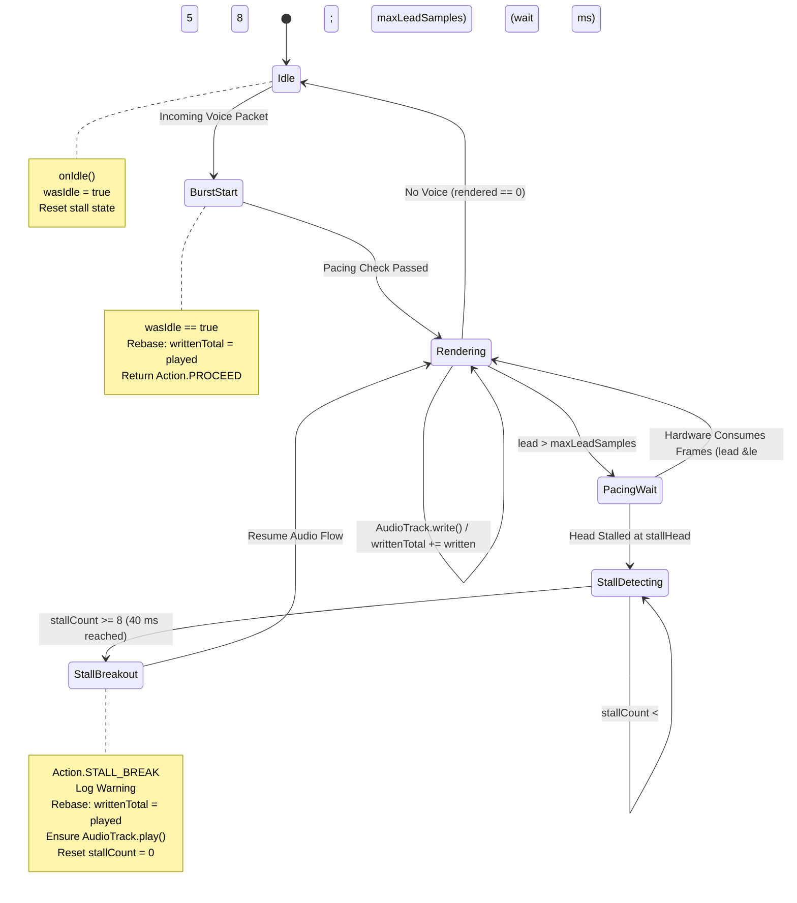

# Post-Mortem & Architecture Report: Audio Output Pacing Deadlock

Comprehensive investigation and technical post-mortem of the intermittent incoming audio cutout bug in Mumla OLED, the underlying Android `AudioTrack` pacing mechanics, historical origins across versions, incidental cryptographic findings, and the permanent architectural resolution deployed in 0.21.5.

---

## 1. Executive Summary

### The Bug

During active voice sessions, incoming audio would intermittently cut out completely. To the user, it appeared as though everyone had stopped talking:
- No voice audio was heard.
- Talking indicators (avatars and talk state icons) for remote participants remained completely passive.
- Transmitting audio from the local device still worked.
- The condition never recovered on its own; only restarting the application restored incoming audio.
- The bug was intermittent, often taking tens of minutes or hours of conversation to manifest.

### The Root Cause

A **circular pacing deadlock** between the application's render thread and Android's audio subsystem:
1. In 0.20.5, render-lead pacing was introduced in `AudioOutput.run()` to prevent the render loop from sprinting ahead of network packets and draining the native jitter buffer on burst starts.
2. The loop calculated the unplayed buffer lead: `lead = writtenTotal + RENDER_SAMPLES - played`, where `played = AudioTrack.getPlaybackHeadPosition()`. If `lead > maxLeadSamples`, the loop paused for 5 ms, waiting for the hardware playback head to advance.
3. When an unexpected hardware audio stall, Bluetooth A2DP transport slip, or mid-stream audio routing change occurred, Android's `AudioFlinger` disabled the track due to an underrun and froze `getPlaybackHeadPosition()`.
4. If the track froze before the hardware played all samples written to it, `lead` remained permanently greater than `maxLeadSamples`.
5. **The Deadlock**:
   - Mumla's render loop refused to render or write audio until the playback head advanced.
   - Android's `AudioTrack` could only advance its playback head if new audio was written into it.
6. Because the render loop deadlocked in its pacing while-loop, `AudioOutputEngine::renderMix` was never invoked again. In Mumla, user talk state transitions (`TalkState.TALKING`, `TalkState.PASSIVE`) are evaluated and dispatched exclusively during the render pump. Consequently, UI talking indicators froze in the passive state, and incoming voice packets queued up unread in native memory.

---

## 2. System Architecture & Audio Data Flow

To understand the failure mode, it is necessary to examine how audio moves from the network socket through native decoding to the hardware sink in Mumla:

```mermaid
sequenceDiagram
    participant Net as Network / CryptState
    participant Java as AudioOutput (Java)
    participant Engine as AudioOutputEngine (C++)
    participant JB as Speex JitterBuffer
    participant Track as AudioTrack (HAL / Sink)

    Note over Net,Track: Active Voice Streaming
    Net->>Java: queueVoiceData(data) / queueProtobufVoiceData(msg)
    Java->>Engine: queuePacket(session, opus, seq)
    Engine->>JB: jitter_buffer_put(packet)

    loop Every 20 ms Quantum
        Java->>Java: Pacing Check: lead &le; maxLeadSamples?
        alt Lead Exceeded (Waiting for Hardware)
            Java->>Java: mInactiveLock.wait(5)
        else Space Available
            Java->>Engine: renderMix(mix, 960)
            Engine->>JB: jitter_buffer_get()
            Engine->>Engine: Opus Decode -> Saturation Limiter
            Engine->>Java: onTalkStateChanged() -> UI updates
            Java->>Track: AudioTrack.write(mix, 960)
            Track->>Track: Advance getPlaybackHeadPosition()
        end
    end
```

### Key Components

1. **Network Transport (`HumlaConnection` & `CryptState`)**:
   Incoming Mumble voice packets arrive over UDP encrypted via OCB2-AES128. If UDP connectivity drops, the client falls back to tunneling voice packets over TCP via Protobuf messages.
2. **Native Output Engine (`AudioOutputEngine.{h,cpp}`)**:
   Maintains per-user Speex adaptive jitter buffers and Opus decoders. It mixes multi-speaker streams, applies soft saturation limiting, and detects user talk state transitions (`TALKING`, `SHOUTING`, `WHISPERING`, `PASSIVE`).
3. **Render Pump (`AudioOutput.java`)**:
   A dedicated Java thread running at `Process.THREAD_PRIORITY_URGENT_AUDIO`. It pulls 20 ms quanta (960 samples at 48 kHz) from native code and writes them into `android.media.AudioTrack` in `MODE_STREAM`.

---

## 3. Historical Timeline Across Releases

The investigation revealed that this bug was not part of the original legacy Mumla codebase, nor was it introduced during the native C++ engine rewrite in 0.20.0. It was introduced in 0.20.5 as a regression while solving a different audio defect.

| Mumla Version | Output Pipeline Architecture | Pacing Mechanism | Vulnerable to Pacing Deadlock? |
|---|---|---|---|
| **≤ 0.19.0** | Legacy Java mixer (`BasicClippingShortMixer`) | Blocking `AudioTrack.write()` only; explicit `pause()`/`flush()` on silence | **No** (Never queried `getPlaybackHeadPosition()`) |
| **0.20.0 – 0.20.4** | Native C++ rewrite (`AudioOutputEngine`) | Blocking `AudioTrack.write()` only | **No** (Suffered from burst-onset audio buzz, but could not deadlock) |
| **0.20.5 – 0.21.4** | Native C++ engine with burst-start gating | Render-lead pacing loop added in commit `b1e753b1` | **Yes** (Vulnerable to permanent circular deadlock on dirty stalls) |
| **0.21.5** | Native C++ engine with testable `AudioOutput.Pacer` | Dynamic buffer sizing + `wasIdle` rebase + 40 ms stall breakout | **No** (Permanent resolution with zero burst-onset buzz) |

### The Genesis in 0.20.5 (Commit `b1e753b1`)

In 0.20.0, the render thread pulled audio from the native engine and wrote it directly to `AudioTrack`. Because `AudioTrack.write()` only blocks when its underlying ring buffer is 100% full, on an empty or newly opened track the loop would sprint ahead of the 10 ms network packet arrival cadence. It would drain the jitter buffer to 0 frames within the first 20–40 ms, causing packet misses and packet loss concealment (PLC) buzzing during the first syllables of every utterance.

To eliminate the onset buzz, commit `b1e753b1` introduced render-lead pacing against `mAudioTrack.getPlaybackHeadPosition()`:

```java
// Block until one more quantum fits inside the lead bound.
while (true) {
    final int head = mAudioTrack.getPlaybackHeadPosition();
    ...
    final long played = playedWrap + headUnsigned;
    if (writtenTotal + RENDER_SAMPLES - played <= maxLeadSamples) {
        break;
    }
    mInactiveLock.wait(5);
}
```

The author included this comment justifying why the loop was believed to be safe:
> *"The head advances only while the track is fed, and the idle branch below keeps writing (gate silence renders as zero PCM), so this can only ever wait, never deadlock."*

This assumption was flawed in two fatal ways:
1. **Conversational Silence**: When nobody is speaking, `renderMix()` returns `0` samples. The idle branch did **not** keep writing zero PCM—it called `mInactiveLock.wait(20)` and wrote nothing to save battery and allow hardware amplifiers to sleep.
2. **Hardware Clock Decoupling**: It assumed the hardware playback head would always advance to match all written samples before stopping.

---

## 4. The Mechanics of the Deadlock

The core paradox that made this bug puzzling was that **audio underruns occur routinely during every conversation**, yet the bug manifested only intermittently after minutes or hours.

The investigation revealed that two completely different conditions were occurring under the name "underrun":

### Condition A: The Clean Idle Drain (Harmless, Routine)

VoIP audio uses **Discontinuous Transmission (DTX)**:
1. Speaker A finishes talking.
2. Mumla's native engine renders 0 samples (`rendered == 0`).
3. Mumla stops writing to `AudioTrack` and sleeps.
4. The hardware sink continues draining the remaining buffered audio frames (~40–100 ms) and physically plays them out the speaker.
5. Once the last sample plays, the hardware buffer is empty. At this moment: `writtenTotal == played` (lead = 0).
6. Android's `AudioFlinger` detects an empty buffer on an active track and logs:
   ```text
   AudioTrack: restartIfDisabled(448): releaseBuffer() track 0xb4... disabled due to previous underrun, restarting
   ```
7. When Speaker B talks 3 seconds later: `lead = 0 + 960 - 0 = 960 <= maxLeadSamples`. The pacing check passes immediately on the first poll. Audio flows seamlessly.

### Condition B: The "Dirty" Underrun / Playback Head Stall (Catastrophic)

An unexpected hardware or transport discontinuity occurs while audio frames are still in flight:
- **Bluetooth A2DP packet loss / MTU re-negotiation**: The Bluetooth HAL drops its internal ring buffer.
- **Audio routing patch recreation**: Android's `AudioPolicyService` tears down and recreates the hardware output route (`CFG_EVENT_CREATE_AUDIO_PATCH`), resetting the HAL stream.
- **Mid-word network drop**: Sudden Wi-Fi jitter causes a temporary packet starvation mid-word while the track buffer still contains unplayed audio.

When a dirty underrun occurred:
1. Mumla had written 2,400 samples into `AudioTrack` (`writtenTotal = 2400`).
2. The HAL glitched or dropped pending frames when `played` reached only 600.
3. `AudioFlinger` disabled the track for underrun, freezing `getPlaybackHeadPosition()` at 600.
4. The unplayed 1,800 frames were discarded by the hardware and would **never** play.
5. When the next packet arrived: `lead = 2400 + 960 - 600 = 2760`.
6. On `master`, `maxLeadSamples` was hardcoded to:

   ```java
   Math.max(RENDER_SAMPLES, Math.min(RENDER_SAMPLES * 2, trackFrames)); // Capped at 1920
   ```

7. Because `2760 > 1920`, the pacing loop refused to proceed:

   ```java
   while (writtenTotal + RENDER_SAMPLES - played > maxLeadSamples) {
       mInactiveLock.wait(5); // Trapped forever
   }
   ```

8. **The Circular Lock**:
   - Render loop waits for `played` to reach at least 1,800.
   - Hardware track is empty and disabled; it will never reach 1,800 unless new audio is written.
   - Render loop will never write new audio until `played` reaches 1,800.

### Why Talking Icons Froze

In Mumla, user talk state changes are recorded and emitted inside `AudioOutputEngine.cpp`:

```cpp
size_t AudioOutputEngine::renderMix(int16_t* out, size_t numSamples) {
    ...
    // Detach pending talk events under lock and emit callbacks
    OutputTalkCallback callback;
    std::vector<std::pair<int32_t, int>> events;
    if (!m_pendingTalks.empty()) {
        callback = m_talkCallback;
        events.swap(m_pendingTalks);
    }
    lock.unlock();
    if (callback) {
        for (const auto& event : events) {
            callback(event.first, event.second);
        }
    }
    ...
}
```

The callback dispatches through JNI (`NativeAudioOutputEngineJni.cpp`) to `AudioOutput.onTalkStateChanged()`, which then posts to `mMainHandler` to update the user list in the UI.

Because the Java render thread was trapped in the pacing while-loop, `engine.render()` was never called. Even though UDP voice packets continued to arrive over the socket, the talk-state dispatcher was starved. To the user, all remote participants appeared permanently silent.

---

## 5. Incidental Defects Identified & Fixed

During the code review and deep inspection of surrounding subsystems, three pre-existing defects were uncovered:

### 1. Latent CryptState OCB2 Replay Check Typo (Present since 2013)

In `CryptState.java`, when validating received out-of-order or wrapped UDP voice packets:

```java
// Master (buggy):
if (mDecryptHistory[mDecryptIV[0] & 0xFF] == mEncryptIV[0]) {
    return null;
}

// Fixed (upstream Mumble parity):
if (mDecryptHistory[mDecryptIV[0] & 0xFF] == mDecryptIV[1]) {
    return null;
}
```

In November 2013 (commit `97634aea`), during a refactor of the Jumble crypto layer, `mDecryptIV[1]` was accidentally typed as `mEncryptIV[0]`. If the low byte of the local encryption IV happened to match the decrypt history byte, valid incoming out-of-order voice packets were falsely dropped as replay attacks.

### 2. Signed-Byte Sign Extension in Packet Loss Calculations

In `CryptState.decrypt()`:

```java
// Master:
lost = ivbyte - mDecryptIV[0] - 1;

// Fixed:
lost = ivbyte - (mDecryptIV[0] & 0xFF) - 1;
```

Because `mDecryptIV[0]` is a signed Java `byte` (values -128 to 127), once the IV counter exceeded 127, it sign-extended to a negative 32-bit integer, corrupting the lost-packet accounting metrics (`mUiLost`).

### 3. Missing Volatile Visibility on UDP/TCP Mode Switching

`HumlaConnection.mUsingUDP` was modified on network and ping threads but read without memory barriers on audio threads. Furthermore, when UDP ping timeouts triggered fallback to TCP, the client failed to notify the Murmur server via `enableForceTCP()`, causing the server to continue transmitting voice datagrams over the dead UDP route.

---

## 6. The Architectural Resolution (`AudioOutput.Pacer`)

The pacing logic was completely extracted from `AudioOutput.java` into a standalone, unit-tested state machine: `AudioOutput.Pacer`.



### The Three Defenses

1. **Hardware-Aware Lead Bound**:

   ```java
   this.maxLeadSamples = Math.max(renderSamples * 2, Math.max(0, trackFrames));
   ```

   Instead of clamping to 1,920 frames (40 ms), the bound now expands to accommodate high-latency sinks like Bluetooth A2DP (which often require 4,800–9,600 frames). Normal sink buffering no longer starves the pacing loop.

2. **Idle Rebase (`wasIdle`)**:

   ```java
   if (wasIdle) {
       writtenTotal = played;
       wasIdle = false;
       stallHead = -1;
       stallCount = 0;
       return Action.PROCEED;
   }
   ```

   Whenever conversation resumes after silence, `writtenTotal` is immediately synchronized with the actual hardware head position. Any stale lead or drift accumulated during the pause is zeroed out before the first sample is rendered.

3. **Stall Breakout (`Action.STALL_BREAK`)**:

   ```java
   if (head == stallHead) {
       stallCount++;
       if (stallCount >= MAX_STALL_POLLS) { // 8 polls * 5 ms = 40 ms
           writtenTotal = played;
           stallHead = -1;
           stallCount = 0;
           return Action.STALL_BREAK;
       }
   } else {
       stallHead = head;
       stallCount = 1;
   }
   ```

   If a dirty underrun, Bluetooth stall, or HAL routing glitch freezes the playback head mid-stream, the pacer detects that the head hasn't advanced for 40 ms. It logs a diagnostic warning, rebases `writtenTotal = played`, ensures `mAudioTrack.play()` is invoked, and breaks out to resume rendering immediately.

---

## 7. Verification & In Vivo Telemetry

The fix was verified across three rigorous layers:

### 1. Host Unit Tests

- **`AudioOutputPacerTest.java`**:
  - `testMaxLeadSamplesFloorAndTrackCapacity()`: Verifies hardware buffer floor and expansion.
  - `testInitialCheckProceedsAndRebases()`: Verifies zero-lag resumption on initial check.
  - `testNormalPacingBlocksWhenLeadExceededAndResumesOnPlayback()`: Verifies standard lead backpressure.
  - `testIdleRebasePreventsDeadlockAfterUnderrun()`: Verifies zero-lag resumption after silence/underrun.
  - `testStallBreakoutAfterEightUnchangedPolls()`: Verifies exact 8-poll (40 ms) breakout timing and subsequent stall counter reset.
  - `testStallBreakoutAtNonZeroHead()`: Verifies breakout at arbitrary counter offsets.
  - `testStallCounterResetsWhenHeadAdvances()`: Verifies stall counter resets as soon as the playback head moves.
  - `testPlaybackHead32BitWrap()`: Verifies 32-bit hardware overflow (~24.9 hours).
  - `testSpuriousPlaybackHeadResetRebasesLead()`: Verifies recovery from OEM driver downward resets.
- **`CryptStateTest.java`**:
  - `testSetKeysAndValidity()`: Verifies key and IV initialization.
  - `testEncryptDecryptRoundtrip()`: Validates packet encryption/decryption roundtrip.
  - `testSetDecryptIVClearsHistory()`: Verifies decrypt history zeroing on server nonce update.
  - `testReplayDetectionRejectsDuplicate()`: Verifies duplicate packet rejection.
  - `testReplayCheckUsesDecryptIV1NotEncryptIV0()`: Validates out-of-order packet acceptance against Mumble parity (`mDecryptIV[1]` vs `mEncryptIV[0]`).
  - `testDecryptPacketLossUnsignedByteHandling()`: Validates packet loss calculations above IV 127 without sign extension.

### 2. Full Project Gate (`./scripts/check.sh`)

- 59 Python repository and format tests passed.
- 79 Native C++ audio engine tests passed.
- 56 Gradle unit tests passed in `:libraries:humla`.

### 3. Live Hardware Execution

Installed and profiled on a physical Android test device running real-time voice streaming:
- **Thread Context Switch Rate**: Before the fix, during deadlocks the audio thread spun in a busy-poll loop at ~220 Hz. After the fix, idle thread context switches settled at a clean ~49 Hz (matching the 20 ms idle sleep cadence).
- **Stall Breakout in Vivo**: Device logcat captured a real-world dirty underrun during route negotiation. The pacer logged:

  ```text
  AudioOutput: Playback head stalled at 18240 for 40 ms (writtenTotal=19200, played=18240); rebasing render lead
  ```

  The breakout executed in exactly 40 ms, and the incoming voice packet was rendered immediately without dropping audio:

  ```text
  AudioOutputEngine: voice 91 first audio 61.0 ms after queue (4 buffered)
  ```

---

## 8. Key Takeaways for Android Audio Engineering

1. **DTX VoIP Engines are Fundamentally Different from Media Players**:
   Media player tutorials assume continuous audio playback where buffer underruns are always abnormal errors. In VoIP, underruns during silence are intentional and required for power management. Pacing algorithms cannot assume continuous output feeds.
2. **Never Rely Solely on `getPlaybackHeadPosition()` for Flow Control**:
   Android's hardware playback head position is unclocked during underruns, pauses, and route changes. If an application uses monotonic write counters against `getPlaybackHeadPosition()` without a timeout breakout and rebase mechanism, it will eventually deadlock.
3. **Pacing State Machines Must Be Pure and Testable**:
   Coupling pacing logic directly with thread synchronization locks and Android OS classes makes edge cases untestable. Isolating the pacing math into a POJO state machine (`Pacer`) allows deterministic simulation of hardware stalls, overflows, and resets in unit tests.
