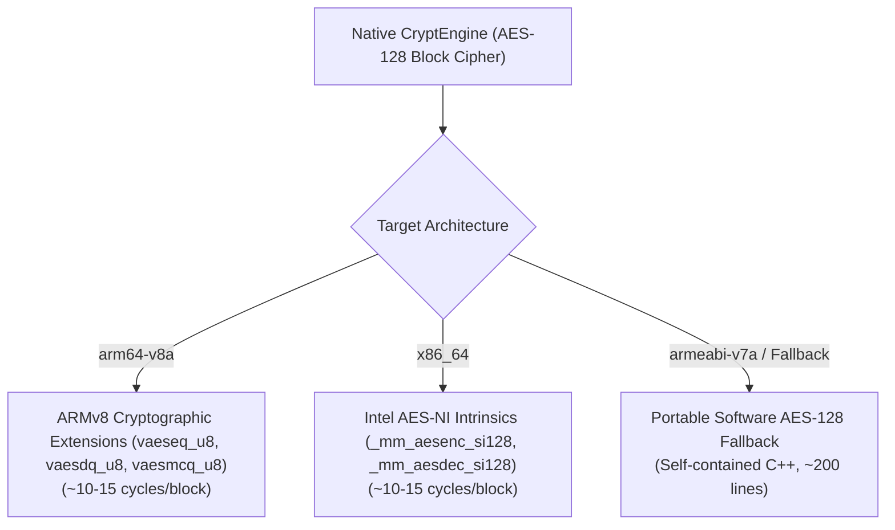
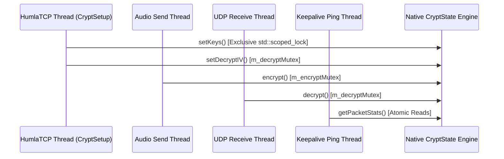
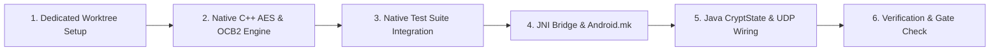

# Native In-Place OCB2-AES Cryptographic Engine: Architectural Notes & Remediation Plan

This document details the architectural analysis, cryptographic constraints, hardware acceleration strategies, upstream protocol parity requirements, and test pipeline considerations prior to implementing **Phase 3.2 (Native In-Place OCB2-AES Cryptographic Engine)** of the Mumla OLED power draw optimization roadmap ([`remediation-plan.md`](remediation-plan.md#32-native-in-place-ocb2-aes-cryptographic-engine)).

---

## Table of Contents

1. [Executive Summary & Problem Statement](#executive-summary--problem-statement)
2. [Root Cause Analysis: Java CryptState Inefficiencies](#root-cause-analysis-java-cryptstate-inefficiencies)
3. [NDK Cryptographic Constraints & Hardware Acceleration](#ndk-cryptographic-constraints--hardware-acceleration)
   - [The Android NDK OpenSSL/BoringSSL Boundary](#the-android-ndk-opensslboringssl-boundary)
   - [Hardware Acceleration Strategy by Target ABI](#hardware-acceleration-strategy-by-target-abi)
4. [Upstream Protocol & Cryptographic Parity](#upstream-protocol--cryptographic-parity)
   - [Inoue-Minematsu Attack Countermeasures (IACR ePrint 2019/311)](#inoue-minematsu-attack-countermeasures-iacr-eprint-2019311)
   - [Wire Format & Replay Protection Invariants](#wire-format--replay-protection-invariants)
   - [Official Test Vectors & Reference Verification](#official-test-vectors--reference-verification)
5. [Zero-Allocation In-Place Datagram Architecture](#zero-allocation-in-place-datagram-architecture)
   - [In-Place Decryption Mechanics](#in-place-decryption-mechanics)
   - [In-Place Encryption Mechanics](#in-place-encryption-mechanics)
   - [Datagram Buffer Flow in Network Transport](#datagram-buffer-flow-in-network-transport)
6. [Concurrency, Thread Safety & Decoupled Mutexes](#concurrency-thread-safety--decoupled-mutexes)
7. [Host Unit Testing & `./scripts/check.sh` Gate Strategy](#host-unit-testing--scriptschecksh-gate-strategy)
8. [Phased Implementation Roadmap](#phased-implementation-roadmap)

---

## Executive Summary & Problem Statement

In Mumla OLED, all UDP voice and ping datagrams are secured using the **OCB2-AES128** authenticated encryption scheme. During active voice communication, voice frames arrive and depart at a rate of 50 to 100 packets per second (and significantly higher during multi-party conversations).

In the current implementation ([`CryptState.java`](../../libraries/humla/src/main/java/se/lublin/humla/net/CryptState.java)), packet encryption and decryption are executed entirely in Java on top of standard JCE `Cipher.getInstance("AES/ECB/NoPadding")`:
- **Inner-Loop GC Allocations**: A new `byte[16]` buffer is allocated on every 16-byte block iteration across every single packet.
- **Per-Block JNI Crossings**: Java calls through JNI into Android's Conscrypt/BoringSSL bridge for every 16-byte block, generating 6 to 8 JNI transitions per packet.
- **CPU & Power Overhead**: Profiling in [`README.md`](README.md#35-java-gc-allocation-churn--crypto-jni-overhead-in-ocb2-aes) attributes $4.0\text{--}8.0\text{ mA}$ ($15\text{--}31\text{ mW}$) of continuous battery drain to cryptographic processing and Dalvik/ART GC churn during active speech.

Migrating the cryptographic engine to a native C++ implementation with hardware SIMD acceleration eliminates both the inner-loop heap allocations and the per-block JNI transitions, reducing cryptographic CPU overhead by an estimated $5\times$ to $10\times$ ($\sim 85\%$ power reduction, down to $0.5\text{--}1.2\text{ mA}$ / $1.9\text{--}4.6\text{ mW}$).

---

## Root Cause Analysis: Java CryptState Inefficiencies

The current implementation in [`CryptState.java`](../../libraries/humla/src/main/java/se/lublin/humla/net/CryptState.java#L238-L348) contains several architectural bottlenecks:

```java
// CryptState.java: ocbDecrypt inner loop
final byte[] tmp = new byte[AES_BLOCK_SIZE];
final byte[] delta = mEncryptCipher.doFinal(nonce);
int offset = 0;
int len = encrypted.length;
while (len > AES_BLOCK_SIZE) {
    final byte[] buffer = new byte[AES_BLOCK_SIZE]; // ALLOCATION INSIDE WHILE LOOP
    CryptSupport.S2(delta);
    System.arraycopy(encrypted, offset, buffer, 0, AES_BLOCK_SIZE);

    CryptSupport.XOR(tmp, delta, buffer);
    mDecryptCipher.doFinal(tmp, 0, AES_BLOCK_SIZE, tmp); // JNI CROSSING PER 16 BYTES

    CryptSupport.XOR(buffer, delta, tmp);
    System.arraycopy(buffer, 0, plain, offset, AES_BLOCK_SIZE);

    CryptSupport.XOR(checksum, checksum, buffer);
    len -= AES_BLOCK_SIZE;
    offset += AES_BLOCK_SIZE;
}
```

1. **Ephemeral Heap Allocations**:
   - `ocbDecrypt` allocates `checksum`, `tmp`, `delta`, and in each loop iteration, a new `buffer = new byte[AES_BLOCK_SIZE]`, plus trailing `pad`.
   - `decrypt` allocates `dst = new byte[plainLength]` and `tagShiftedDst = new byte[plainLength]`, followed by `tag = new byte[AES_BLOCK_SIZE]` and `saveiv = new byte[AES_BLOCK_SIZE]`.
   - For an average 100-byte voice packet (5 blocks), decryption triggers 12 distinct object allocations on the Java heap. At 100 packets/sec, this generates over 1,200 allocations/sec, triggering frequent Garbage Collection (GC) pauses and memory fragmentation.
2. **Per-Block JNI Crossings**:
   - Standard Android JCE does not expose an OCB2 cipher mode. As a result, OCB2 is orchestrated in Java byte-by-byte, delegating raw 16-byte block encryption to `mDecryptCipher.doFinal(...)`.
   - Each `doFinal` call incurs Java-to-native JNI parameter marshalling, method dispatch overhead, and Conscrypt security checks. A single 120-byte voice packet crosses the JNI boundary 8 times.
3. **Synchronized Contention on Full-Duplex Audio**:
   - In [`CryptState.java`](../../libraries/humla/src/main/java/se/lublin/humla/net/CryptState.java#L136,L285), both `encrypt()` and `decrypt()` are declared `public synchronized`.
   - A single Java object monitor locks outgoing microphone transmission against incoming network audio reception. Under simultaneous speaking and listening (full-duplex), the UDP receive thread and audio capture thread contend for the same monitor.

---

## NDK Cryptographic Constraints & Hardware Acceleration

### The Android NDK OpenSSL/BoringSSL Boundary

Upstream desktop Mumble implements OCB2 in [`CryptStateOCB2.cpp`](https://github.com/mumble-voip/mumble/blob/master/src/crypto/CryptStateOCB2.cpp) by linking against desktop OpenSSL (`<openssl/evp.h>`) using `EVP_aes_128_ecb()`.

However, the Android NDK has specific platform constraints:
- **No Public OpenSSL/BoringSSL in NDK**: Since Android 6.0 (API 23), Google removed `libcrypto.so` and `libssl.so` from the public NDK API surface. Android's internal BoringSSL library is a private platform implementation; apps linking directly to `/system/lib/libcrypto.so` are rejected by Google Play and break across OS updates.
- **Vendoring Full OpenSSL is Excessive**: Building an in-tree static copy of OpenSSL or BoringSSL adds megabytes of compiled binary bloat, complex toolchain configuration, and long build times for a single primitive operation: raw 128-bit AES block encryption.

### Hardware Acceleration Strategy by Target ABI

OCB2 requires only two fundamental block operations:
1. `AES128_ECB_encrypt(const uint8_t in[16], uint8_t out[16], const AES_KEY *key)`
2. `AES128_ECB_decrypt(const uint8_t in[16], uint8_t out[16], const AES_KEY *key)`

Rather than bundling external libraries, the native C++ engine should use a compact, self-contained implementation with architecture-specific hardware SIMD acceleration:



1. **ARM64 (`arm64-v8a`)**:
   - Utilizes ARMv8-A Cryptographic Extensions via `<arm_neon.h>`.
   - Single-round AES instructions:
     - `vaeseq_u8`: SubBytes + ShiftRows + AddRoundKey.
     - `vaesmcq_u8`: MixColumns.
     - `vaesdq_u8`: InvSubBytes + InvShiftRows + AddRoundKey.
     - `vaesimcq_u8`: InvMixColumns.
   - 10-round AES-128 executes in ~10–15 CPU cycles per 16-byte block.
   - While optional in the original ARMv8.0-A specification, the Android Compatibility Definition Document (CDD) effectively mandates ARMv8 crypto instructions on all 64-bit consumer devices for hardware-backed storage encryption.
   - **NDK Compiler Flags**: In Android NDK Clang (`r25c`), target `arm64-v8a` defaults to standard ARMv8.0-A without crypto extensions. Compiling `vaeseq_u8` requires `-march=armv8-a+crypto` (or `+aes`) in `Android.mk`.
2. **x86_64 (`x86_64`)**:
   - Utilizes Intel AES-NI intrinsics via `<wmmintrin.h>`.
   - `_mm_aesenc_si128`, `_mm_aesenclast_si128`, `_mm_aesdec_si128`, `_mm_aesdeclast_si128`.
   - Supported by virtually all modern x86_64 CPUs, ensuring near-instantaneous execution in Android emulators and host development environments.
   - **Host Compiler Flags**: Compiling with `g++` in host test environments requires `-maes` (or runtime target attribute `#pragma GCC target("aes")`).
3. **ARMv7 (`armeabi-v7a`) & Software Fallback**:
   - For 32-bit ARM cores without cryptographic extensions (or host test environments lacking CPU flags), a self-contained, portable software AES-128 implementation ensures 100% portability without external library dependencies.
   - *Timing Side-Channel Note*: Standard S-box table lookups are subject to CPU cache-timing side channels. For 32-bit fallback where hardware extensions are absent, a compact table implementation suffices for ephemeral session audio, or a bitsliced implementation (e.g. BearSSL `ct64`) can be utilized if constant-time execution without hardware crypto is strictly required.

---

## Upstream Protocol & Cryptographic Parity

### Inoue-Minematsu Attack Countermeasures (IACR ePrint 2019/311)

In 2019, Akiko Inoue and Kazuhiko Minematsu published a practical attack against OCB2 ([IACR ePrint 2019/311](https://eprint.iacr.org/2019/311), referred to as the XEX* attack), demonstrating that Rogaway's OCB2 is vulnerable to universal forgery and plaintext recovery.

Upstream Mumble implemented specific counter-cryptanalysis defenses in [`CryptStateOCB2.cpp:305-326, 401-408`](https://github.com/mumble-voip/mumble/blob/master/src/crypto/CryptStateOCB2.cpp):

```cpp
// Upstream Mumble CryptStateOCB2.cpp: ocb_encrypt
// For an attack, the second to last block must be all 0 except for the last byte.
bool flipABit = false;
if (len - AES_BLOCK_SIZE <= AES_BLOCK_SIZE) {
    unsigned char sum = 0;
    for (int i = 0; i < AES_BLOCK_SIZE - 1; ++i) {
        sum |= plain[i];
    }
    if (sum == 0) {
        if (modifyPlainOnXEXStarAttack) {
            // Upstream discovery: digital silence produces critical packets in mass.
            // Modify packet bit to prevent the attack without affecting audio perceptibility.
            flipABit = true;
        } else {
            success = false;
        }
    }
}
// ...
if (flipABit) {
    *reinterpret_cast< unsigned char * >(tmp) ^= 1;
    *reinterpret_cast< unsigned char * >(checksum) ^= 1;
}
```

And in `ocb_decrypt`:
```cpp
// Upstream Mumble CryptStateOCB2.cpp: ocb_decrypt
// Counter-cryptanalysis check: decrypted last block cannot equal delta ^ len(128)
if (memcmp(tmp, delta, AES_BLOCK_SIZE - 1) == 0) {
    success = false;
}
```

> [!IMPORTANT]
> **Parity Gap in Existing Java Code**:
> Mumla OLED's current Java implementation ([`CryptState.java`](../../libraries/humla/src/main/java/se/lublin/humla/net/CryptState.java)) does **not** include this countermeasure. When transmitting digital silence, Mumla OLED can emit packets that trip upstream Murmur's cryptanalysis guards or fail when connecting to hardened servers. Implementing native OCB2 based directly on upstream [`CryptStateOCB2.cpp`](https://github.com/mumble-voip/mumble/blob/master/src/crypto/CryptStateOCB2.cpp) resolves this discrepancy.

### Wire Format & Replay Protection Invariants

The Mumble UDP datagram layout must remain byte-for-byte identical to the wire specification:

```
+---------------+------------------------+------------------------------------+
| Byte 0        | Bytes 1 .. 3           | Bytes 4 .. (Length - 1)            |
| Encrypt IV[0] | Truncated Tag (24-bit) | Ciphertext (Plain Length bytes)    |
+---------------+------------------------+------------------------------------+
```

1. **IV Counter Mechanics**:
   - The IV is a 128-bit little-endian integer.
   - On each encrypted packet, `encrypt_iv` is incremented starting at byte 0, rippling through byte 15 on overflow.
   - Byte 0 of `encrypt_iv` is transmitted as the packet's first header byte.
2. **Replay Detection History**:
   - `decrypt_history` is a 256-byte array indexed by `decrypt_iv[0]`.
   - On successful decryption of packet `iv0`, `decrypt_history[iv0]` is set to `decrypt_iv[1]`.
   - If an incoming out-of-order packet arrives where `decrypt_history[decrypt_iv[0]] == decrypt_iv[1]`, the packet is dropped as a replay.
   - *Historical Note*: Upstream Mumla before the OLED fork historically suffered from a typo comparing against `mEncryptIV[0]` instead of `mDecryptIV[1]`, resolved in 0.21.6. The native implementation must maintain the correct `decrypt_history[decrypt_iv[0]] == decrypt_iv[1]` invariant.
3. **Out-of-Order Recovery Window**:
   - `diff = ivbyte - decrypt_iv[0]` (wrapped modulo 256).
   - Late packets are accepted if `diff > -30 && diff < 0` without advancing the base IV. When `ivbyte > decrypt_iv[0]`, rollover has occurred across the 0x00/0xFF boundary and higher bytes of `decrypt_iv` must be decremented (`decrypt_iv[i]--`) before decryption, then restored.
   - Lost packets jump forward if `diff > 0`, incrementing higher bytes (`++decrypt_iv[i]`) if wrapped (`ivbyte < decrypt_iv[0]`) and updating lost count metrics.

### Official Test Vectors & Reference Verification

Upstream Mumble verifies its implementation using test vectors from `draft-krovetz-ocb-00.txt` in [`TestCrypt.cpp`](https://github.com/mumble-voip/mumble/blob/master/src/tests/TestCrypt/TestCrypt.cpp):

1. **Zero-Length Plaintext (Blank Tag)**:
   - Key: `{ 0x00, 0x01, ..., 0x0f }`
   - Nonce: `{ 0x00, 0x01, ..., 0x0f }`
   - Expected 16-byte Tag:
     `BF 31 08 13 07 73 AD 5E C7 0E C6 9E 78 75 A7 B0`
2. **40-Byte Plaintext (`0x00` through `0x27`)**:
   - Key: `{ 0x00, 0x01, ..., 0x0f }`
   - Nonce: `{ 0x00, 0x01, ..., 0x0f }`
   - Expected 16-byte Tag:
     `9D B0 CD F8 80 F7 3E 3E 10 D4 EB 32 17 76 66 88`
   - Expected Ciphertext:
     `F7 5D 6B C8 B4 DC 8D 66 B8 36 A2 B0 8B 32 A6 36 9F 1C D3 C5 22 8D 79 FD 6C 26 7F 5F 6A A7 B2 31 C7 DF B9 D5 99 51 AE 9C`

These vectors will be integrated directly into native unit tests to prove mathematical correctness before connecting to live servers.

---

## Zero-Allocation In-Place Datagram Architecture

### In-Place Decryption Mechanics

In OCB2, block decryption processes 16-byte chunks iteratively:

```cpp
while (len > AES_BLOCK_SIZE) {
    S2(delta);
    XOR(tmp, delta, reinterpret_cast<const subblock *>(encrypted));
    AESdecrypt(tmp, tmp, raw_key);
    XOR(reinterpret_cast<subblock *>(plain), delta, tmp);
    XOR(checksum, checksum, reinterpret_cast<const subblock *>(plain));
    len -= AES_BLOCK_SIZE;
    plain += AES_BLOCK_SIZE;
    encrypted += AES_BLOCK_SIZE;
}
```

Notice the memory access sequence:
1. The ciphertext block `encrypted` is read into local stack variable `tmp`.
2. `AESdecrypt` operates in-place on `tmp`.
3. `plain` is written with `delta ^ tmp`.
4. `checksum` accumulates `plain`.

Because the input block is read completely into `tmp` **before** `plain` is written, **`plain` and `encrypted` can safely reference the exact same memory buffer**. In-place decryption requires zero auxiliary buffers.

### In-Place Encryption Mechanics

In standard `ocb_encrypt`, `plain` is XORed into `checksum` and read into `tmp`:

```cpp
// Modified for safe in-place execution where plain == encrypted
S2(delta);
XOR(tmp, delta, reinterpret_cast<const subblock *>(plain));
XOR(checksum, checksum, reinterpret_cast<const subblock *>(plain)); // Accumulate BEFORE write
if (flipABit) {
    *reinterpret_cast<unsigned char *>(tmp) ^= 1;
    *reinterpret_cast<unsigned char *>(checksum) ^= 1;
}
AESencrypt(tmp, tmp, raw_key);
XOR(reinterpret_cast<subblock *>(encrypted), delta, tmp); // Overwrite in-place
```

By accumulating `checksum` before writing `encrypted`, encryption can also operate directly in-place within the same buffer.

### Datagram Buffer Flow in Network Transport

In [`HumlaUDP.java`](../../libraries/humla/src/main/java/se/lublin/humla/net/HumlaUDP.java):
1. **Receive Path & Offset Alignment**:
   - `mUDPSocket.receive(packet)` writes incoming bytes directly into `packet.getData()`.
   - The native decrypt method accepts the underlying `byte[]` and length, decrypts the ciphertext in-place starting at offset 4, verifies the 24-bit tag, and returns the plaintext length.
   - **Header Realignment**: Because the plaintext begins at offset 4 while downstream packet dispatch in [`HumlaConnection.java`](../../libraries/humla/src/main/java/se/lublin/humla/net/HumlaConnection.java#L750-L786) (`onUDPDataReceived`) expects packet headers at index `0`, the native layer executes `memmove(data, data + 4, plainLength)` before returning to Java (or provides an offset-aware signature).
   - **Zero-Copy JNI Access**: The JNI bridge (`NativeCryptStateJni.cpp`) uses `GetPrimitiveArrayCritical` / `ReleasePrimitiveArrayCritical` to eliminate intermediate memory copies and JNI pinning overhead.
   - *Allocation Scope*: Eliminates all 12 ephemeral object allocations per packet within `CryptState`. (Downstream protobuf parsing and audio queueing in Java will be decoupled in subsequent transport optimizations).
2. **Send Path & Asynchronous Queue Thread Safety**:
   - Unlike synchronous socket writes, [`HumlaUDP.java`](../../libraries/humla/src/main/java/se/lublin/humla/net/HumlaUDP.java#L265-L276) pushes outgoing packets onto an asynchronous `mSendQueue` (`LinkedBlockingQueue<DatagramPacket>`) drained by `OutgoingConsumer`.
   - Reusing a single transmission buffer in-place inside `AudioHandler` would introduce race conditions with queued packets waiting for socket transmission.
   - Send path optimization therefore employs a bounded buffer pool for `mSendQueue` where transmission buffers allocate a 4-byte header margin, allowing native encryption to write `[IV: 1B][Tag: 3B]` directly into indices `[0..3]` and encrypt payload bytes in-place without copying.
   - Ping datagrams (`pingBuffer` in `HumlaConnection.java`) allocate a 14-byte buffer (4-byte header + 10-byte payload) to enable in-place encryption.

---

## Concurrency, Thread Safety & Decoupled Mutexes

The cryptographic engine participates in multiple concurrent threads:



To eliminate lock contention:
- **Decoupled Encryption & Decryption Mutexes**:
  - `m_encryptMutex`: Guards `encrypt_iv` and outgoing encryption operations.
  - `m_decryptMutex`: Guards `decrypt_iv`, `decrypt_history`, and incoming decryption operations.
  - SIMD/software AES block operations are stateless pure functions with no shared context pointers.
  - Sending microphone audio and receiving speaker audio proceed concurrently with **zero mutex contention**.
- **Granular Key & IV Setup**:
  - `setKeys()` acquires both mutexes simultaneously using `std::scoped_lock(m_encryptMutex, m_decryptMutex)` to ensure atomic rekeying without data races or ABBA deadlocks.
  - `setDecryptIV()` only acquires `m_decryptMutex`. Because it only modifies `decrypt_iv` and resets `decrypt_history`, outgoing microphone transmission on `m_encryptMutex` is never blocked during server-initiated decrypt resyncs.
- **Lock-Free Statistics & Underflow Guards**:
  - Packet statistics (`good`, `late`, `lost`, `resync`) are maintained using `std::atomic<int32_t>`, allowing `HumlaConnection`'s keepalive ping timer to inspect packet health without locking the audio pipeline.
  - When late packets arrive (`diff > -30 && diff < 0`), `lost` is decremented by 1 (`lost = -1`) to reconcile speculative loss counts. Unsigned underflow guards (`if (lost > 0) ...`) are enforced to prevent `lost` wrapping to $2^{32}-1$.
- **Java State Machine Synchronization**:
  - `CryptState.java` synchronizes packet statistics (`mUiGood`, `mUiRemoteGood`) and timestamp accessors (`getLastGoodElapsed()`, `resetLastRequestTime()`) with the native engine to maintain seamless integration with `AdaptiveKeepalive` and crypt resync triggers in `HumlaConnection`.

---

## Host Unit Testing & `./scripts/check.sh` Gate Strategy

### The Host JVM Challenge

The pre-completion verification script ([`scripts/check.sh`](../../scripts/check.sh)) executes two primary test suites:
1. `nix develop --command ./scripts/test_native_audio.sh` (compiles and executes native C++ tests on the Linux host with `g++`).
2. `nix develop --command ./gradlew testFossDebugUnitTest :libraries:humla:testDebugUnitTest` (executes Java unit tests inside the host JVM).

The native suite runs exactly once per `check.sh` invocation (step 1 above): Gradle `Test` tasks deliberately do not re-trigger it (`./gradlew check` still covers it via an explicit dependency), and the 3-ABI NDK build is likewise reserved for packaging tasks (see `libraries/humla/build.gradle`). `scripts/test_native_audio.sh` builds incrementally — per-TU objects under `build/test-native/obj/` compiled in parallel and cached via `ccache` (shared across worktrees) — so repeat runs skip compilation and only re-execute the tests.

Because the host JVM does not have Android's Bionic C runtime or Android NDK `.so` libraries in `java.library.path`, an unconditional `System.loadLibrary("humlaaudio")` inside [`CryptState.java`](../../libraries/humla/src/main/java/se/lublin/humla/net/CryptState.java) will throw `UnsatisfiedLinkError` during `./gradlew testDebugUnitTest`, failing:
- [`CryptStateTest.java`](../../libraries/humla/src/test/java/se/lublin/humla/net/CryptStateTest.java)
- [`AdaptiveKeepaliveTest.java`](../../libraries/humla/src/test/java/se/lublin/humla/net/AdaptiveKeepaliveTest.java)
- [`HumlaUDPReceiveThreadTest.java`](../../libraries/humla/src/test/java/se/lublin/humla/net/HumlaUDPReceiveThreadTest.java)
- [`HumlaUDPSendQueueTest.java`](../../libraries/humla/src/test/java/se/lublin/humla/net/HumlaUDPSendQueueTest.java)

### Host JNI Shared Library Strategy

To ensure seamless host test execution while maintaining a single, unified native cryptographic engine across both host tests and Android production:

1. **Host JNI Shared Library Compilation in `scripts/test_native_audio.sh`**:
   - `scripts/test_native_audio.sh` compiles `CryptStateOCB2.cpp` and `NativeCryptStateJni.cpp` into a host shared library (`libhumlaaudio.so` / `libhumlaaudio.dylib`) under `build/test-native/` using host `$CXX` and JDK JNI headers from `$JAVA_HOME/include`.
   - `libraries/humla/build.gradle` injects `-Djava.library.path=${project.rootDir}/build/test-native` into all `Test` tasks.
2. **Pure JNI Binding in `CryptState.java`**:
   - [`CryptState.java`](../../libraries/humla/src/main/java/se/lublin/humla/net/CryptState.java) acts as a clean, thin JNI wrapper over `libhumlaaudio.so`.
   - The legacy Java OCB2 cipher, Galois field arithmetic, and software fallback loops are eliminated completely, ensuring zero divergence between test and production environments.
3. **Dedicated Native C++ Host Test Suite**:
   - A standalone C++ test runner ([`test_crypt_state.cpp`](../../libraries/humla/src/test/cpp/test_crypt_state.cpp)) runs in [`scripts/test_native_audio.sh`](../../scripts/test_native_audio.sh).
   - This compiles directly on the host using `g++ -std=c++17` and executes:
     - Official `draft-krovetz-ocb-00.txt` test vectors.
     - Inoue-Minematsu XEX* attack validation.
     - Out-of-order packet recovery and replay detection.
     - Multi-threaded encrypt/decrypt stress tests.

---

## Phased Implementation Roadmap



1. **Worktree Creation**:
   - Create a dedicated worktree using `./scripts/worktree.py add feature/native-ocb2-crypto master`.
2. **Native Cryptographic Engine**:
   - Create `libraries/humla/src/main/jni/crypto/Aes128.h` (portable AES-128 with ARMv8 Crypto Extensions, x86 AES-NI, and software fallback).
   - Create `libraries/humla/src/main/jni/crypto/CryptStateOCB2.{h,cpp}` implementing the Mumble OCB2 protocol, replay detection, underflow-safe statistics, and IACR ePrint 2019/311 (XEX* attack) mitigations.
3. **Host Native Test Suite**:
   - Create `libraries/humla/src/test/cpp/test_crypt_state.cpp`.
   - Wire into `scripts/test_native_audio.sh` with `-maes` for x86_64 host compilation and confirm all cryptographic test vectors pass on the host.
4. **JNI Bridge & Build System**:
   - Create `libraries/humla/src/main/jni/crypto/NativeCryptStateJni.cpp` using `GetPrimitiveArrayCritical` / `ReleasePrimitiveArrayCritical` for zero-copy buffer access and in-place header alignment.
   - Add new source files to `LOCAL_SRC_FILES` in `libraries/humla/src/main/jni/Android.mk` under `humlaaudio`.
   - Add `$(ROOT)/crypto` to `LOCAL_C_INCLUDES` and `-march=armv8-a+crypto` under `arm64-v8a` in `Android.mk`.
5. **Java Transport Integration**:
   - Update `libraries/humla/src/main/java/se/lublin/humla/net/CryptState.java` to route through native JNI on Android and host tests with in-place buffer execution.
   - Synchronize packet counters (`mUiGood`, `mUiRemoteGood`) and timestamp tracking (`getLastGoodElapsed()`) with the native engine for `AdaptiveKeepalive` and crypt resync compatibility.
   - Eliminate legacy Java OCB2 cipher, Galois arithmetic, and software fallback loops.
6. **Pre-Completion Verification**:
   - Run `./scripts/check.sh` inside the worktree to verify both host native tests and Gradle test suites pass without regression.
