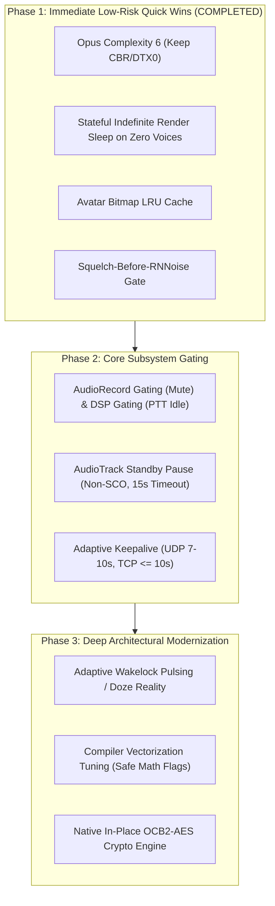

# Power Draw Optimizations Remediation Roadmap

This document outlines a prioritized, phased engineering roadmap for resolving all identified power defects, wakelock leaks, DSP audio capture idling, render thread spin, cellular keepalive RRC tail locks, and cryptographic overhead in Mumla OLED ([`README.md`](file:///home/bualy/files/devel/mumla_dev/mumla-oled/docs/power-draw-optimizations/README.md)).

## Table of Contents

1. [Architectural Remediation Overview](#architectural-remediation-overview)
2. [Phase 1: Immediate Low-Risk Quick Wins — COMPLETED](#phase-1-immediate-low-risk-quick-wins--completed)
   - [1.1 Invert Squelch Gate Before RNNoise — RESOLVED](#11-invert-squelch-gate-before-rnnoise--resolved)
   - [1.2 Render Thread Indefinite Wait with Lost-Notification Guard — RESOLVED](#12-render-thread-indefinite-wait-with-lost-notification-guard--resolved)
   - [1.3 Optimize Opus Complexity — RESOLVED](#13-optimize-opus-complexity--resolved)
   - [1.4 Avatar Bitmap LRU Caching — RESOLVED](#14-avatar-bitmap-lru-caching--resolved)
3. [Phase 2: Core Subsystem Gating](#phase-2-core-subsystem-gating)
   - [2.1 Microphone Gating (Mute) & DSP Gating (PTT Idle)](#21-microphone-gating-mute--dsp-gating-ptt-idle)
   - [2.2 AudioTrack Standby Pause (Guarded against Bluetooth SCO)](#22-audiotrack-standby-pause-guarded-against-bluetooth-sco)
   - [2.3 Adaptive Keepalive Pinging & CryptSetup Compliance](#23-adaptive-keepalive-pinging--cryptsetup-compliance)
4. [Phase 3: Deep Architectural Modernization](#phase-3-deep-architectural-modernization)
   - [3.1 Adaptive Wakelock Pulsing & Android Deep Doze Reality](#31-adaptive-wakelock-pulsing--android-deep-doze-reality)
   - [3.2 Compiler Vectorization Tuning (Safe Math Flags)](#32-compiler-vectorization-tuning-safe-math-flags)
   - [3.3 Native In-Place OCB2-AES Cryptographic Engine](#33-native-in-place-ocb2-aes-cryptographic-engine)

---

## Architectural Remediation Overview

To address these inefficiencies systematically without compromising audio quality, protocol compliance, or user experience, optimizations are organized into three prioritized phases:



---

## Phase 1: Immediate Low-Risk Quick Wins — COMPLETED

> [!NOTE]
> **Status: COMPLETED**
>
> All Phase 1 remediation items (1.1 through 1.4) have been implemented, tested, and merged into `master` in release `0.21.8` (branch `feature/power-optimizations-phase1`, commits [`f7781563`](file:///home/bualy/files/devel/mumla_dev/mumla-oled/libraries/humla/src/main/jni/audio_engine/AudioInputEngine.cpp#L80-L109) through [`35c88064`](file:///home/bualy/files/devel/mumla_dev/mumla-oled/app/src/main/java/se/lublin/mumla/channel/ChannelListAdapter.java#L110-L113), merge commit [`923d026c`](file:///home/bualy/files/devel/mumla_dev/mumla-oled)): 1.1 resolved by squelch-gating RNNoise inference during idle silence with native unit tests in [`test_audio_input_engine.cpp`](file:///home/bualy/files/devel/mumla_dev/mumla-oled/libraries/humla/src/test/cpp/test_audio_input_engine.cpp); 1.2 resolved by introducing stateful render wait on zero voices with unit tests in [`NativeAudioOutputEngineTest.java`](file:///home/bualy/files/devel/mumla_dev/mumla-oled/libraries/humla/src/test/java/se/lublin/humla/audio/NativeAudioOutputEngineTest.java); 1.3 resolved by setting Opus encoder complexity to 6 while preserving Hard CBR / DTX(0); 1.4 resolved by implementing centralized memory-bounded [`AvatarCache`](file:///home/bualy/files/devel/mumla_dev/mumla-oled/app/src/main/java/se/lublin/mumla/channel/AvatarCache.java) with negative caching and unit tests in [`AvatarCacheTest.java`](file:///home/bualy/files/devel/mumla_dev/mumla-oled/app/src/test/java/se/lublin/mumla/channel/AvatarCacheTest.java).

### 1.1 Invert Squelch Gate Before RNNoise — RESOLVED

**Status**: Resolved on `master` in release `0.21.8` (commits [`f7781563`](file:///home/bualy/files/devel/mumla_dev/mumla-oled/libraries/humla/src/main/jni/audio_engine/AudioInputEngine.cpp#L80-L109), [`ab824a49`](file:///home/bualy/files/devel/mumla_dev/mumla-oled/libraries/humla/src/main/jni/audio_engine/AudioInputEngine.cpp#L80-L109), [`e882eaf3`](file:///home/bualy/files/devel/mumla_dev/mumla-oled/libraries/humla/src/main/jni/audio_engine/AudioInputEngine.cpp#L104), [`2e065d7d`](file:///home/bualy/files/devel/mumla_dev/mumla-oled/libraries/humla/src/main/jni/audio_engine/HysteresisVad.h#L52-L65), and [`ddfd2d9c`](file:///home/bualy/files/devel/mumla_dev/mumla-oled/libraries/humla/src/main/jni/audio_engine/HysteresisVad.cpp#L60-L75)).

**Component**: [`AudioInputEngine.cpp`](file:///home/bualy/files/devel/mumla_dev/mumla-oled/libraries/humla/src/main/jni/audio_engine/AudioInputEngine.cpp#L80-L109), [`AudioInputEngine.h`](file:///home/bualy/files/devel/mumla_dev/mumla-oled/libraries/humla/src/main/jni/audio_engine/AudioInputEngine.h#L106), [`HysteresisVad.h`](file:///home/bualy/files/devel/mumla_dev/mumla-oled/libraries/humla/src/main/jni/audio_engine/HysteresisVad.h#L52-L65), [`HysteresisVad.cpp`](file:///home/bualy/files/devel/mumla_dev/mumla-oled/libraries/humla/src/main/jni/audio_engine/HysteresisVad.cpp#L60-L75), [`test_audio_input_engine.cpp`](file:///home/bualy/files/devel/mumla_dev/mumla-oled/libraries/humla/src/test/cpp/test_audio_input_engine.cpp), [`test_hysteresis_vad.cpp`](file:///home/bualy/files/devel/mumla_dev/mumla-oled/libraries/humla/src/test/cpp/test_hysteresis_vad.cpp)

**Problem**: In `AudioInputEngine::processFrame`, neural denoising (`m_denoiser->process(...)`) was evaluated unconditionally at 100 Hz even when audio levels were far below the squelch floor ($-65\text{ dBFS}$), wasting $20\text{--}40\text{ mW}$ of CPU during pauses and room silence.

**Solution**:
In `AudioInputEngine::processFrame`, compute the frame RMS energy in dBFS before running neural denoising. When the input signal is below `m_vad.getSquelchMinDb()` and the client is not actively transmitting (continuous mode, PTT pressed or release hangover hold active, or VAD active speech), feed a static zeroed frame to RNNoise while discarding its output into `m_silenceDiscardBuffer`:

```cpp
// 3. Squelch-Gated Neural Denoising (RNNoise)
float peakDb = HysteresisVad::calculateRmsDb(m_processedFrame.data(), SAMPLES_PER_10MS);
float speechProb = -1.0f;

bool isActivelyTransmitting = false;
if (!m_muted) {
    if (m_inputMode == InputMode::CONTINUOUS) {
        isActivelyTransmitting = true;
    } else if (m_inputMode == InputMode::PUSH_TO_TALK) {
        isActivelyTransmitting = m_pttTalking || (m_pttHoldFramesRemaining > 0);
    } else { // InputMode::VOICE_ACTIVITY
        isActivelyTransmitting = m_vad.isSpeaking();
    }
}

if (m_denoiser) {
    if (!isActivelyTransmitting && peakDb < m_vad.getSquelchMinDb()) {
        // Idle silence (< -65 dBFS) while not actively transmitting: feed static zeroes
        // to RNNoise to advance overlap-add delay (delayed_X) and pitch buffers while cleanly
        // triggering its native silence bypass (!silence in denoise.c). This completely avoids
        // running recurrent GRU matrix multiplications without freezing internal filter state.
        // Raw acoustic PCM in m_processedFrame is preserved so pre-speech lookahead buffering
        // and VAD evaluate authentic audio.
        static const int16_t kSilencePcm[SAMPLES_PER_10MS] = {0};
        m_denoiser->process(kSilencePcm, m_silenceDiscardBuffer.data(), SAMPLES_PER_10MS);
        speechProb = 0.0f;
    } else {
        speechProb = m_denoiser->process(m_processedFrame.data(), m_processedFrame.data(), SAMPLES_PER_10MS);
    }
}
```

- **Filter Continuity & RNNoise Silence Optimization**: Feeding static zeroes during squelched silence triggers RNNoise's native bypass (`!silence` in `rnnoise/src/denoise.c:389, 472-474` where $E = 0 < 0.04$), bypassing dense `compute_rnn` GRU matrix multiplications and pitch filtering while advancing `frame_synthesis` and flushing `delayed_X` and pitch history smoothly. Raw acoustic PCM is preserved in `m_processedFrame` so lookahead buffering and VAD evaluate authentic audio without clipping speech onsets.
- **Refinements**: Squelch bypass is strictly restricted to non-transmitting idle frames in VAD mode (continuous mode, PTT active, and VAD hangover hold frames run unhindered). `HysteresisVad::calculateRmsDb` clamps correctly to $[-96.0, 0.0]\text{ dBFS}$ with proper zero-energy handling ($0.0 \to -96.0\text{ dBFS}$), eliminating stack allocations by using the class-member `m_silenceDiscardBuffer`.
- **Benefit**: Completely eliminates 80–90% of RNNoise neural network inference during ambient silence and pauses with zero overlap-add clicks on speech resumption.

---

### 1.2 Render Thread Indefinite Wait with Lost-Notification Guard — RESOLVED

**Status**: Resolved on `master` in release `0.21.8` (commits [`0470963c`](file:///home/bualy/files/devel/mumla_dev/mumla-oled/libraries/humla/src/main/java/se/lublin/humla/audio/AudioOutput.java#L350-L377), [`cdeec245`](file:///home/bualy/files/devel/mumla_dev/mumla-oled/libraries/humla/src/main/java/se/lublin/humla/audio/AudioOutput.java), [`4c69badd`](file:///home/bualy/files/devel/mumla_dev/mumla-oled/libraries/humla/src/main/java/se/lublin/humla/audio/AudioOutput.java), and [`bbbddab7`](file:///home/bualy/files/devel/mumla_dev/mumla-oled/libraries/humla/src/main/java/se/lublin/humla/audio/AudioOutput.java)).

**Component**: [`AudioOutput.java`](file:///home/bualy/files/devel/mumla_dev/mumla-oled/libraries/humla/src/main/java/se/lublin/humla/audio/AudioOutput.java#L350-L377), [`NativeAudioOutputEngine.java`](file:///home/bualy/files/devel/mumla_dev/mumla-oled/libraries/humla/src/main/java/se/lublin/humla/audio/NativeAudioOutputEngine.java#L38-L46), [`NativeAudioOutputEngineJni.cpp`](file:///home/bualy/files/devel/mumla_dev/mumla-oled/libraries/humla/src/main/jni/audio_engine/NativeAudioOutputEngineJni.cpp#L108-L117), [`NativeAudioOutputEngineTest.java`](file:///home/bualy/files/devel/mumla_dev/mumla-oled/libraries/humla/src/test/java/se/lublin/humla/audio/NativeAudioOutputEngineTest.java)

**Problem**: When no participants were speaking on the server, the audio output thread woke up every 20 ms via `mInactiveLock.wait(20)`, polling JNI, acquiring C++ engine mutexes, and scanning empty voice maps 50 times per second, preventing CPU cores from entering deep C-states.

**Solution**:
Expose `activeUserCount() > 0` as `hasActiveVoices()` from C++ through JNI to `NativeAudioOutputEngine`. Track incoming audio packets via a `volatile boolean mHasIncomingAudio` set under `mInactiveLock` in `signalData()`. Replace the 50 Hz polling wait with an indefinite wait when zero voices are registered:

```java
synchronized (mInactiveLock) {
    if (!mHasIncomingAudio) {
        engine = mEngine;
        boolean hasVoices = (engine != null && engine.hasActiveVoices());
        if (!hasVoices) {
            while (mRunning && !mHasIncomingAudio) {
                try {
                    mInactiveLock.wait();
                } catch (InterruptedException e) {
                    Thread.currentThread().interrupt();
                    break renderLoop;
                }
                engine = mEngine;
                if (engine != null && engine.hasActiveVoices()) {
                    break;
                }
            }
        } else {
            try {
                mInactiveLock.wait(20);
            } catch (InterruptedException e) {
                Thread.currentThread().interrupt();
                break renderLoop;
            }
        }
    }
    mHasIncomingAudio = false;
}
```

- **Lost-Notification & Race Guarding**: Waking is guarded by `mRunning`, `mHasIncomingAudio`, and `hasActiveVoices()`. Arriving voice packets skip unnecessary waits entirely.
- **Concurrency & Lifecycle**: Method calls in `NativeAudioOutputEngine` are synchronized with `destroy()` to eliminate use-after-free risks on native handles during teardown. `InterruptedException` reliably breaks the outer `renderLoop`.
- **Benefit**: Completely eliminates the 50 Hz CPU spin, JNI transitions, and mutex locks during silent standby, allowing CPU cores to drop to deep C-states.

---

### 1.3 Optimize Opus Complexity — RESOLVED

**Status**: Resolved on `master` in release `0.21.8` (commit [`c4b4c348`](file:///home/bualy/files/devel/mumla_dev/mumla-oled/libraries/humla/src/main/jni/audio_engine/OpusVoiceEncoder.cpp#L39-L46)).

**Component**: [`OpusVoiceEncoder.cpp`](file:///home/bualy/files/devel/mumla_dev/mumla-oled/libraries/humla/src/main/jni/audio_engine/OpusVoiceEncoder.cpp#L39-L46)

**Problem**: The native Opus voice encoder was hardcoded to `OPUS_SET_COMPLEXITY(10)`. While complexity 10 performs exhaustive psychoacoustic vector quantization searches, on mobile processors it consumes ~2.5× to 3× more CPU cycles than complexity 6 for $< 0.15\text{ dB}$ PESQ perceptual difference in voice communication.

**Solution**:
Set Opus complexity to 6 in `OpusVoiceEncoder::OpusVoiceEncoder()`:

```cpp
// Psychoacoustic voice quality optimizations:
// Complexity 6 is the optimal sweet spot for mobile VoIP (WebRTC default).
// It reduces encoder CPU consumption by ~65% compared to complexity 10 with
// virtually zero perceptual difference (< 0.15 dB PESQ) in speech mode.
opus_encoder_ctl(m_encoder, OPUS_SET_COMPLEXITY(6));
```

- **Invariants**: Hard CBR (`OPUS_SET_VBR(0)`) and DTX disabled (`OPUS_SET_DTX(0)`) are strictly preserved to maintain constant transmission security and avoid remote jitter buffer concealment artifacts.
- **Benefit**: Cuts Opus CPU consumption by $\sim 65\%$ during voice encoding with zero audible loss in quality.

---

### 1.4 Avatar Bitmap LRU Caching — RESOLVED

**Status**: Resolved on `master` in release `0.21.8` (commits [`dcb66a14`](file:///home/bualy/files/devel/mumla_dev/mumla-oled/app/src/main/java/se/lublin/mumla/channel/ChannelListAdapter.java), [`90b2cce4`](file:///home/bualy/files/devel/mumla_dev/mumla-oled/app/src/main/java/se/lublin/mumla/channel/AvatarCache.java), [`cc2ab81f`](file:///home/bualy/files/devel/mumla_dev/mumla-oled/app/src/main/java/se/lublin/mumla/channel/AvatarCache.java), [`2b05827d`](file:///home/bualy/files/devel/mumla_dev/mumla-oled/app/src/main/java/se/lublin/mumla/drawable/CircleDrawable.java), [`aafcda83`](file:///home/bualy/files/devel/mumla_dev/mumla-oled/app/src/main/java/se/lublin/mumla/channel/AvatarCache.java), and [`35c88064`](file:///home/bualy/files/devel/mumla_dev/mumla-oled/app/src/main/java/se/lublin/mumla/channel/ChannelListAdapter.java#L110-L113)).

**Component**: [`AvatarCache.java`](file:///home/bualy/files/devel/mumla_dev/mumla-oled/app/src/main/java/se/lublin/mumla/channel/AvatarCache.java), [`ChannelAdapter.java`](file:///home/bualy/files/devel/mumla_dev/mumla-oled/app/src/main/java/se/lublin/mumla/channel/ChannelAdapter.java#L311-L325), [`ChannelListAdapter.java`](file:///home/bualy/files/devel/mumla_dev/mumla-oled/app/src/main/java/se/lublin/mumla/channel/ChannelListAdapter.java#L368-L385), [`CircleDrawable.java`](file:///home/bualy/files/devel/mumla_dev/mumla-oled/app/src/main/java/se/lublin/mumla/drawable/CircleDrawable.java), [`MumlaOverlay.java`](file:///home/bualy/files/devel/mumla_dev/mumla-oled/app/src/main/java/se/lublin/mumla/service/MumlaOverlay.java), [`ChannelListFragment.java`](file:///home/bualy/files/devel/mumla_dev/mumla-oled/app/src/main/java/se/lublin/mumla/channel/ChannelListFragment.java), [`AvatarCacheTest.java`](file:///home/bualy/files/devel/mumla_dev/mumla-oled/app/src/test/java/se/lublin/mumla/channel/AvatarCacheTest.java), [`ChannelAdapterTest.java`](file:///home/bualy/files/devel/mumla_dev/mumla-oled/app/src/test/java/se/lublin/mumla/channel/ChannelAdapterTest.java)

**Problem**: Every talk-state change triggered synchronous `BitmapFactory.decodeByteArray()` decompression on the Android UI thread without memoization, generating frame drops and heap allocation churn.

**Solution**:
Implemented a centralized, memory-bounded [`AvatarCache.java`](file:///home/bualy/files/devel/mumla_dev/mumla-oled/app/src/main/java/se/lublin/mumla/channel/AvatarCache.java) based on `androidx.collection.LruCache<Integer, Entry>`, sized by byte footprint (4 MB heap cap) rather than raw count:
- **Hashing & Cache Key**: Uses `user.getTextureHash()` to detect avatar modifications, caching decoded bitmaps across talk state redraws.
- **Negative Caching**: Caches decode failures (`Entry(key, null)`) to prevent repeated decode attempts on corrupt or unsupported avatar blobs.
- **Eager Lifecycle Invalidation**: Wires `removeUser(session)` and `clearAvatarCache()` into `ChannelListFragment` and `MumlaOverlay` on user disconnection/removal.
- **Zero-Allocation Rendering**: Replaces per-draw `RectF` allocations in `CircleDrawable` with cached bounds fields, and ensures proper unsigned 32-bit masking (`0xFFFFFFFFL`) on session and channel IDs.
- **Benefit**: Completely eliminates UI thread avatar decompression during voice activity transitions and list scrolling, eliminating GC churn and frame jank.

---

## Phase 2: Core Subsystem Gating

### 2.1. Microphone Gating (Mute) & DSP Gating (PTT Idle)
- **Target**: [`AudioHandler.java`](file:///home/bualy/files/devel/mumla_dev/mumla-oled/libraries/humla/src/main/java/se/lublin/humla/protocol/AudioHandler.java) and [`AudioInputEngine.cpp`](file:///home/bualy/files/devel/mumla_dev/mumla-oled/libraries/humla/src/main/jni/audio_engine/AudioInputEngine.cpp)
- **Change**:
  - **Self-Muted State**: Flush pending frames, emit an explicit terminator packet, then call `mInput.stopRecording()`. Unmuting is a deliberate user action where 50ms HAL startup lag is completely imperceptible, saving 100% of mic hardware and ADC power.
  - **Push-To-Talk Idle State**: **Do not stop `AudioRecord`**. Keep `AudioRecord` capturing into `PreSpeechRingBuffer` to preserve the 80ms lookahead onset audio and avoid PTT click latency. However, **bypass RNNoise (`m_denoiser->process`) and Adaptive Leveler** while PTT is unpressed.
  - **Mandatory Terminator Packet Invariant**: Prior to pausing or stopping `AudioRecord` (whether from mute or PTT release), the audio pipeline **must flush any remaining samples and dispatch an explicit terminator packet** (`is_terminator = true` in Protobuf or `header |= (1 << 13)` in legacy varint format) preserving the active whisper target ID (`iPrevTarget`). Halting capture without a terminator forces remote Mumble receivers to interpret the sudden packet drop as loss, invoking 10 frames of robotic Packet Loss Concealment (PLC) before voice expiry.
- **Benefit**: Saves $50 \text{ to } 80 \text{ mW}$ of mic hardware power during mute, and cuts 90% of CPU power during PTT standby without any speech onset clipping.

> [!NOTE]
> **Sidenote & Counter-Perspective (Ultra-Power-Saving PTT Mode)**:
> Preserving `AudioRecord` capture during PTT idle protects the 80ms lookahead ring buffer and avoids 50–200ms HAL re-initialization lag. However, keeping the hardware microphone bias and ADC energized consumes $15\text{--}25\text{ mA}$ ($58\text{--}96\text{ mW}$) continuously. For extended listening-only scenarios (e.g. monitoring a dispatch or conference channel for 4–8 hours where the user rarely or never transmits), an optional "Ultra Power Saver" PTT mode could fully sleep the `AudioRecord` hardware, accepting a brief initial onset ramp in exchange for true zero-power microphone idling.

### 2.2. AudioTrack Standby Pause (Guarded against Bluetooth SCO)
- **Target**: [`AudioOutput.java`](file:///home/bualy/files/devel/mumla_dev/mumla-oled/libraries/humla/src/main/java/se/lublin/humla/audio/AudioOutput.java)
- **Change**:
  - When the native engine reports 0 active voices for **15 consecutive seconds**, invoke `mAudioTrack.pause()`.
  - **Bluetooth SCO Guard**: If `AudioManager.isBluetoothScoOn()` is true, **never pause `AudioTrack`**, preventing Bluetooth voice link teardown.
  - Apply a 10ms raised-cosine fade before pausing to prevent hardware DAC pop transients.
- **Benefit**: Allows the audio DSP (Hexagon/LPASS) and audio DAC to power down into low-power standby during conversational pauses.

> [!NOTE]
> **Sidenote & Counter-Perspective (AudioTrack Standby on Built-in Speaker vs Bluetooth)**:
> While a 15-second inactivity timeout is essential on Bluetooth SCO to prevent link teardown and re-pairing delay, on built-in phone speakers or wired 3.5mm/USB-C headphones, modern Android HALs handle track pause and resumption with $< 10\text{ ms}$ latency. On non-Bluetooth routes, the standby threshold could be shortened to 3–5 seconds without audible penalty, allowing the audio DSP and DAC to power-gate much earlier during conversational pauses.

### 2.3. Adaptive Keepalive Pinging & CryptSetup Compliance
- **Target**: [`HumlaConnection.java`](file:///home/bualy/files/devel/mumla_dev/mumla-oled/libraries/humla/src/main/java/se/lublin/humla/net/HumlaConnection.java#L138)
- **Change**:
  - **Never drop TCP pings** (Murmur requires TCP messages to reset `Connection::activityTime()`).
  - **Bootstrap Phase (Initial 30s)**: Maintain aggressive 5s keepalives (UDP + TCP) to establish `mUiRemoteGood > 3 && mUiGood > 3` before the 20-second threshold in `HumlaConnection.java:240`, preventing false-positive traps in TCP tunneling.
  - **Steady-State Background**: Relax keepalives to **7.0–10.0s for UDP** (staying safely below Murmur's 5s/10s `tLastGood` crypt resync limit and carrier CGNAT pin-hole timeouts) and **maximum 10.0s for TCP** (providing a 3× retry margin against Murmur's 30s timeout and surviving custom `timeout = 15/20` server configs).
  - **Implement Missing CryptSetup Server Resync**: In `HumlaConnection.java:181`, implement the missing branch for empty `CryptSetup` requests from Murmur, replying with the client's current encryption IV:
    ```java
    } else {
        // Empty CryptSetup from server requesting client nonce
        Mumble.CryptSetup.Builder csb = Mumble.CryptSetup.newBuilder();
        csb.setClientNonce(ByteString.copyFrom(mCryptState.getEncryptIV()));
        sendTCPMessage(csb.build(), HumlaTCPMessageType.CryptSetup);
    }
    ```
- **Benefit**: Allows the cellular modem to enter DRX cycles without risking carrier NAT drops, server disconnects, or crypt-resync storms, reducing cellular baseline current by $30\%\text{--}40\%$.

---

## Phase 3: Deep Architectural Modernization

### 3.1. Adaptive Wakelock Pulsing & Android Deep Doze Reality
- **Target**: [`HumlaService.java`](file:///home/bualy/files/devel/mumla_dev/mumla-oled/libraries/humla/src/main/java/se/lublin/humla/HumlaService.java#L396-L401)
- **Change**:
  - On devices with battery optimization whitelisting (`PowerManager.isIgnoringBatteryOptimizations()`), drop the permanent `PARTIAL_WAKE_LOCK` during extended silent standby.
  - **Deep Doze Constraint**: Android Deep Doze restricts `AlarmManager.setAndAllowWhileIdle()` to once every **9 to 15 minutes**, making it physically impossible to pulse 10s keepalives via alarms during deep sleep. Therefore, true kernel `suspend-to-RAM` can only be sustained if battery optimization exemption (`REQUEST_IGNORE_BATTERY_OPTIMIZATIONS`) is granted, or if the Linux kernel Wi-Fi/cellular driver supports socket wakeup interrupts for incoming Mumble traffic.
  - Hold `PARTIAL_WAKE_LOCK` continuously while incoming or outgoing audio is actively streaming.
- **Benefit**: Allows the Linux kernel to enter true `suspend-to-RAM` during silent connected standby on exempt devices.

### 3.2. Compiler Vectorization Tuning (Safe Math Flags)
- **Target**: [`Android.mk`](file:///home/bualy/files/devel/mumla_dev/mumla-oled/libraries/humla/src/main/jni/Android.mk)
- **Change**:
  - Add `-O3 -fno-math-errno -fvectorize` to `humlaaudio` CFLAGS to optimize NEON vector loop generation across both 32-bit and 64-bit ARM architectures.
  - **Avoid `-ffast-math` / `-ffinite-math-only`**: Fast-math optimizes away `celt_isnan(x) ((x) != (x))` in `rnnoise/src/arch.h:173`. Disabling NaN validation risks permanent NaN poisoning of RNNoise's recurrent GRU hidden state if a floating-point denormal occurs.
- **Benefit**: Maximizes vector SIMD throughput across RNNoise GRU and audio DSP routines without risking floating-point state corruption.

### 3.3. Native In-Place OCB2-AES Cryptographic Engine
- **Target**: [`CryptState.java`](file:///home/bualy/files/devel/mumla_dev/mumla-oled/libraries/humla/src/main/java/se/lublin/humla/net/CryptState.java) and native JNI
- **Change**:
  - Migrate OCB2-AES encryption and decryption into native C++ (e.g. leveraging ARMv8 Cryptographic Extensions `arm_neon.h` / OpenSSL AES-NI).
  - Encrypt and decrypt directly inside the UDP datagram buffers with zero intermediate Java heap allocations.
- **Benefit**: Eliminates per-packet garbage collection churn and reduces cryptographic CPU overhead by $5\times$ to $10\times$.
