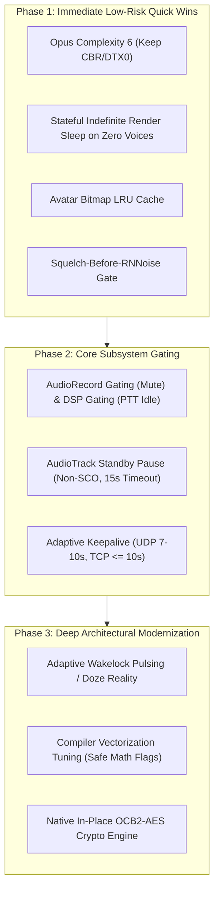

# Power Draw Optimizations Remediation Roadmap

This document outlines a prioritized, phased engineering roadmap for resolving all identified power defects, wakelock leaks, DSP audio capture idling, render thread spin, cellular keepalive RRC tail locks, and cryptographic overhead in Mumla OLED ([`README.md`](file:///home/bualy/files/devel/mumla_dev/mumla-oled/docs/power-draw-optimizations/README.md)).

## Table of Contents

1. [Architectural Remediation Overview](#architectural-remediation-overview)
2. [Phase 1: Immediate Low-Risk Quick Wins](#phase-1-immediate-low-risk-quick-wins)
   - [1.1 Invert Squelch Gate Before RNNoise](#11-invert-squelch-gate-before-rnnoise)
   - [1.2 Render Thread Indefinite Wait with Lost-Notification Guard](#12-render-thread-indefinite-wait-with-lost-notification-guard)
   - [1.3 Optimize Opus Complexity](#13-optimize-opus-complexity)
   - [1.4 Avatar Bitmap LRU Caching](#14-avatar-bitmap-lru-caching)
3. [Phase 2: Core Subsystem Gating](#phase-2-core-subsystem-gating)
   - [2.1 Microphone Gating (Mute) & DSP Gating (PTT Idle)](#21-microphone-gating-mute--dsp-gating-ptt-idle)
   - [2.2 AudioTrack Standby Pause (Guarded against Bluetooth SCO)](#22-audiotrack-standby-pause-guarded-against-bluetooth-sco)
   - [2.3 Adaptive Keepalive Pinging & CryptSetup Compliance](#23-adaptive-keepalive-pinging--cryptsetup-compliance)
4. [Phase 3: Deep Architectural Modernization](#phase-3-deep-architectural-modernization)
   - [3.1 Adaptive Wakelock Pulsing & Android Deep Doze Reality](#31-adaptive-wakelock-pulsing--android-deep-doze-reality)
   - [3.2 Compiler Vectorization Tuning (Safe Math Flags)](#32-compiler-vectorization-tuning-safe-math-flags)
   - [3.3 Native In-Place OCB2-AES Cryptographic Engine](#33-native-in-place-ocb2-aes-cryptographic-engine)

---

## Architectural Remediation Overview

To address these inefficiencies systematically without compromising audio quality, protocol compliance, or user experience, optimizations are organized into three prioritized phases:



---

## Phase 1: Immediate Low-Risk Quick Wins

### 1.1. Invert Squelch Gate Before RNNoise
- **Target**: [`AudioInputEngine.cpp`](file:///home/bualy/files/devel/mumla_dev/mumla-oled/libraries/humla/src/main/jni/audio_engine/AudioInputEngine.cpp#L76-L84), [`HysteresisVad.h`](file:///home/bualy/files/devel/mumla_dev/mumla-oled/libraries/humla/src/main/jni/audio_engine/HysteresisVad.h), [`HysteresisVad.cpp`](file:///home/bualy/files/devel/mumla_dev/mumla-oled/libraries/humla/src/main/jni/audio_engine/HysteresisVad.cpp)
- **Change**: In `AudioInputEngine::processFrame`, compute the frame RMS energy in dBFS before running neural denoising.
- **Implementation**:
  ```cpp
  // Quick energy check (< 0.001 ms) against squelch floor (getSquelchMinDb = -65 dBFS)
  float peakDb = HysteresisVad::calculateRmsDb(m_processedFrame.data(), SAMPLES_PER_10MS);
  float speechProb = -1.0f;
  if (peakDb >= m_vad.getSquelchMinDb()) {
      if (m_denoiser) {
          speechProb = m_denoiser->process(m_processedFrame.data(), m_processedFrame.data(), SAMPLES_PER_10MS);
      }
  } else {
      // Squelch silence: feed zeroed frame to trigger RNNoise's native silence bypass
      if (m_denoiser) {
          int16_t silencePcm[SAMPLES_PER_10MS] = {0};
          m_denoiser->process(silencePcm, silencePcm, SAMPLES_PER_10MS);
      }
      std::memset(m_processedFrame.data(), 0, SAMPLES_PER_10MS * sizeof(int16_t));
      speechProb = 0.0f;
  }
  ```
- **Filter Continuity & RNNoise Silence Optimization**: RNNoise is a stateful filter maintaining a 10ms overlap-add delay buffer (`delayed_X`), pitch history (`pitch_buf`), and synthesis memory (`synthesis_mem`). Completely bypassing `rnnoise_process_frame` freezes internal filter state; when speech resumes, synthesis crossfades against stale audio from the last active frame, causing audible clicks. Furthermore, RNNoise's native silence shortcut (`rnnoise/src/denoise.c:389` & `472-474` -> `if (!silence)`) evaluates $E < 0.04$ against unnormalized band energies of raw 16-bit PCM amplitudes. Real ambient room noise at $-70\text{ dBFS}$ yields $E \gg 0.04$, meaning ambient silence never triggers the native bypass on its own. Feeding a zeroed buffer during squelched silence ($E = 0 < 0.04$) cleanly triggers `silence = 1`: dense GRU matrix multiplications (`compute_rnn`) and pitch filtering are completely bypassed, while `frame_synthesis` advances and zeroes `delayed_X` and pitch history smoothly.
- **Benefit**: Completely eliminates 80–90% of RNNoise neural network inference during ambient silence and pauses with zero overlap-add clicks on speech resumption.

### 1.2. Render Thread Indefinite Wait with Lost-Notification Guard
- **Target**: [`AudioOutput.java`](file:///home/bualy/files/devel/mumla_dev/mumla-oled/libraries/humla/src/main/java/se/lublin/humla/audio/AudioOutput.java#L353-L360), [`NativeAudioOutputEngine.java`](file:///home/bualy/files/devel/mumla_dev/mumla-oled/libraries/humla/src/main/java/se/lublin/humla/audio/NativeAudioOutputEngine.java), [`NativeAudioOutputEngineJni.cpp`](file:///home/bualy/files/devel/mumla_dev/mumla-oled/libraries/humla/src/main/jni/audio_engine/NativeAudioOutputEngineJni.cpp), [`AudioOutputEngine.h`](file:///home/bualy/files/devel/mumla_dev/mumla-oled/libraries/humla/src/main/jni/audio_engine/AudioOutputEngine.h)
- **Change**: Expose `activeUserCount()` as `hasActiveVoices()` from C++ through JNI to `NativeAudioOutputEngine`, track incoming audio packets via `mHasIncomingAudio` when waking `mInactiveLock`, and replace the 50 Hz `mInactiveLock.wait(20)` loop with an indefinite wait when zero voices are registered:
- **Implementation**:
  ```java
  synchronized (mInactiveLock) {
      if (mEngine == null || !mEngine.hasActiveVoices()) {
          // Zero active voices registered in native engine: wait indefinitely
          // until incoming packets arrive via signalData()
          while (mRunning && !mHasIncomingAudio && (mEngine == null || !mEngine.hasActiveVoices())) {
              try {
                  mInactiveLock.wait();
              } catch (InterruptedException e) {
                  Thread.currentThread().interrupt();
                  break;
              }
          }
      } else {
          // Active voices exist (e.g. startup gate filling or wedged voices expiring):
          // timed wait to allow jitter buffer accumulation or miss count advancement
          try {
              mInactiveLock.wait(20);
          } catch (InterruptedException e) {
              Thread.currentThread().interrupt();
              break;
          }
      }
      mHasIncomingAudio = false;
  }
  ```
- **Benefit**: Eliminates the 50 Hz CPU spin, JNI boundary transitions, and mutex acquisitions when nobody is talking, allowing CPU cores to drop to deep C-states during silent standby.

### 1.3. Optimize Opus Complexity
- **Target**: [`OpusVoiceEncoder.cpp`](file:///home/bualy/files/devel/mumla_dev/mumla-oled/libraries/humla/src/main/jni/audio_engine/OpusVoiceEncoder.cpp#L39-L46)
- **Change**:
  ```cpp
  opus_encoder_ctl(m_encoder, OPUS_SET_COMPLEXITY(6));
  // Keep OPUS_SET_DTX(0) to maintain Hard CBR security and avoid jitter buffer PLC artifacts
  ```
- **Benefit**: Cuts Opus CPU consumption by $\sim 65\%$ during voice encoding with zero audible loss in quality.

### 1.4. Avatar Bitmap LRU Caching
- **Target**: [`ChannelListAdapter.java`](file:///home/bualy/files/devel/mumla_dev/mumla-oled/app/src/main/java/se/lublin/mumla/channel/ChannelListAdapter.java#L368-L375)
- **Change**: In `ChannelListAdapter.getTalkStateDrawable()`, replace unmemoized main-thread `BitmapFactory.decodeByteArray()` (`// FIXME: cache bitmaps`) with an `LruCache<Integer, Drawable>` keyed by session ID (or validated against `user.getTextureHash()`), invalidating on user removal or texture update.
- **Benefit**: Eliminates UI thread bitmap decompression on every talk state change, eliminating frame jank and GC allocations.

---

## Phase 2: Core Subsystem Gating

### 2.1. Microphone Gating (Mute) & DSP Gating (PTT Idle)
- **Target**: [`AudioHandler.java`](file:///home/bualy/files/devel/mumla_dev/mumla-oled/libraries/humla/src/main/java/se/lublin/humla/protocol/AudioHandler.java) and [`AudioInputEngine.cpp`](file:///home/bualy/files/devel/mumla_dev/mumla-oled/libraries/humla/src/main/jni/audio_engine/AudioInputEngine.cpp)
- **Change**:
  - **Self-Muted State**: Flush pending frames, emit an explicit terminator packet, then call `mInput.stopRecording()`. Unmuting is a deliberate user action where 50ms HAL startup lag is completely imperceptible, saving 100% of mic hardware and ADC power.
  - **Push-To-Talk Idle State**: **Do not stop `AudioRecord`**. Keep `AudioRecord` capturing into `PreSpeechRingBuffer` to preserve the 80ms lookahead onset audio and avoid PTT click latency. However, **bypass RNNoise (`m_denoiser->process`) and Adaptive Leveler** while PTT is unpressed.
  - **Mandatory Terminator Packet Invariant**: Prior to pausing or stopping `AudioRecord` (whether from mute or PTT release), the audio pipeline **must flush any remaining samples and dispatch an explicit terminator packet** (`is_terminator = true` in Protobuf or `header |= (1 << 13)` in legacy varint format) preserving the active whisper target ID (`iPrevTarget`). Halting capture without a terminator forces remote Mumble receivers to interpret the sudden packet drop as loss, invoking 10 frames of robotic Packet Loss Concealment (PLC) before voice expiry.
- **Benefit**: Saves $50 \text{ to } 80 \text{ mW}$ of mic hardware power during mute, and cuts 90% of CPU power during PTT standby without any speech onset clipping.

> [!NOTE]
> **Sidenote & Counter-Perspective (Ultra-Power-Saving PTT Mode)**:
> Preserving `AudioRecord` capture during PTT idle protects the 80ms lookahead ring buffer and avoids 50–200ms HAL re-initialization lag. However, keeping the hardware microphone bias and ADC energized consumes $15\text{--}25\text{ mA}$ ($58\text{--}96\text{ mW}$) continuously. For extended listening-only scenarios (e.g. monitoring a dispatch or conference channel for 4–8 hours where the user rarely or never transmits), an optional "Ultra Power Saver" PTT mode could fully sleep the `AudioRecord` hardware, accepting a brief initial onset ramp in exchange for true zero-power microphone idling.

### 2.2. AudioTrack Standby Pause (Guarded against Bluetooth SCO)
- **Target**: [`AudioOutput.java`](file:///home/bualy/files/devel/mumla_dev/mumla-oled/libraries/humla/src/main/java/se/lublin/humla/audio/AudioOutput.java)
- **Change**:
  - When the native engine reports 0 active voices for **15 consecutive seconds**, invoke `mAudioTrack.pause()`.
  - **Bluetooth SCO Guard**: If `AudioManager.isBluetoothScoOn()` is true, **never pause `AudioTrack`**, preventing Bluetooth voice link teardown.
  - Apply a 10ms raised-cosine fade before pausing to prevent hardware DAC pop transients.
- **Benefit**: Allows the audio DSP (Hexagon/LPASS) and audio DAC to power down into low-power standby during conversational pauses.

> [!NOTE]
> **Sidenote & Counter-Perspective (AudioTrack Standby on Built-in Speaker vs Bluetooth)**:
> While a 15-second inactivity timeout is essential on Bluetooth SCO to prevent link teardown and re-pairing delay, on built-in phone speakers or wired 3.5mm/USB-C headphones, modern Android HALs handle track pause and resumption with $< 10\text{ ms}$ latency. On non-Bluetooth routes, the standby threshold could be shortened to 3–5 seconds without audible penalty, allowing the audio DSP and DAC to power-gate much earlier during conversational pauses.

### 2.3. Adaptive Keepalive Pinging & CryptSetup Compliance
- **Target**: [`HumlaConnection.java`](file:///home/bualy/files/devel/mumla_dev/mumla-oled/libraries/humla/src/main/java/se/lublin/humla/net/HumlaConnection.java#L138)
- **Change**:
  - **Never drop TCP pings** (Murmur requires TCP messages to reset `Connection::activityTime()`).
  - **Bootstrap Phase (Initial 30s)**: Maintain aggressive 5s keepalives (UDP + TCP) to establish `mUiRemoteGood > 3 && mUiGood > 3` before the 20-second threshold in `HumlaConnection.java:240`, preventing false-positive traps in TCP tunneling.
  - **Steady-State Background**: Relax keepalives to **7.0–10.0s for UDP** (staying safely below Murmur's 5s/10s `tLastGood` crypt resync limit and carrier CGNAT pin-hole timeouts) and **maximum 10.0s for TCP** (providing a 3× retry margin against Murmur's 30s timeout and surviving custom `timeout = 15/20` server configs).
  - **Implement Missing CryptSetup Server Resync**: In `HumlaConnection.java:181`, implement the missing branch for empty `CryptSetup` requests from Murmur, replying with the client's current encryption IV:
    ```java
    } else {
        // Empty CryptSetup from server requesting client nonce
        Mumble.CryptSetup.Builder csb = Mumble.CryptSetup.newBuilder();
        csb.setClientNonce(ByteString.copyFrom(mCryptState.getEncryptIV()));
        sendTCPMessage(csb.build(), HumlaTCPMessageType.CryptSetup);
    }
    ```
- **Benefit**: Allows the cellular modem to enter DRX cycles without risking carrier NAT drops, server disconnects, or crypt-resync storms, reducing cellular baseline current by $30\%\text{--}40\%$.

---

## Phase 3: Deep Architectural Modernization

### 3.1. Adaptive Wakelock Pulsing & Android Deep Doze Reality
- **Target**: [`HumlaService.java`](file:///home/bualy/files/devel/mumla_dev/mumla-oled/libraries/humla/src/main/java/se/lublin/humla/HumlaService.java#L396-L401)
- **Change**:
  - On devices with battery optimization whitelisting (`PowerManager.isIgnoringBatteryOptimizations()`), drop the permanent `PARTIAL_WAKE_LOCK` during extended silent standby.
  - **Deep Doze Constraint**: Android Deep Doze restricts `AlarmManager.setAndAllowWhileIdle()` to once every **9 to 15 minutes**, making it physically impossible to pulse 10s keepalives via alarms during deep sleep. Therefore, true kernel `suspend-to-RAM` can only be sustained if battery optimization exemption (`REQUEST_IGNORE_BATTERY_OPTIMIZATIONS`) is granted, or if the Linux kernel Wi-Fi/cellular driver supports socket wakeup interrupts for incoming Mumble traffic.
  - Hold `PARTIAL_WAKE_LOCK` continuously while incoming or outgoing audio is actively streaming.
- **Benefit**: Allows the Linux kernel to enter true `suspend-to-RAM` during silent connected standby on exempt devices.

### 3.2. Compiler Vectorization Tuning (Safe Math Flags)
- **Target**: [`Android.mk`](file:///home/bualy/files/devel/mumla_dev/mumla-oled/libraries/humla/src/main/jni/Android.mk)
- **Change**:
  - Add `-O3 -fno-math-errno -fvectorize` to `humlaaudio` CFLAGS to optimize NEON vector loop generation across both 32-bit and 64-bit ARM architectures.
  - **Avoid `-ffast-math` / `-ffinite-math-only`**: Fast-math optimizes away `celt_isnan(x) ((x) != (x))` in `rnnoise/src/arch.h:173`. Disabling NaN validation risks permanent NaN poisoning of RNNoise's recurrent GRU hidden state if a floating-point denormal occurs.
- **Benefit**: Maximizes vector SIMD throughput across RNNoise GRU and audio DSP routines without risking floating-point state corruption.

### 3.3. Native In-Place OCB2-AES Cryptographic Engine
- **Target**: [`CryptState.java`](file:///home/bualy/files/devel/mumla_dev/mumla-oled/libraries/humla/src/main/java/se/lublin/humla/net/CryptState.java) and native JNI
- **Change**:
  - Migrate OCB2-AES encryption and decryption into native C++ (e.g. leveraging ARMv8 Cryptographic Extensions `arm_neon.h` / OpenSSL AES-NI).
  - Encrypt and decrypt directly inside the UDP datagram buffers with zero intermediate Java heap allocations.
- **Benefit**: Eliminates per-packet garbage collection churn and reduces cryptographic CPU overhead by $5\times$ to $10\times$.
