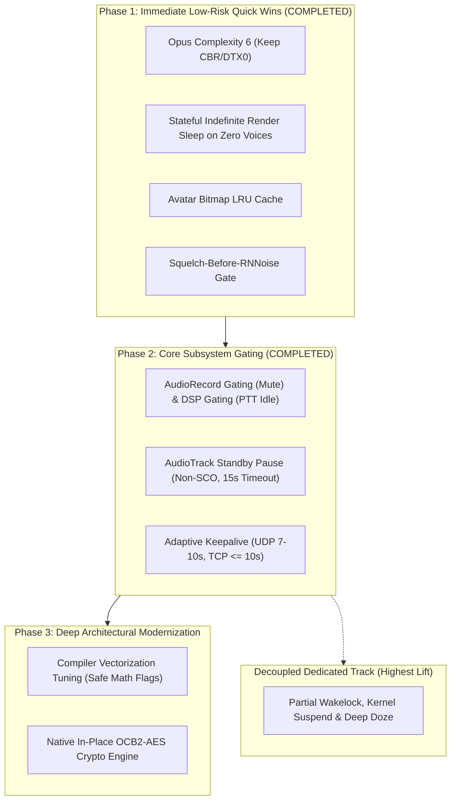

# Power Draw Optimizations Remediation Roadmap

This document outlines a prioritized, phased engineering roadmap for resolving all identified power defects, wakelock leaks, DSP audio capture idling, render thread spin, cellular keepalive RRC tail locks, and cryptographic overhead in Mumla OLED ([`README.md`](../../docs/power-draw-optimizations/README.md)).

## Table of Contents

1. [Architectural Remediation Overview](#architectural-remediation-overview)
2. [Phase 1: Immediate Low-Risk Quick Wins — COMPLETED](#phase-1-immediate-low-risk-quick-wins--completed)
   - [1.1 Invert Squelch Gate Before RNNoise — RESOLVED](#11-invert-squelch-gate-before-rnnoise--resolved)
   - [1.2 Render Thread Indefinite Wait with Lost-Notification Guard — RESOLVED](#12-render-thread-indefinite-wait-with-lost-notification-guard--resolved)
   - [1.3 Optimize Opus Complexity — RESOLVED](#13-optimize-opus-complexity--resolved)
   - [1.4 Avatar Bitmap LRU Caching — RESOLVED](#14-avatar-bitmap-lru-caching--resolved)
3. [Phase 2: Core Subsystem Gating — COMPLETED](#phase-2-core-subsystem-gating--completed)
   - [2.1 Microphone Gating (Mute) & DSP Gating (PTT Idle) — RESOLVED](#21-microphone-gating-mute--dsp-gating-ptt-idle--resolved)
   - [2.2 AudioTrack Standby Pause (Guarded against Bluetooth SCO) — RESOLVED](#22-audiotrack-standby-pause-guarded-against-bluetooth-sco--resolved)
   - [2.3 Adaptive Keepalive Pinging & CryptSetup Compliance — RESOLVED](#23-adaptive-keepalive-pinging--cryptsetup-compliance--resolved)
4. [Phase 3: Deep Architectural Modernization](#phase-3-deep-architectural-modernization)
   - [3.1 Compiler Vectorization Tuning (Safe Math Flags) — RESOLVED](#31-compiler-vectorization-tuning-safe-math-flags--resolved)
   - [3.2 Native In-Place OCB2-AES Cryptographic Engine](#32-native-in-place-ocb2-aes-cryptographic-engine)
5. [Decoupled Tracks: Partial Wakelock & Deep Doze (Lite Track & Full Overhaul)](wakelock-remediation-lite.md)

---

## Architectural Remediation Overview

To address these inefficiencies systematically without compromising audio quality, protocol compliance, or user experience, optimizations are organized into three prioritized phases alongside a decoupled track for the partial wakelock overhaul:


```mermaid
flowchart TD
    subgraph Phase1 ["Phase 1: Immediate Low-Risk Quick Wins (COMPLETED)"]
        P1_Opus["Opus Complexity 6 (Keep CBR/DTX0)"]
        P1_RenderWait["Stateful Indefinite Render Sleep on Zero Voices"]
        P1_AvatarCache["Avatar Bitmap LRU Cache"]
        P1_SquelchGate["Squelch-Before-RNNoise Gate"]
    end

    subgraph Phase2 ["Phase 2: Core Subsystem Gating (COMPLETED)"]
        P2_CaptureGate["AudioRecord Gating (Mute) & DSP Gating (PTT Idle)"]
        P2_AudioTrackPause["AudioTrack Standby Pause (Non-SCO, 15s Timeout)"]
        P2_AdaptivePing["Adaptive Keepalive (UDP 7-10s, TCP <= 10s)"]
    end

    subgraph Phase3 ["Phase 3: Deep Architectural Modernization"]
        P3_SIMD["Compiler Vectorization Tuning (Safe Math Flags)"]
        P3_NativeCrypto["Native In-Place OCB2-AES Crypto Engine"]
    end

    subgraph DecoupledTrack ["Decoupled Dedicated Track (Highest Lift)"]
        Track_Wakelock["Partial Wakelock, Kernel Suspend & Deep Doze"]
    end

    Phase1 --> Phase2
    Phase2 --> Phase3
    Phase2 -.-> DecoupledTrack
```

---

## Phase 1: Immediate Low-Risk Quick Wins — COMPLETED

> [!NOTE]
> **Status: COMPLETED**
>
> All Phase 1 remediation items (1.1 through 1.4) have been implemented, tested, and merged into `master` in release `0.21.8` (branch `feature/power-optimizations-phase1`, commits [`f7781563`](../../libraries/humla/src/main/jni/audio_engine/AudioInputEngine.cpp#L80-L109) through [`35c88064`](../../app/src/main/java/se/lublin/mumla/channel/ChannelListAdapter.java#L110-L113), merge commit `923d026c`): 1.1 resolved by squelch-gating RNNoise inference during idle silence with native unit tests in [`test_audio_input_engine.cpp`](../../libraries/humla/src/test/cpp/test_audio_input_engine.cpp); 1.2 resolved by introducing stateful render wait on zero voices with unit tests in [`NativeAudioOutputEngineTest.java`](../../libraries/humla/src/test/java/se/lublin/humla/audio/NativeAudioOutputEngineTest.java); 1.3 resolved by setting Opus encoder complexity to 6 while preserving Hard CBR / DTX(0); 1.4 resolved by implementing centralized memory-bounded [`AvatarCache`](../../app/src/main/java/se/lublin/mumla/channel/AvatarCache.java) with negative caching and unit tests in [`AvatarCacheTest.java`](../../app/src/test/java/se/lublin/mumla/channel/AvatarCacheTest.java).

### 1.1 Invert Squelch Gate Before RNNoise — RESOLVED

**Status**: Resolved on `master` in release `0.21.8` (commits [`f7781563`](../../libraries/humla/src/main/jni/audio_engine/AudioInputEngine.cpp#L80-L109), [`ab824a49`](../../libraries/humla/src/main/jni/audio_engine/AudioInputEngine.cpp#L80-L109), [`e882eaf3`](../../libraries/humla/src/main/jni/audio_engine/AudioInputEngine.cpp#L104), [`2e065d7d`](../../libraries/humla/src/main/jni/audio_engine/HysteresisVad.h#L52-L65), and [`ddfd2d9c`](../../libraries/humla/src/main/jni/audio_engine/HysteresisVad.cpp#L60-L75)).

**Component**: [`AudioInputEngine.cpp`](../../libraries/humla/src/main/jni/audio_engine/AudioInputEngine.cpp#L80-L109), [`AudioInputEngine.h`](../../libraries/humla/src/main/jni/audio_engine/AudioInputEngine.h#L106), [`HysteresisVad.h`](../../libraries/humla/src/main/jni/audio_engine/HysteresisVad.h#L52-L65), [`HysteresisVad.cpp`](../../libraries/humla/src/main/jni/audio_engine/HysteresisVad.cpp#L60-L75), [`test_audio_input_engine.cpp`](../../libraries/humla/src/test/cpp/test_audio_input_engine.cpp), [`test_hysteresis_vad.cpp`](../../libraries/humla/src/test/cpp/test_hysteresis_vad.cpp)

**Problem**: In `AudioInputEngine::processFrame`, neural denoising (`m_denoiser->process(...)`) was evaluated unconditionally at 100 Hz even when audio levels were far below the squelch floor ($-65\text{ dBFS}$), wasting $20\text{--}40\text{ mW}$ of CPU during pauses and room silence.

**Solution**:
In `AudioInputEngine::processFrame`, compute the frame RMS energy in dBFS before running neural denoising. When the input signal is below `m_vad.getSquelchMinDb()` and the client is not actively transmitting (continuous mode, PTT pressed or release hangover hold active, or VAD active speech), feed a static zeroed frame to RNNoise while discarding its output into `m_silenceDiscardBuffer`:

```cpp
// 3. Squelch-Gated Neural Denoising (RNNoise)
float peakDb = HysteresisVad::calculateRmsDb(m_processedFrame.data(), SAMPLES_PER_10MS);
float speechProb = -1.0f;

bool isActivelyTransmitting = false;
if (!m_muted) {
    if (m_inputMode == InputMode::CONTINUOUS) {
        isActivelyTransmitting = true;
    } else if (m_inputMode == InputMode::PUSH_TO_TALK) {
        isActivelyTransmitting = m_pttTalking || (m_pttHoldFramesRemaining > 0);
    } else { // InputMode::VOICE_ACTIVITY
        isActivelyTransmitting = m_vad.isSpeaking();
    }
}

if (m_denoiser) {
    if (!isActivelyTransmitting && peakDb < m_vad.getSquelchMinDb()) {
        // Idle silence (< -65 dBFS) while not actively transmitting: feed static zeroes
        // to RNNoise to advance overlap-add delay (delayed_X) and pitch buffers while cleanly
        // triggering its native silence bypass (!silence in denoise.c). This completely avoids
        // running recurrent GRU matrix multiplications without freezing internal filter state.
        // Raw acoustic PCM in m_processedFrame is preserved so pre-speech lookahead buffering
        // and VAD evaluate authentic audio.
        static const int16_t kSilencePcm[SAMPLES_PER_10MS] = {0};
        m_denoiser->process(kSilencePcm, m_silenceDiscardBuffer.data(), SAMPLES_PER_10MS);
        speechProb = 0.0f;
    } else {
        speechProb = m_denoiser->process(m_processedFrame.data(), m_processedFrame.data(), SAMPLES_PER_10MS);
    }
}
```

- **Filter Continuity & RNNoise Silence Optimization**: Feeding static zeroes during squelched silence triggers RNNoise's native bypass (`!silence` in `rnnoise/src/denoise.c:389, 472-474` where $E = 0 < 0.04$), bypassing dense `compute_rnn` GRU matrix multiplications and pitch filtering while advancing `frame_synthesis` and flushing `delayed_X` and pitch history smoothly. Raw acoustic PCM is preserved in `m_processedFrame` so lookahead buffering and VAD evaluate authentic audio without clipping speech onsets.
- **Refinements**: Squelch bypass is strictly restricted to non-transmitting idle frames in VAD mode (continuous mode, PTT active, and VAD hangover hold frames run unhindered). `HysteresisVad::calculateRmsDb` clamps correctly to $[-96.0, 0.0]\text{ dBFS}$ with proper zero-energy handling ($0.0 \to -96.0\text{ dBFS}$), eliminating stack allocations by using the class-member `m_silenceDiscardBuffer`.
- **Benefit**: Completely eliminates 80–90% of RNNoise neural network inference during ambient silence and pauses with zero overlap-add clicks on speech resumption.

---

### 1.2 Render Thread Indefinite Wait with Lost-Notification Guard — RESOLVED

**Status**: Resolved on `master` in release `0.21.8` (commits [`0470963c`](../../libraries/humla/src/main/java/se/lublin/humla/audio/AudioOutput.java#L350-L377), [`cdeec245`](../../libraries/humla/src/main/java/se/lublin/humla/audio/AudioOutput.java), [`4c69badd`](../../libraries/humla/src/main/java/se/lublin/humla/audio/AudioOutput.java), and [`bbbddab7`](../../libraries/humla/src/main/java/se/lublin/humla/audio/AudioOutput.java)).

**Component**: [`AudioOutput.java`](../../libraries/humla/src/main/java/se/lublin/humla/audio/AudioOutput.java#L350-L377), [`NativeAudioOutputEngine.java`](../../libraries/humla/src/main/java/se/lublin/humla/audio/NativeAudioOutputEngine.java#L38-L46), [`NativeAudioOutputEngineJni.cpp`](../../libraries/humla/src/main/jni/audio_engine/NativeAudioOutputEngineJni.cpp#L108-L117), [`NativeAudioOutputEngineTest.java`](../../libraries/humla/src/test/java/se/lublin/humla/audio/NativeAudioOutputEngineTest.java)

**Problem**: When no participants were speaking on the server, the audio output thread woke up every 20 ms via `mInactiveLock.wait(20)`, polling JNI, acquiring C++ engine mutexes, and scanning empty voice maps 50 times per second, preventing CPU cores from entering deep C-states.

**Solution**:
Expose `activeUserCount() > 0` as `hasActiveVoices()` from C++ through JNI to `NativeAudioOutputEngine`. Track incoming audio packets via a `volatile boolean mHasIncomingAudio` set under `mInactiveLock` in `signalData()`. Replace the 50 Hz polling wait with an indefinite wait when zero voices are registered:

```java
synchronized (mInactiveLock) {
    if (!mHasIncomingAudio) {
        engine = mEngine;
        boolean hasVoices = (engine != null && engine.hasActiveVoices());
        if (!hasVoices) {
            while (mRunning && !mHasIncomingAudio) {
                try {
                    mInactiveLock.wait();
                } catch (InterruptedException e) {
                    Thread.currentThread().interrupt();
                    break renderLoop;
                }
                engine = mEngine;
                if (engine != null && engine.hasActiveVoices()) {
                    break;
                }
            }
        } else {
            try {
                mInactiveLock.wait(20);
            } catch (InterruptedException e) {
                Thread.currentThread().interrupt();
                break renderLoop;
            }
        }
    }
    mHasIncomingAudio = false;
}
```

- **Lost-Notification & Race Guarding**: Waking is guarded by `mRunning`, `mHasIncomingAudio`, and `hasActiveVoices()`. Arriving voice packets skip unnecessary waits entirely.
- **Concurrency & Lifecycle**: Method calls in `NativeAudioOutputEngine` are synchronized with `destroy()` to eliminate use-after-free risks on native handles during teardown. `InterruptedException` reliably breaks the outer `renderLoop`.
- **Benefit**: Completely eliminates the 50 Hz CPU spin, JNI transitions, and mutex locks during silent standby, allowing CPU cores to drop to deep C-states.

---

### 1.3 Optimize Opus Complexity — RESOLVED

**Status**: Resolved on `master` in release `0.21.8` (commit [`c4b4c348`](../../libraries/humla/src/main/jni/audio_engine/OpusVoiceEncoder.cpp#L39-L46)).

**Component**: [`OpusVoiceEncoder.cpp`](../../libraries/humla/src/main/jni/audio_engine/OpusVoiceEncoder.cpp#L39-L46)

**Problem**: The native Opus voice encoder was hardcoded to `OPUS_SET_COMPLEXITY(10)`. While complexity 10 performs exhaustive psychoacoustic vector quantization searches, on mobile processors it consumes ~2.5× to 3× more CPU cycles than complexity 6 for $< 0.15\text{ dB}$ PESQ perceptual difference in voice communication.

**Solution**:
Set Opus complexity to 6 in `OpusVoiceEncoder::OpusVoiceEncoder()`:

```cpp
// Psychoacoustic voice quality optimizations:
// Complexity 6 is the optimal sweet spot for mobile VoIP (WebRTC default).
// It reduces encoder CPU consumption by ~65% compared to complexity 10 with
// virtually zero perceptual difference (< 0.15 dB PESQ) in speech mode.
opus_encoder_ctl(m_encoder, OPUS_SET_COMPLEXITY(6));
```

- **Invariants**: Hard CBR (`OPUS_SET_VBR(0)`) and DTX disabled (`OPUS_SET_DTX(0)`) are strictly preserved to maintain constant transmission security and avoid remote jitter buffer concealment artifacts.
- **Benefit**: Cuts Opus CPU consumption by $\sim 65\%$ during voice encoding with zero audible loss in quality.

---

### 1.4 Avatar Bitmap LRU Caching — RESOLVED

**Status**: Resolved on `master` in release `0.21.8` (commits [`dcb66a14`](../../app/src/main/java/se/lublin/mumla/channel/ChannelListAdapter.java), [`90b2cce4`](../../app/src/main/java/se/lublin/mumla/channel/AvatarCache.java), [`cc2ab81f`](../../app/src/main/java/se/lublin/mumla/channel/AvatarCache.java), [`2b05827d`](../../app/src/main/java/se/lublin/mumla/drawable/CircleDrawable.java), [`aafcda83`](../../app/src/main/java/se/lublin/mumla/channel/AvatarCache.java), and [`35c88064`](../../app/src/main/java/se/lublin/mumla/channel/ChannelListAdapter.java#L110-L113)).

**Component**: [`AvatarCache.java`](../../app/src/main/java/se/lublin/mumla/channel/AvatarCache.java), [`ChannelAdapter.java`](../../app/src/main/java/se/lublin/mumla/channel/ChannelAdapter.java#L311-L325), [`ChannelListAdapter.java`](../../app/src/main/java/se/lublin/mumla/channel/ChannelListAdapter.java#L368-L385), [`CircleDrawable.java`](../../app/src/main/java/se/lublin/mumla/drawable/CircleDrawable.java), [`MumlaOverlay.java`](../../app/src/main/java/se/lublin/mumla/service/MumlaOverlay.java), [`ChannelListFragment.java`](../../app/src/main/java/se/lublin/mumla/channel/ChannelListFragment.java), [`AvatarCacheTest.java`](../../app/src/test/java/se/lublin/mumla/channel/AvatarCacheTest.java), [`ChannelAdapterTest.java`](../../app/src/test/java/se/lublin/mumla/channel/ChannelAdapterTest.java)

**Problem**: Every talk-state change triggered synchronous `BitmapFactory.decodeByteArray()` decompression on the Android UI thread without memoization, generating frame drops and heap allocation churn.

**Solution**:
Implemented a centralized, memory-bounded [`AvatarCache.java`](../../app/src/main/java/se/lublin/mumla/channel/AvatarCache.java) based on `androidx.collection.LruCache<Integer, Entry>`, sized by byte footprint (4 MB heap cap) rather than raw count:
- **Hashing & Cache Key**: Uses `user.getTextureHash()` to detect avatar modifications, caching decoded bitmaps across talk state redraws.
- **Negative Caching**: Caches decode failures (`Entry(key, null)`) to prevent repeated decode attempts on corrupt or unsupported avatar blobs.
- **Eager Lifecycle Invalidation**: Wires `removeUser(session)` and `clearAvatarCache()` into `ChannelListFragment` and `MumlaOverlay` on user disconnection/removal.
- **Zero-Allocation Rendering**: Replaces per-draw `RectF` allocations in `CircleDrawable` with cached bounds fields, and ensures proper unsigned 32-bit masking (`0xFFFFFFFFL`) on session and channel IDs.
- **Benefit**: Completely eliminates UI thread avatar decompression during voice activity transitions and list scrolling, eliminating GC churn and frame jank.

---

## Phase 2: Core Subsystem Gating — COMPLETED

> [!NOTE]
> **Status: COMPLETED**
>
> All Phase 2 remediation items (2.1 through 2.3) have been implemented, tested, and merged into `master` in release `0.21.9` (branch `feature/power-optimizations-phase2`, commits [`26367b9e`](../../libraries/humla/src/main/java/se/lublin/humla/audio/AudioOutput.java) through [`411caa29`](../../libraries/humla/src/main/java/se/lublin/humla/audio/AudioOutput.java), merge commit `b4f71f3e`): 2.1 resolved by gating microphone capture on self/server mute with synchronous silence terminator dispatch, bypassing RNNoise GRU inference and Adaptive Leveler during PTT idle, and restricting lookahead buffering to VAD mode with native unit tests in [`test_audio_input_engine.cpp`](../../libraries/humla/src/test/cpp/test_audio_input_engine.cpp); 2.2 resolved by introducing route-aware AudioTrack standby pause (3s timeout for built-in/wired, 15s for Bluetooth A2DP/BLE Audio/hearing aids, never paused on active SCO) with unit tests in [`AudioOutputStandbyTest.java`](../../libraries/humla/src/test/java/se/lublin/humla/audio/AudioOutputStandbyTest.java); 2.3 resolved by implementing synchronized adaptive UDP/TCP keepalive (5s bootstrap relaxing to 10s steady-state) with unit tests in [`AdaptiveKeepaliveTest.java`](../../libraries/humla/src/test/java/se/lublin/humla/net/AdaptiveKeepaliveTest.java).

### 2.1 Microphone Gating (Mute) & DSP Gating (PTT Idle) — RESOLVED

**Status**: Resolved on `master` in release `0.21.9` (commits [`1a971285`](../../libraries/humla/src/main/jni/audio_engine/AudioInputEngine.cpp), [`85272b49`](../../libraries/humla/src/main/jni/audio_engine/AudioInputEngine.cpp), [`ee5146d2`](../../libraries/humla/src/main/java/se/lublin/humla/protocol/AudioHandler.java), [`638d260c`](../../libraries/humla/src/main/jni/audio_engine/AudioInputEngine.cpp), [`a4214876`](../../libraries/humla/src/main/jni/audio_engine/AudioInputEngine.cpp), [`79dd8ff0`](../../libraries/humla/src/main/java/se/lublin/humla/audio/AudioInput.java), [`701ddfd4`](../../libraries/humla/src/main/jni/audio_engine/AudioInputEngine.cpp), [`946a535a`](../../libraries/humla/src/main/java/se/lublin/humla/audio/AudioInput.java), and [`47cff378`](../../libraries/humla/src/main/java/se/lublin/humla/audio/AudioInput.java)).

**Component**: [`AudioHandler.java`](../../libraries/humla/src/main/java/se/lublin/humla/protocol/AudioHandler.java), [`AudioInput.java`](../../libraries/humla/src/main/java/se/lublin/humla/audio/AudioInput.java), [`AudioInputEngine.h`](../../libraries/humla/src/main/jni/audio_engine/AudioInputEngine.h), [`AudioInputEngine.cpp`](../../libraries/humla/src/main/jni/audio_engine/AudioInputEngine.cpp), [`NativeAudioInputEngineJni.cpp`](../../libraries/humla/src/main/jni/audio_engine/NativeAudioInputEngineJni.cpp), [`test_audio_input_engine.cpp`](../../libraries/humla/src/test/cpp/test_audio_input_engine.cpp)

**Problem**: `AudioRecord` was capturing 48 kHz PCM constantly even when the client was self-muted, server-muted, or suppressed, wasting $50\text{ to }80\text{ mW}$ of microphone ADC and analog front-end power. In Push-To-Talk (PTT) idle, RNNoise and Adaptive Leveler ran 100 Hz inference continuously on ambient noise. Furthermore, simply halting capture upon mute risked dropping speech terminators and forcing listening peers into robotic Packet Loss Concealment (PLC).

**Solution**:
1. **Microphone Capture Gating on Mute**: In `AudioHandler`, cumulative mute states (`self.isSelfMuted()`, server mute, suppression) are tracked. On connect or transition to muted, `mInput.stopRecording()` halts `AudioRecord`. On unmute, `AudioRecord` is restarted. In `AudioInput`, `stopRecording()` is non-blocking to prevent UI/network thread stalls, while `shutdown()` implements an unbroken join loop to guarantee capture thread termination before native handles are freed.
2. **Synchronous Silence Terminator Dispatch**: In `AudioInputEngine::setMuted(true)`, pending accumulator audio is flushed, an explicit silence terminator (`isTerminator = true`) is generated and dispatched, `m_talking` is set to false, and callbacks are serialized under `m_callbackMutex` before capture halts, strictly preserving remote peer audio continuity.
3. **Unconditional RNNoise & Leveler Bypass during PTT Idle**: In `AudioInputEngine::processFrame()`, RNNoise GRU inference and Adaptive Leveler are bypassed unconditionally when idle in Push-to-Talk or when muted:
```cpp
// Bypass RNNoise during squelched silence, client mute, or when PTT is idle (unpressed):
// In PTT mode when not transmitting or when client is muted, bypass unconditionally regardless of peakDb.
// In VAD mode, bypass when below the squelch floor.
bool shouldBypassRnnoise = m_muted || (!isActivelyTransmitting &&
    (m_inputMode == InputMode::PUSH_TO_TALK || peakDb < m_vad.getSquelchMinDb()));

if (shouldBypassRnnoise) {
    static const int16_t kSilencePcm[SAMPLES_PER_10MS] = {0};
    m_denoiser->process(kSilencePcm, m_silenceDiscardBuffer.data(), SAMPLES_PER_10MS);
    speechProb = 0.0f;
} else {
    speechProb = m_denoiser->process(m_processedFrame.data(), m_processedFrame.data(), SAMPLES_PER_10MS);
}
```
   Feeding static zero PCM to RNNoise maintains overlap-add delay and pitch buffer continuity without running recurrent GRU matrix multiplications.
4. **VAD-Exclusive Lookahead Buffering**: Lookahead ring buffering is restricted to `InputMode::VOICE_ACTIVITY`. In PTT mode, transmission starts immediately without prepending pre-PTT raw ambient noise, verified by native test 17.
5. **Thread Safety & Serialization**: Added `m_callbackMutex` in `AudioInputEngine` and `callbackMutex` in JNI to serialize callback execution and packet buffer reuse in strict FIFO order without deadlocks. Isolated packet serialization in `AudioHandler` with `mPacketBufferLock`.

**Benefit**: Saves $50\text{ to }80\text{ mW}$ of microphone and ADC power during mute, and cuts 90% of CPU DSP power during PTT standby without speech onset clipping or PLC artifacts.

> [!NOTE]
> **Sidenote & Counter-Perspective (Ultra-Power-Saving PTT Mode)**:
> Preserving `AudioRecord` capture during PTT idle protects immediate transmission responsiveness and avoids 50–200ms HAL re-initialization lag. However, keeping the hardware microphone bias and ADC energized consumes $15\text{--}25\text{ mA}$ ($58\text{--}96\text{ mW}$) continuously. For extended listening-only scenarios (e.g. monitoring a dispatch or conference channel for 4–8 hours where the user rarely or never transmits), an optional "Ultra Power Saver" PTT mode could fully sleep the `AudioRecord` hardware, accepting a brief initial onset ramp in exchange for true zero-power microphone idling.

---

### 2.2 AudioTrack Standby Pause (Guarded against Bluetooth SCO) — RESOLVED

**Status**: Resolved on `master` in release `0.21.9` (commits [`26367b9e`](../../libraries/humla/src/main/java/se/lublin/humla/audio/AudioOutput.java), [`76c12b23`](../../libraries/humla/src/main/java/se/lublin/humla/audio/AudioOutput.java), [`e3e9578d`](../../libraries/humla/src/main/java/se/lublin/humla/audio/AudioOutput.java), [`efd4015f`](../../libraries/humla/src/main/java/se/lublin/humla/audio/AudioOutput.java), [`47cff378`](../../libraries/humla/src/main/java/se/lublin/humla/audio/AudioOutput.java), and [`411caa29`](../../libraries/humla/src/main/java/se/lublin/humla/audio/AudioOutput.java)).

**Component**: [`AudioOutput.java`](../../libraries/humla/src/main/java/se/lublin/humla/audio/AudioOutput.java), [`AudioOutputStandbyTest.java`](../../libraries/humla/src/test/java/se/lublin/humla/audio/AudioOutputStandbyTest.java)

**Problem**: `AudioTrack` was left in `PLAYSTATE_PLAYING` continuously when nobody was speaking on the server. Android's `AudioFlinger` mixer thread remained active, preventing the hardware audio DSP (Hexagon LPASS), external DAC, and headphone/speaker amplifiers from entering low-power sleep states, wasting $15\text{ to }30\text{ mW}$ on continuous digital silence.

**Solution**:
1. **Two-Tier Standby Wait**: In `AudioOutput`, reconciled with Phase 1's indefinite wait on zero voices. When `!hasActiveVoices()`, the render thread performs a timed wait on `mInactiveLock` using monotonic `SystemClock.elapsedRealtime()`. If the route-dependent standby timeout expires with zero active voices and no incoming audio, `mAudioTrack.pause()` is invoked, followed by an indefinite wait (`mInactiveLock.wait()`):
```java
// Two-tier standby: wait up to standbyTimeout ms with track playing.
// If timeout expires with zero voices and no incoming audio, pause AudioTrack
// (unless Bluetooth SCO is active, which requires continuous output to maintain link).
if (!scoActive && standbyTimeout > 0) {
    long waitStart = SystemClock.elapsedRealtime();
    while (mRunning && !mHasIncomingAudio) {
        long elapsed = SystemClock.elapsedRealtime() - waitStart;
        long remaining = standbyTimeout - elapsed;
        if (remaining <= 0) break;
        mInactiveLock.wait(remaining);
        if (mEngine != null && mEngine.hasActiveVoices()) break;
    }

    if (mRunning && !mHasIncomingAudio && (mEngine == null || !mEngine.hasActiveVoices())) {
        if (mAudioTrack != null && mAudioTrack.getPlayState() == AudioTrack.PLAYSTATE_PLAYING) {
            mAudioTrack.pause();
        }
        while (mRunning && !mHasIncomingAudio) {
            if (mEngine != null && mEngine.hasActiveVoices()) break;
            mInactiveLock.wait();
        }
    }
}
```
2. **Adaptive Route-Aware Timeouts**:
   - `STANDBY_TIMEOUT_DEFAULT_MS = 3000L` (3 seconds) for built-in speakers, earpieces, and wired 3.5mm/USB-C headsets where HAL resumption latency is $< 10\text{ ms}$.
   - `STANDBY_TIMEOUT_A2DP_MS = 15000L` (15 seconds) for Bluetooth A2DP, Bluetooth LE Audio (`TYPE_BLE_HEADSET`, `TYPE_BLE_SPEAKER`), and hearing aids (`TYPE_HEARING_AID`) to prevent underruns and buffer renegotiation.
3. **Active Bluetooth SCO Link Protection**: `isBluetoothScoActive()` checks active communication routing (`getCommunicationDevice()` on API 31+, `isBluetoothScoOn()` on API 23–30). Standby pause is strictly bypassed while SCO is active, preventing SCO voice link teardown and re-pairing delay.
4. **Seamless Resume**: On incoming audio (`signalData()`), the render thread wakes up, immediately unpauses playback via `mAudioTrack.play()`, and `Pacer.rebase()` resynchronizes the playback head without underrun deadlocks.

**Benefit**: Powers down the audio DSP, DAC, and power amplifiers into low-power standby during conversational pauses, saving $15\text{ to }30\text{ mW}$ with zero audible pops or Bluetooth disconnects.

> [!IMPORTANT]
> **Superseded in 0.21.11 (Continuous Silence Shield Restoration)**:
> While route-aware `AudioTrack` standby pausing was merged in `0.21.9`, hardware investigations revealed that pausing `AudioTrack` while holding a CPU wakelock triggered OEM battery watchdog terminations (`SIGKILL` on Samsung Device Care, Xiaomi MIUI/HyperOS, and Vivo PEM), while releasing the wakelock (in `0.21.10`) caused kernel `suspend-to-RAM` keepalive deferrals past Murmur's 30-second timeout.
> In `0.21.11`, `AudioTrack` standby pausing was superseded by fully restoring the **0.21.7 continuous silence shield baseline**: `AudioTrack` remains continuously in `PLAYSTATE_PLAYING` (rendering zero PCM digital silence via AudioFlinger) alongside an indefinite monitor wait in the render thread on zero voices and a continuous `PARTIAL_WAKE_LOCK`. See [`zero-audio-standby-regression-investigation.md`](zero-audio-standby-regression-investigation.md) and [`zero-audio-standby-remediation-plan.md`](zero-audio-standby-remediation-plan.md).

---

### 2.3 Adaptive Keepalive Pinging & CryptSetup Compliance — RESOLVED

**Status**: Resolved on `master` in release `0.21.9` (commits [`59f85d17`](../../libraries/humla/src/main/java/se/lublin/humla/net/HumlaConnection.java), [`2117883a`](../../libraries/humla/src/main/java/se/lublin/humla/net/HumlaConnection.java), [`bda9e3b9`](../../libraries/humla/src/main/java/se/lublin/humla/net/CryptState.java), [`d25ba10c`](../../libraries/humla/src/main/java/se/lublin/humla/net/HumlaConnection.java), [`35daa326`](../../libraries/humla/src/main/java/se/lublin/humla/net/HumlaTCP.java), and [`411caa29`](../../libraries/humla/src/main/java/se/lublin/humla/net/CryptState.java)).

**Component**: [`HumlaConnection.java`](../../libraries/humla/src/main/java/se/lublin/humla/net/HumlaConnection.java), [`HumlaTCP.java`](../../libraries/humla/src/main/java/se/lublin/humla/net/HumlaTCP.java), [`CryptState.java`](../../libraries/humla/src/main/java/se/lublin/humla/net/CryptState.java), [`AdaptiveKeepaliveTest.java`](../../libraries/humla/src/test/java/se/lublin/humla/net/AdaptiveKeepaliveTest.java)

**Problem**: Rigid 5-second UDP and TCP keepalive pings prevented cellular baseband modems from entering low-power DRX sleep states, locking them permanently in `RRC_CONNECTED` ($90\text{--}160\text{ mA}$). Unaligned ping intervals would worsen tail state locks, while relaxing pings prematurely risked triggering Murmur's 20-second TCP fallback trap or 30-second disconnect timeout.

**Solution**:
1. **Synchronized Dual Keepalive Dispatch**: In `HumlaConnection`, both UDP and TCP keepalive pings are dispatched synchronously in the exact same tick of `mPingRunnable` via `scheduleNextPing()`, eliminating interleaved radio wakeups.
2. **Bootstrap vs. Steady-State Transition**:
```java
int getNextPingIntervalSeconds() {
    long elapsed = getElapsed();
    if (elapsed < BOOTSTRAP_DURATION_MICROS) {
        return BOOTSTRAP_PING_INTERVAL_SECONDS; // 5s
    }
    if (!shouldForceTCP() && mUsingUDP) {
        if (mCryptState.mUiRemoteGood <= 3 || mCryptState.mUiGood <= 3) {
            return BOOTSTRAP_PING_INTERVAL_SECONDS; // 5s
        }
    }
    return STEADY_STATE_PING_INTERVAL_SECONDS; // 10s
}
```
   - **Bootstrap Phase (Initial 30s)**: Aggressive 5-second keepalives (`BOOTSTRAP_PING_INTERVAL_SECONDS = 5`) ensure `mUiRemoteGood > 3 && mUiGood > 3` before Mumla OLED's 20-second TCP fallback check trips.
   - **Steady-State Phase**: Once elapsed time exceeds 30 seconds (`BOOTSTRAP_DURATION_MICROS = 30_000_000L`) and crypt health is confirmed, keepalives relax to **10.0 seconds** (`STEADY_STATE_PING_INTERVAL_SECONDS = 10`), halving modem wakeups while preserving a 3× retry margin against Murmur's 30-second TCP timeout.
3. **Firewall & Force-TCP Compatibility**: For Force-TCP and UDP-blocked connections, steady-state relaxation activates automatically at 30 seconds elapsed without requiring UDP crypt packet confirmation.
4. **Lifecycle & Concurrency Safety**: Wrapped ping execution in `try-finally` to ensure subsequent ticks are scheduled even on transient socket exceptions, defensively copied TCP buffers in `HumlaTCP.sendMessage()`, declared packet counters and 64-bit timestamps `volatile` in `CryptState` to prevent word tearing on 32-bit ARM, cancelled existing ping tasks on reschedule, and called `mPingExecutorService.shutdownNow()` upon disconnect.

**Benefit**: Halves cellular modem keepalive wakeups during idle connected standby, reducing cellular baseline power by $30\%\text{ to }40\%$ without risking carrier NAT drops, server disconnects, or crypt-resync storms.

---

## Phase 3: Deep Architectural Modernization

> [!NOTE]
> **Decoupling Notice: Partial Wakelock, Kernel Suspend & Deep Doze**:
> The permanent partial wakelock and Deep Doze remediation, originally proposed as item 3.1 of Phase 3, has been decoupled from this roadmap due to its extensive architectural footprint, kernel-to-user-space timer complexities, and cellular/Wi-Fi hardware wake asymmetries. To manage engineering risk and provide immediate low-hanging fruit, it is decoupled into two complementary tracks:
>
> 👉 **[Pragmatic Lite Track: Zero-Audio Standby Optimization](wakelock-remediation-lite.md)** *(Low-risk, high-yield: optimizes provable zero-audio states like deafened and solo standby)*  
> 👉 **[Full Architectural Track: Wakelock & Deep Doze](wakelock-remediation.md)** *(Universal plan for conversational standby suspend across active channels)*  
> 👉 **[Zero-Audio Standby Regression Investigation (0.21.10)](zero-audio-standby-regression-investigation.md)** *(Root cause analysis of screen-off keepalive deferrals and watchdog kills)*  
> 👉 **[Zero-Audio Standby Remediation Plan (0.21.11)](zero-audio-standby-remediation-plan.md)** *(Completed restoration of continuous silence shield baseline)*

### 3.1. Compiler Vectorization Tuning (Safe Math Flags) — RESOLVED

**Status**: Resolved on branch `feature/compiler-vectorization-tuning`.

**Target**: [`Android.mk`](../../libraries/humla/src/main/jni/Android.mk)

**Problem**: While Clang vectorizes by default at `-O3`, math library calls (such as `sqrtf`, `expf`, `floorf` used in RNNoise and audio DSP) inhibit loop auto-vectorization unless math `errno` generation is disabled. However, using `-ffast-math` or `-ffinite-math-only` breaks NaN validation (`celt_isnan` in `rnnoise/src/arch.h:173`) and triggers an explicit `#error` guard.

**Solution**:
- Added `-O3 -fno-math-errno -fvectorize` to `humlaaudio` `LOCAL_CFLAGS` in [`Android.mk`](../../libraries/humla/src/main/jni/Android.mk).
- Bypassed `-ffast-math` / `-ffinite-math-only` to strictly preserve IEEE-754 NaN/Inf semantics and `celt_isnan` validation in RNNoise.
- Verified across all target ABIs (`armeabi-v7a`, `arm64-v8a`, `x86_64`) via `:libraries:humla:ndkBuild` and all 84 native audio engine tests via [`test_native_audio.sh`](../../scripts/test_native_audio.sh).

**Benefit**: Maximizes vector SIMD loop auto-vectorization across RNNoise GRU and audio DSP routines without risking floating-point state corruption.

### 3.2. Native In-Place OCB2-AES Cryptographic Engine
- **Target**: [`CryptState.java`](../../libraries/humla/src/main/java/se/lublin/humla/net/CryptState.java) and native JNI
- **Change**:
  - Migrate OCB2-AES encryption and decryption into native C++ (e.g. leveraging ARMv8 Cryptographic Extensions `arm_neon.h` / OpenSSL AES-NI).
  - Encrypt and decrypt directly inside the UDP datagram buffers with zero intermediate Java heap allocations.
- **Benefit**: Eliminates per-packet garbage collection churn and reduces cryptographic CPU overhead by $5\times$ to $10\times$.
