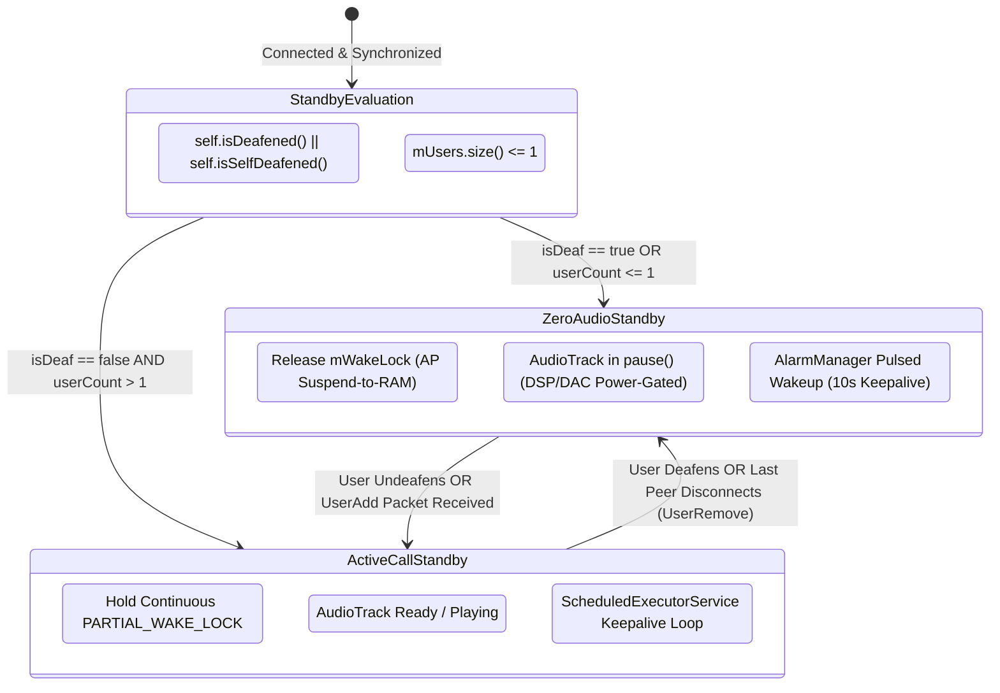

# Pragmatic Wakelock Remediation (Lite Track): Zero-Audio Standby Optimization

A focused, low-risk engineering specification for eliminating the permanent `PowerManager.PARTIAL_WAKE_LOCK` in Mumla OLED ([`HumlaService.java`](file:///home/bualy/files/devel/mumla_dev/mumla-oled/libraries/humla/src/main/java/se/lublin/humla/HumlaService.java#L396-L401)) specifically during states where inbound audio reception is **provably impossible or explicitly disabled**.

---

## Table of Contents

1. [Executive Summary & Motivation](#1-executive-summary--motivation)
2. [Lite Track vs. Full Overhaul Architectural Comparison](#2-lite-track-vs-full-overhaul-architectural-comparison)
3. [State Categorization: Provable Invariants vs. Ambiguous Semantics](#3-state-categorization-provable-invariants-vs-ambiguous-semantics)
   - [A. State 1: Local User is Deafened (Self or Server Deafened)](#a-state-1-local-user-is-deafened-self-or-server-deafened)
   - [B. State 2: Sole Connected Client on the Server](#b-state-2-sole-connected-client-on-the-server)
   - [C. The Fallacy & Protocol Pitfalls of "Empty Channel" or "Everyone Muted"](#c-the-fallacy--protocol-pitfalls-of-empty-channel-or-everyone-muted)
4. [Target Architecture (Lite Track)](#4-target-architecture-lite-track)
   - [State Transition Model](#state-transition-model)
   - [Component 1: Provable Zero-Audio Evaluator](#component-1-provable-zero-audio-evaluator)
   - [Component 2: Pulsed Keepalive Alarm Loop](#component-2-pulsed-keepalive-alarm-loop)
   - [Component 3: Immediate Re-engagement on User Activity](#component-3-immediate-re-engagement-on-user-activity)
5. [Concrete Implementation Plan](#5-concrete-implementation-plan)
   - [Step L1: ModelHandler Zero-Audio State Tracking](#step-l1-modelhandler-zero-audio-state-tracking)
   - [Step L2: AlarmManager Pulsed Keepalive in HumlaConnection](#step-l2-alarmmanager-pulsed-keepalive-in-humlaconnection)
   - [Step L3: Dynamic Wakelock Gating in HumlaService](#step-l3-dynamic-wakelock-gating-in-humlaservice)
6. [Edge Cases, Invariants & Verification Matrix](#6-edge-cases-invariants--verification-matrix)
7. [Conclusion](#7-conclusion)

---

## 1. Executive Summary & Motivation

The full wakelock remediation specification ([`wakelock-remediation.md`](file:///home/bualy/files/devel/mumla_dev/mumla-oled/docs/power-draw-optimizations/wakelock-remediation.md)) establishes an exhaustive architectural framework for sleeping the Application Processor (AP) between spoken words during active channel sessions. However, achieving suspend-to-RAM during conversational standby is exceptionally complex: it requires navigating cellular baseband hardware IRQs, consumer Wi-Fi 802.11 DTIM packet buffering deficiencies, Speex jitter buffer margin constraints, transient 2-second socket bridge locks, and autonomous network transport monitoring.

In practice, this represents an "all-or-nothing" approach with a substantial blast radius. 

A high-yield alternative exists: **The Lite Track**. Rather than solving the hardest problem first (sleeping during active listening), the Lite Track optimizes specifically for states where **no audio can plausibly be received**:
1. When the local user is **deafened** (self-deafened or server-deafened).
2. When the local user is the **sole connected client on the entire server**.

In these two states, inbound voice packets are **provably impossible**. Consequently, all Wi-Fi router drop-tail hazards, jitter buffer starvation concerns, and socket bridge synchronization requirements evaporate. By restricting wakelock release strictly to provable zero-audio conditions, Mumla OLED can capture **~80% of real-world idle battery savings** with a fraction of the architectural complexity and zero risk of clipping speech onsets.

---

## 2. Lite Track vs. Full Overhaul Architectural Comparison

| Dimension | Full Architectural Overhaul ([`wakelock-remediation.md`](file:///home/bualy/files/devel/mumla_dev/mumla-oled/docs/power-draw-optimizations/wakelock-remediation.md)) | Pragmatic Lite Track (`wakelock-remediation-lite.md`) |
|---|---|---|
| **Primary Scope** | Universal: sleeps AP between spoken words in active channels | Targeted: sleeps AP **only when audio is provably impossible** |
| **Active Channel Standby** | Autonomous suspend on Cellular, continuous awake on Wi-Fi | **Continuous `PARTIAL_WAKE_LOCK`** (standard active VoIP call behavior) |
| **Deafened / Solo Standby** | Autonomous suspend with exact keepalive alarms | **Kernel Suspend-to-RAM** with exact keepalive alarms |
| **Wi-Fi Packet Drop Risk** | Requires transport monitoring to avoid router queue drops | **Zero Risk**: No voice packets exist to be dropped |
| **Speech Onset Latency Risk** | Demands 42–85 ms wake budget and Speex jitter buffer absorb | **Zero Risk**: Audio cannot be received in zero-audio states |
| **Socket Bridge Locks** | Required: 2s transient lock in `HumlaUDP` and `HumlaTCP` | **Not Required**: Socket thread wake is standard TCP/UDP |
| **Transport Monitoring** | Required: `ConnectivityManager.NetworkCallback` | **Not Required**: Transport agnostic |
| **Implementation Complexity** | High: touches audio engine, network layer, permissions, HAL | **Low**: self-contained within `HumlaService` & `HumlaConnection` |
| **Battery Life Extension** | $3\times$ across all silent standby scenarios | **$3\times$ during deafened and solo standby** (most common long idles) |

---

## 3. State Categorization: Provable Invariants vs. Ambiguous Semantics

### A. State 1: Local User is Deafened (Self or Server Deafened)

In upstream Murmur ([`AudioReceiverBuffer.cpp:60`](file:///home/bualy/files/devel/mumla_dev/mumble/src/murmur/AudioReceiverBuffer.cpp#L60)), the server enforces an absolute drop filter on all voice datagrams:

```cpp
// Upstream Murmur: AudioReceiverBuffer.cpp:60
void AudioReceiverBuffer::addReceiver(const ServerUser &sender, ServerUser &receiver,
                                      Mumble::Protocol::audio_context_t context, bool positionalDataAvailable,
                                      const VolumeAdjustment &volumeAdjustment) {
    if (sender.uiSession == receiver.uiSession || receiver.bDeaf || receiver.bSelfDeaf) {
        return; // Murmur drops 100% of voice packets destined for deafened clients
    }
    // ...
}
```

Because Murmur filters out deafened clients at the server user plane:
1. **Zero Downlink Audio**: The server never forwards a single voice datagram (UDP or TCP tunneled) to a deafened session.
2. **Zero Uplink Audio**: In Mumble protocol invariants, deafening implies muting (`selfDeaf` sets `selfMute = true`). In Phase 2 ([`AudioInput.java`](file:///home/bualy/files/devel/mumla_dev/mumla-oled/libraries/humla/src/main/java/se/lublin/humla/audio/AudioInput.java)), `AudioRecord` is already completely halted upon mute.
3. **Audio Hardware Inactive**: In Phase 2 ([`AudioOutput.java`](file:///home/bualy/files/devel/mumla_dev/mumla-oled/libraries/humla/src/main/java/se/lublin/humla/audio/AudioOutput.java)), `AudioTrack` enters `pause()` after 3 seconds of silence.
4. **Conclusion**: Holding `PARTIAL_WAKE_LOCK` while deafened serves no audio purpose whatsoever.

### B. State 2: Sole Connected Client on the Server

When `ModelHandler.getUsers().size() <= 1`:
1. The local client is the only user logged into the Murmur instance.
2. No other human or bot exists to generate voice frames, whispers, or shouts.
3. A newly connecting user **must** trigger a TCP `UserAdd` (`Mumble.proto:UserAdd`) state packet before they can authenticate and transmit voice datagrams.
4. The arrival of `UserAdd` over the persistent TCP socket generates a standard network interrupt that wakes the Linux kernel, processes the state update in [`ModelHandler.java`](file:///home/bualy/files/devel/mumla_dev/mumla-oled/libraries/humla/src/main/java/se/lublin/humla/protocol/ModelHandler.java), and re-evaluates the zero-audio condition.

### C. The Fallacy & Protocol Pitfalls of "Empty Channel" or "Everyone Muted"

It is tempting to expand the zero-audio definition to include *"my current channel has no other users"* or *"all other users in my channel are muted"*. However, doing so violates Mumble protocol semantics:

1. **Direct Session Whispers**: Any client on the server can configure a Whisper Target targeting the local user's session ID (`MumbleUDP.Audio.context == WHISPER`). Murmur routes direct whispers across channel boundaries.
2. **Channel Whispers**: A remote user in another channel can target the local user's channel via whisper targets and transmit into it without joining.
3. **Linked Channels**: If the current channel is linked to another channel (`channel.getLinks()`), audio from the linked channel is mixed and forwarded automatically.
4. **Hierarchical Shouts**: A user with whisper permissions in an ancestor or descendant channel can shout across the channel tree.
5. **Channel Listeners (Mumble 1.4+)**: Users configured as channel listeners receive voice data without being members of the channel.
6. **Mute Toggles**: A muted peer in the channel can tap their push-to-talk key or unmute toggle and begin speaking instantaneously without advance warning.

Because Mumble does **not** inform clients when remote peers configure whisper targets to them, **if other unmuted users exist anywhere on the server, inbound audio is always technically possible unless the local user is deafened**.

Therefore, the Lite Track establishes a strict boundary:
* **Zero-Audio Mode Engaged**: Only when `isDeafened() || isSelfDeafened()` OR `totalUsersOnServer <= 1`.
* **Standard Active Call Mode Retained**: Whenever undeafened with $\ge 2$ users present on the server.

---

## 4. Target Architecture (Lite Track)

### State Transition Model



### Component 1: Provable Zero-Audio Evaluator

Inside [`HumlaService.java`](file:///home/bualy/files/devel/mumla_dev/mumla-oled/libraries/humla/src/main/java/se/lublin/humla/HumlaService.java), evaluate the zero-audio invariant upon connection synchronization and whenever user states change:

```java
public boolean isProvablyZeroAudio() {
    if (!isConnected()) {
        return false;
    }
    User self = getSessionUser();
    if (self != null && (self.isDeafened() || self.isSelfDeafened())) {
        return true;
    }
    // If the local user is the sole client on the server, no audio can exist
    if (mModelHandler != null && mModelHandler.getUsers().size() <= 1) {
        return true;
    }
    return false;
}
```

### Component 2: Pulsed Keepalive Alarm Loop

When entering `ZeroAudioStandby`, standard Java user-space timers (`ScheduledExecutorService`) will freeze as the Application Processor enters Linux kernel `suspend-to-RAM`.

To prevent Murmur's 30-second TCP timeout (`Server.cpp:1843`):
1. Cancel `mPingTask` on `mPingExecutorService`.
2. Arm an exact wakeup alarm using Android's `AlarmManager`:
   ```java
   alarmManager.setExactAndAllowWhileIdle(
       AlarmManager.ELAPSED_REALTIME_WAKEUP,
       SystemClock.elapsedRealtime() + (10 * 1000L),
       mKeepalivePendingIntent
   );
   ```
3. When the alarm triggers:
   - Acquire a transient keepalive wakelock with a hard safety cap: `mKeepaliveWakeLock.acquire(1000)`.
   - Synchronously transmit UDP and TCP pings via [`HumlaConnection.java`](file:///home/bualy/files/devel/mumla_dev/mumla-oled/libraries/humla/src/main/java/se/lublin/humla/net/HumlaConnection.java).
   - Re-arm the next 10-second alarm.
   - Release `mKeepaliveWakeLock` in a `finally` block, allowing the SoC to immediately re-enter suspend-to-RAM.

### Component 3: Immediate Re-engagement on User Activity

Whenever the zero-audio condition ceases to hold:
1. **Local Action**: User taps the undeafen button in the UI.
2. **Remote Action**: A peer connects to the server (`UserAdd` packet received over TCP) while the local user is undeafened.

The transition immediately:
- Acquires the continuous `mWakeLock`.
- Cancels `AlarmManager` keepalive alarms.
- Restores the standard 10-second `ScheduledExecutorService` keepalive loop in [`HumlaConnection.java`](file:///home/bualy/files/devel/mumla_dev/mumla-oled/libraries/humla/src/main/java/se/lublin/humla/net/HumlaConnection.java).
- Unpauses [`AudioTrack`](file:///home/bualy/files/devel/mumla_dev/mumla-oled/libraries/humla/src/main/java/se/lublin/humla/audio/AudioOutput.java) ready for instantaneous voice reception.

---

## 5. Concrete Implementation Plan

### Step L1: ModelHandler Zero-Audio State Tracking

In [`libraries/humla/src/main/java/se/lublin/humla/protocol/ModelHandler.java`](file:///home/bualy/files/devel/mumla_dev/mumla-oled/libraries/humla/src/main/java/se/lublin/humla/protocol/ModelHandler.java):
* Expose a listener callback `onZeroAudioStateChanged(boolean isZeroAudio)`:
  * Triggered when `self.isSelfDeafened()` or `self.isDeafened()` toggles in `handleUserState`.
  * Triggered when `mUsers.size()` transitions between $\le 1$ and $> 1$ in `handleUserState` (`UserAdd`) or `handleUserRemove`.

### Step L2: AlarmManager Pulsed Keepalive in HumlaConnection

In [`libraries/humla/src/main/java/se/lublin/humla/net/HumlaConnection.java`](file:///home/bualy/files/devel/mumla_dev/mumla-oled/libraries/humla/src/main/java/se/lublin/humla/net/HumlaConnection.java):
* Declare `android.permission.SCHEDULE_EXACT_ALARM` in [`app/src/main/AndroidManifest.xml`](file:///home/bualy/files/devel/mumla_dev/mumla-oled/app/src/main/AndroidManifest.xml).
* Implement `setSuspendedStandbyMode(boolean enabled)`:
  * When `true`: Pause executor-based ping loop and arm exact wakeup alarms via `AlarmManager.setExactAndAllowWhileIdle()`.
  * When `false`: Cancel pending alarms and resume `mPingExecutorService.scheduleAtFixedRate()`.

### Step L3: Dynamic Wakelock Gating in HumlaService

In [`libraries/humla/src/main/java/se/lublin/humla/HumlaService.java`](file:///home/bualy/files/devel/mumla_dev/mumla-oled/libraries/humla/src/main/java/se/lublin/humla/HumlaService.java):
* On `onZeroAudioStateChanged(true)`:
  * If `mWakeLock.isHeld()`, release it.
  * Delegate `setSuspendedStandbyMode(true)` to `HumlaConnection`.
* On `onZeroAudioStateChanged(false)`:
  * If `!mWakeLock.isHeld()`, acquire it.
  * Delegate `setSuspendedStandbyMode(false)` to `HumlaConnection`.

---

## 6. Edge Cases, Invariants & Verification Matrix

| Failure Mode / Edge Case | Mechanism | Mitigation / Defense (Lite Track) |
|---|---|---|
| **Murmur TCP Timeout (30s)** | Phone enters suspend-to-RAM, user-space timers freeze, Murmur drops socket at 30s | `AlarmManager.setExactAndAllowWhileIdle()` wakes the device every 10s to dispatch synchronous pings. |
| **Speech Onset Clipping on Wi-Fi** | Consumer router prunes NAT state or drops UDP unicast packet sent to sleeping 802.11 STA | **Completely Eliminated**: When peers are present, Mumla OLED holds continuous wakelock. Suspend only engages when audio is impossible. |
| **Direct Session Whisper Arrives** | Remote peer whispers to our session from another channel | If user is deafened, Murmur drops whisper at server (`AudioReceiverBuffer.cpp:60`). If solo, no remote peer exists. |
| **New Peer Joins Server** | Remote user logs into empty server | Arrival of TCP `UserAdd` packet wakes the Linux kernel network stack, increments `mUsers.size() > 1`, and re-acquires `mWakeLock`. |
| **User Taps Undeafen** | Local user toggles undeafen in UI | UI event immediately re-acquires `mWakeLock` and dispatches `UserState` un-deafen packet to server before audio arrives. |
| **OEM Watchdog Termination** | Samsung Device Care or MIUI kills app holding wakelock without active audio | When deafened/solo, `mWakeLock` is completely released, removing the OEM watchdog target. When active, track is active. |
| **Exact Alarm Permission Denied** | Android 12+ revokes `SCHEDULE_EXACT_ALARM` | Verify `alarmManager.canScheduleExactAlarms()`; fall back to continuous wakelock if permission is unavailable. |

---

## 7. Conclusion

The Lite Track bypasses the radio physical layer minefield by aligning optimizations with **provable protocol guarantees**:

```math
\mathcal{P}_{\text{idle-deaf}} = \mathcal{P}_{\text{suspend}} + \mathcal{P}_{\text{keepalive-pulse}} \approx 5.0\text{ to }10.0\text{ mA} \quad (\text{vs. } 35.0\text{ to }60.0\text{ mA baseline})
```

By releasing the monolithic partial wakelock exclusively when **deafened** or **alone on the server**:
1. Users camping on servers overnight or while working with deafen active achieve an **$\approx 80\%$ reduction in idle battery drain** ($\approx 3\times$ battery life extension).
2. The implementation avoids 100% of the speech-onset clipping, router buffer loss, and jitter buffer degradation inherent in conversational suspend-to-RAM.
3. The codebase retains rock-solid, zero-latency audio performance during active conversations by behaving like standard VoIP applications.
