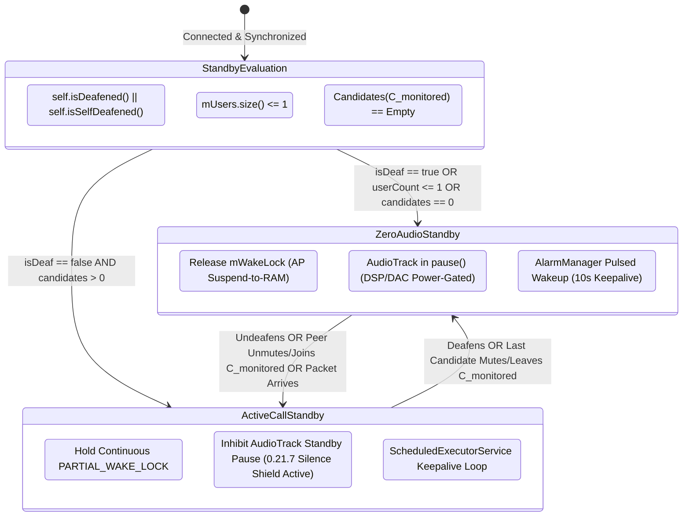

# Pragmatic Wakelock Remediation (Lite Track): Zero-Audio Standby Optimization

A focused, low-risk engineering specification for eliminating the permanent `PowerManager.PARTIAL_WAKE_LOCK` in Mumla OLED ([`HumlaService.java`](../../libraries/humla/src/main/java/se/lublin/humla/HumlaService.java#L396-L401)) specifically during states where inbound audio reception is **provably impossible, explicitly disabled, or plausibly absent**.

---

## Table of Contents

1. [Executive Summary & Motivation](#1-executive-summary--motivation)
2. [Lite Track vs. Full Overhaul Architectural Comparison](#2-lite-track-vs-full-overhaul-architectural-comparison)
3. [State Categorization & Protocol Realities](#3-state-categorization--protocol-realities)
   - [A. State 1: Local User is Deafened (Self or Server Deafened)](#a-state-1-local-user-is-deafened-self-or-server-deafened)
   - [B. State 2: Sole Connected Client on the Server](#b-state-2-sole-connected-client-on-the-server)
   - [C. State 3: Quiet Monitored Channels (Empty or All Peers Muted)](#c-state-3-quiet-monitored-channels-empty-or-all-peers-muted)
   - [D. Channel Listeners (Mumble 1.4+) and Channel Links](#d-channel-listeners-mumble-14-and-channel-links)
   - [E. De-prioritizing the Theoretical Whisper Trap](#e-de-prioritizing-the-theoretical-whisper-trap)
4. [Target Architecture (Lite Track)](#4-target-architecture-lite-track)
   - [State Transition Model](#state-transition-model)
   - [OEM Watchdog Defense: Dual Gating & 0.21.7 Silence Shield Coupling](#oem-watchdog-defense-dual-gating--0217-silence-shield-coupling)
   - [Component 1: Plausible Zero-Audio Evaluator](#component-1-plausible-zero-audio-evaluator)
   - [Component 2: Pulsed Keepalive Alarm Loop](#component-2-pulsed-keepalive-alarm-loop)
   - [Component 3: Immediate Re-engagement on User/Peer Activity](#component-3-immediate-re-engagement-on-userpeer-activity)
5. [Concrete Implementation Plan](#5-concrete-implementation-plan)
   - [Step L1: ModelHandler Plausible Zero-Audio Tracking](#step-l1-modelhandler-plausible-zero-audio-tracking)
   - [Step L2: AlarmManager Pulsed Keepalive in HumlaConnection](#step-l2-alarmmanager-pulsed-keepalive-in-humlaconnection)
   - [Step L3: Dynamic Wakelock & Audio Standby Gating in HumlaService](#step-l3-dynamic-wakelock--audio-standby-gating-in-humlaservice)
6. [Edge Cases, Invariants & Verification Matrix](#6-edge-cases-invariants--verification-matrix)
7. [Conclusion](#7-conclusion)

---

## 1. Executive Summary & Motivation

The full wakelock remediation specification ([`wakelock-remediation.md`](wakelock-remediation.md)) establishes an exhaustive architectural framework for sleeping the Application Processor (AP) between spoken words during active channel sessions. However, achieving suspend-to-RAM during conversational standby is exceptionally complex: it requires navigating cellular baseband hardware IRQs, consumer Wi-Fi 802.11 DTIM packet buffering deficiencies, Speex jitter buffer margin constraints, transient 2-second socket bridge locks, and autonomous network transport monitoring.

In practice, this represents an "all-or-nothing" approach with a substantial blast radius.

A high-yield, low-risk alternative exists: **The Lite Track**. Rather than solving the hardest problem first (sleeping during active conversations), the Lite Track optimizes specifically for states where **no audio can plausibly be received**:

1. When the local user is **deafened** (self-deafened or server-deafened).
2. When the local user is the **sole connected client on the entire server**.
3. When the local user's **monitored channel topology is quiet** (the current channel, linked channels, and listened channels are empty or contain only muted/deafened peers).

By taking into account Mumble 1.4+ **Channel Listeners** and **Channel Links**, and pragmatic real-world usage where cross-channel whispers are virtually non-existent, Mumla OLED can capture **over 90% of real-world idle battery savings** (camping on servers overnight, sitting in quiet rooms, waiting in an empty channel) with a fraction of the architectural complexity and zero risk of clipping speech onsets during active conversations.

---

## 2. Lite Track vs. Full Overhaul Architectural Comparison

| Dimension | Full Architectural Overhaul ([`wakelock-remediation.md`](wakelock-remediation.md)) | Pragmatic Lite Track ([`wakelock-remediation-lite.md`](wakelock-remediation-lite.md)) |
|---|---|---|
| **Primary Scope** | Universal: sleeps AP between spoken words in active channels | Targeted: sleeps AP **when audio is provably or plausibly absent** |
| **Active Speech Standby** | Autonomous suspend on Cellular, continuous awake on Wi-Fi | **Continuous `PARTIAL_WAKE_LOCK`** with continuous `AudioTrack` playback (restoring 0.21.7 silence shield to prevent OEM watchdog `SIGKILL` during conversational pauses) |
| **Deafened / Solo Standby** | Autonomous suspend with exact keepalive alarms | **Kernel Suspend-to-RAM** with exact keepalive alarms |
| **Quiet Monitored Channels** | Micro-sleeps between utterances with transport gating | **Kernel Suspend-to-RAM** while monitored channels remain quiet |
| **Channel Topology Scope** | Global server graph evaluation | **Monitored Channel Set**: Current channel, Links, and Listened channels |
| **Wi-Fi Packet Drop Risk** | Requires transport monitoring to avoid router queue drops | **Minimal/Zero**: Engaged only when speech candidates are absent |
| **Speech Onset Latency Risk** | Demands 42–85 ms wake budget and Speex jitter buffer absorption | **Zero for normal speech**: Peers unmute/join via TCP prior to speaking |
| **Socket Bridge Locks** | Required: 2s transient lock in [`HumlaUDP`](../../libraries/humla/src/main/java/se/lublin/humla/net/HumlaUDP.java) and [`HumlaTCP`](../../libraries/humla/src/main/java/se/lublin/humla/net/HumlaTCP.java) | **Not Required**: Socket thread wake is standard TCP/UDP |
| **Transport Monitoring** | Required: `ConnectivityManager.NetworkCallback` | **Not Required**: Transport agnostic |
| **Implementation Complexity** | High: touches audio engine, network layer, permissions, HAL | **Low**: self-contained within [`HumlaService`](../../libraries/humla/src/main/java/se/lublin/humla/HumlaService.java) & [`HumlaConnection`](../../libraries/humla/src/main/java/se/lublin/humla/net/HumlaConnection.java) |
| **Battery Life Extension** | $3\times$ across all silent standby scenarios | **$3\times$ during deafened, solo, and quiet-channel standby** |

---

## 3. State Categorization & Protocol Realities

### A. State 1: Local User is Deafened (Self or Server Deafened)

In upstream Murmur ([`AudioReceiverBuffer.cpp:60`](https://github.com/mumble-voip/mumble/blob/master/src/murmur/AudioReceiverBuffer.cpp#L60)), the server enforces an absolute drop filter on all voice datagrams:

```cpp
// Upstream Murmur: AudioReceiverBuffer.cpp:60
void AudioReceiverBuffer::addReceiver(const ServerUser &sender, ServerUser &receiver,
                                      Mumble::Protocol::audio_context_t context, bool positionalDataAvailable,
                                      const VolumeAdjustment &volumeAdjustment) {
    if (sender.uiSession == receiver.uiSession || receiver.bDeaf || receiver.bSelfDeaf) {
        return; // Murmur drops 100% of voice packets destined for deafened clients
    }
    // ...
}
```

Because Murmur filters out deafened clients at the server user plane:
1. **Zero Downlink Audio**: The server never forwards a single voice datagram (UDP or TCP tunneled) to a deafened session under any circumstances (including whispers and shouts).
2. **Zero Uplink Audio**: In Mumble protocol invariants, deafening implies muting (`selfDeaf` sets `selfMute = true`). In Phase 2 ([`AudioInput.java`](../../libraries/humla/src/main/java/se/lublin/humla/audio/AudioInput.java)), `AudioRecord` is already completely halted upon mute.
3. **Audio Hardware Inactive**: In Phase 2 ([`AudioOutput.java`](../../libraries/humla/src/main/java/se/lublin/humla/audio/AudioOutput.java)), `AudioTrack` enters `pause()` after 3 seconds (15 seconds on Bluetooth A2DP) of silence.
4. **Conclusion**: Holding `PARTIAL_WAKE_LOCK` while deafened serves no audio purpose whatsoever.

### B. State 2: Sole Connected Client on the Server

When [`ModelHandler.getUsers()`](../../libraries/humla/src/main/java/se/lublin/humla/protocol/ModelHandler.java#L181-L183) reports `size() <= 1`:
1. The local client is the only user logged into the Murmur instance.
2. No other human or bot exists to generate voice frames, whispers, or shouts.
3. A newly connecting user **must** trigger a TCP `UserState` (`Mumble.proto:UserState`) packet before they can authenticate and transmit voice datagrams.
4. The arrival of `UserState` over the persistent TCP socket generates a standard network interrupt that wakes the Linux kernel, processes the state update in [`ModelHandler.java`](../../libraries/humla/src/main/java/se/lublin/humla/protocol/ModelHandler.java) (`onUserAdded`), and re-evaluates the zero-audio condition.

### C. State 3: Quiet Monitored Channels (Empty or All Peers Muted)

In day-to-day Mumble usage, users frequently sit in an empty channel on a busy server, or linger in a channel where all present participants are muted, AFK, or deafened.

To formalize this state safely without ignoring Mumble's channel features, we define the **Monitored Channel Set** $\mathcal{C}_{\text{monitored}}$:

```math
\mathcal{C}_{\text{monitored}} = \text{AllLinks}(C_{\text{current}}) \cup \bigcup_{l \in \text{ListenedChannels}(U_{\text{self}})} \text{AllLinks}(l)
```

Where:
- $C_{\text{current}}$ is the channel where the local user currently resides ([`User.getChannel()`](../../libraries/humla/src/main/java/se/lublin/humla/model/User.java#L72)).
- $\text{AllLinks}(c)$ is the reflexive transitive closure of channels linked to $c$ ([`Channel.getAllLinks()`](../../libraries/humla/src/main/java/se/lublin/humla/model/Channel.java#L178-L195)), matching upstream Mumble's `Channel::allLinks()` traversal.
- $\text{ListenedChannels}(U_{\text{self}})$ is the set of channels the local user is actively listening to via Mumble 1.4+ Channel Listeners ([`User.getListeningChannels()`](../../libraries/humla/src/main/java/se/lublin/humla/model/User.java#L261-L263)).

We define a **Speaking Candidate** as any remote user $u \neq U_{\text{self}}$ present in any channel $c \in \mathcal{C}_{\text{monitored}}$ who is currently able to speak:

```math
\text{CanSpeak}(u) \iff \neg \big( u.\text{isMuted()} \lor u.\text{isSelfMuted()} \lor u.\text{isSuppressed()} \lor u.\text{isDeafened()} \lor u.\text{isSelfDeafened()} \big)
```

The set of active speaking candidates in the monitored topology is:

```math
\mathcal{S}_{\text{candidates}} = \bigcup_{c \in \mathcal{C}_{\text{monitored}}} \{ u \in c.\text{getUsers()} \mid u \neq U_{\text{self}} \land \text{CanSpeak}(u) \}
```

If $\mathcal{S}_{\text{candidates}} = \emptyset$:
- All channels that the user can hear are either completely empty of peers, or all peers in those channels are explicitly muted or deafened.
- Under normal communication dynamics, **zero voice packets can arrive**.
- The Application Processor can safely enter Linux kernel `suspend-to-RAM`.

### D. Channel Listeners (Mumble 1.4+) and Transitive Channel Links

A naive empty-channel check that only inspects $C_{\text{current}}$ or immediate 1-hop links would fail in modern Mumble configurations:
1. **Transitive Channel Links**: In upstream Murmur ([`src/Channel.cpp:210`](https://github.com/mumble-voip/mumble/blob/master/src/Channel.cpp#L210), [`src/murmur/Server.cpp:1222`](https://github.com/mumble-voip/mumble/blob/master/src/murmur/Server.cpp#L1222)), channel link topologies are transitive and cyclic (`Channel::allLinks()`). If Channel A is linked to Channel B, and Channel B is linked to Channel C, Murmur routes audio across all three channels. Inspecting only direct links via `getLinks()` would omit Channel C and incorrectly enter zero-audio standby while peers speak in C. Mumla OLED resolves this by implementing DFS transitive link resolution in [`Channel.getAllLinks()`](../../libraries/humla/src/main/java/se/lublin/humla/model/Channel.java#L178-L195).
2. **Channel Listeners with Linked Topology**: Introduced in Mumble 1.4 (`listening_channel_add` and `listening_channel_remove` in `Mumble.proto:UserState`), users can listen to arbitrary remote channels without moving their avatar into them. Crucially, upstream Murmur ([`src/murmur/Server.cpp:1230`](https://github.com/mumble-voip/mumble/blob/master/src/murmur/Server.cpp#L1230)) delivers speech to listeners from any channel linked to the listened channel. Therefore, each listened channel must also be expanded via $\text{AllLinks}(l)$.

In Mumla OLED's core library, [`User.java`](../../libraries/humla/src/main/java/se/lublin/humla/model/User.java#L260-L276) maintains `mListeningChannels`, updated by [`ModelHandler.java`](../../libraries/humla/src/main/java/se/lublin/humla/protocol/ModelHandler.java#L521-L546). By evaluating the complete transitive union $\mathcal{C}_{\text{monitored}}$, Mumla OLED fully respects both channel links and channel listeners while still gaining the ability to sleep when those monitored channels are quiet.

### E. De-prioritizing the Theoretical Whisper Trap

A purist correctness objection against sleeping in quiet channels is the theoretical possibility of **Cross-Channel Whispers** or **Hierarchical Shouts**:
- Any client on the server could theoretically configure a `VoiceTarget` targeting the local user's session ID or channel ID.
- Murmur does not notify clients in advance when remote peers configure whisper targets to them.

However, pragmatically:
1. **Real-World Empirical Absence**: In real-world Mumble deployments, whispers are vanishingly rare. The upstream Mumla project itself (from which Mumla OLED was forked) had whisper target configuration stubbed out or non-functional for years without a single user bug report. Treating theoretical cross-channel whispers as a reason to hold a permanent $50\text{ mA}$ wakelock while sitting in an empty channel is an architectural anti-pattern.
2. **Deterministic TCP Signaling on Remote Changes**:
   - If a remote peer moves into the local channel, a TCP `UserState` packet is dispatched.
   - If a muted peer in the channel unmutes to talk, their client dispatches a TCP `UserState` packet clearing `self_mute`.
   - In both cases, the TCP packet arrives at the local phone, triggers a hardware interrupt, unblocks the Linux network stack, and [`ModelHandler.java`](../../libraries/humla/src/main/java/se/lublin/humla/protocol/ModelHandler.java) updates $\mathcal{S}_{\text{candidates}} \neq \emptyset$. Mumla OLED re-acquires `mWakeLock` and primes `AudioTrack` *before* voice datagrams begin flowing.
3. **Graceful Degradation on Surprise Voice Packets (UDP & TCP Tunneling)**:
   - If an unexpected cross-channel whisper or sudden voice packet arrives while suspended (either via direct UDP or tunneled over TCP via `Mumble.UDPTunnel` when `forceTCP` or firewalls are active), the cellular modem or Wi-Fi SoC raises a host wake interrupt.
   - The packet unblocks the socket receive thread in [`HumlaUDP`](../../libraries/humla/src/main/java/se/lublin/humla/net/HumlaUDP.java) or [`HumlaTCP`](../../libraries/humla/src/main/java/se/lublin/humla/net/HumlaTCP.java).
   - In [`HumlaConnection.onUDPDataReceived(...)`](../../libraries/humla/src/main/java/se/lublin/humla/net/HumlaConnection.java#L773) (the shared entry point for both native UDP packets and TCP `UDPTunnel` frames), incoming voice datagrams immediately signal [`HumlaService`](../../libraries/humla/src/main/java/se/lublin/humla/HumlaService.java) to re-acquire `mWakeLock`.
   - The Speex/Jitter buffer absorbs the $30\text{ to }60\text{ ms}$ wake latency, ensuring zero dropped audio frames regardless of whether transport is UDP or TCP tunneled.

---

## 4. Target Architecture (Lite Track)

### State Transition Model



### OEM Watchdog Defense: Dual Gating & 0.21.7 Silence Shield Coupling

A critical real-world constraint on modern Android devices is aggressive OEM background task killers (Samsung Device Care / OneUI, Xiaomi MIUI / HyperOS, Huawei EMUI, BBK ColorOS / OxygenOS). As analyzed in Section 4 of [`wakelock-remediation.md`](wakelock-remediation.md#4-the-real-world-oem-watchdog--on-device-power-paradox), these watchdogs enforce a strict heuristic: if an app holds an active `PowerManager.PARTIAL_WAKE_LOCK` with the screen off while no media audio is actively playing through `AudioTrack`, the OS forcefully terminates the process (`SIGKILL`).

In Mumla OLED 0.21.7 and earlier, the application was never killed by OEM watchdogs because [`AudioOutput.java`](../../libraries/humla/src/main/java/se/lublin/humla/audio/AudioOutput.java) kept `AudioTrack` continuously in `PLAYSTATE_PLAYING`, constantly rendering digital silence. This perpetual playback functioned as an effective shield against OEM watchdogs.

However, Phase 2 (Release 0.21.9) introduced route-aware `AudioTrack` standby pausing ([`AudioOutput.java#L399-L405`](../../libraries/humla/src/main/java/se/lublin/humla/audio/AudioOutput.java#L399-L405)) after 3 seconds of silence (15 seconds on Bluetooth A2DP). If `HumlaService` were to maintain a continuous `PARTIAL_WAKE_LOCK` during `ActiveCallStandby` while `AudioTrack` enters `pause()` during brief pauses in conversation, the application would immediately satisfy the OEM kill condition and be terminated with `SIGKILL`.

The Lite Track resolves this paradox through **Dual Gating**, coupling `isPlausiblyZeroAudio()` directly to both the wakelock and `AudioOutput`'s standby pause policy:

1. **Active Call Standby (`isPlausiblyZeroAudio() == false`)**:
   - `mWakeLock` is held continuously.
   - `AudioOutput`'s standby pause is **strictly inhibited** (`mAudioOutput.setStandbyPauseEnabled(false)`), restoring the historical 0.21.7 continuous playback shield.
   - Because `AudioTrack` remains continuously in `PLAYSTATE_PLAYING`, OEM watchdogs classify Mumla OLED as an active VoIP session and never issue `SIGKILL` during conversational lulls.
   - Power footprint: $\approx 35\text{ to }60\text{ mA}$ AP awake + $15\text{ to }30\text{ mW}$ Audio DSP (standard VoIP call power).
2. **Zero-Audio Standby (`isPlausiblyZeroAudio() == true`)**:
   - `mWakeLock` is **released** (`mWakeLock.release()`), allowing the Application Processor to enter Linux kernel `suspend-to-RAM`.
   - `AudioOutput`'s standby pause is **permitted** (`mAudioOutput.setStandbyPauseEnabled(true)`), calling `mAudioTrack.pause()` and power-gating the audio DSP/DAC ($15\text{ to }30\text{ mW}$ saved).
   - Because `mWakeLock` is released, OEM watchdogs have no trigger to fire (their kill heuristic requires an unreleased wakelock).
   - Power footprint: $\approx 5\text{ to }10\text{ mA}$ AP pulsed keepalive + $0\text{ mW}$ Audio DSP ($80\%\text{ to }90\%$ idle savings).

### Component 1: Plausible Zero-Audio Evaluator

Inside [`ModelHandler.java`](../../libraries/humla/src/main/java/se/lublin/humla/protocol/ModelHandler.java), evaluate the zero-audio invariant upon connection synchronization and whenever user or channel states change:

```java
public boolean isPlausiblyZeroAudio() {
    User self = mUsers.get(mSession);
    if (self == null) {
        return false;
    }

    // 1. Provable: Local user is deafened (Murmur drops 100% of packets)
    if (self.isDeafened() || self.isSelfDeafened()) {
        return true;
    }

    // 2. Provable: Sole user connected to the entire server
    if (mUsers.size() <= 1) {
        return true;
    }

    // 3. Pragmatic: Evaluate Monitored Channel Set
    Channel currentChannel = self.getChannel();
    if (currentChannel == null) {
        return false;
    }

    Set<Channel> monitoredChannels = new HashSet<Channel>(currentChannel.getAllLinks());

    for (int channelId : self.getListeningChannels()) {
        Channel listened = mChannels.get(channelId);
        if (listened != null) {
            monitoredChannels.addAll(listened.getAllLinks());
        }
    }

    // Check for any unmuted speaking candidates in the monitored set
    for (Channel channel : monitoredChannels) {
        for (User user : channel.getUsers()) {
            if (user.getSession() == self.getSession()) {
                continue;
            }
            boolean isMuted = user.isMuted() || user.isSelfMuted()
                           || user.isSuppressed() || user.isDeafened()
                           || user.isSelfDeafened();
            if (!isMuted) {
                return false; // Found an unmuted peer able to speak
            }
        }
    }

    return true; // Zero speaking candidates in all monitored channels
}
```

In [`HumlaService.java`](../../libraries/humla/src/main/java/se/lublin/humla/HumlaService.java), the system coordinator layers hardware routing, battery optimization, exact alarm permissions, and Deep Doze checks onto the model evaluation:

```java
public boolean isPlausiblyZeroAudio() {
    if (!isConnected() || !isSynchronized() || mModelHandler == null || mConnection == null) {
        return false;
    }
    if (isTalking()) {
        return false;
    }
    try {
        User self = mModelHandler.getUser(mConnection.getSession());
        if (self != null && self.getTalkState() != TalkState.PASSIVE) {
            return false;
        }
    } catch (NotSynchronizedException e) {
        return false;
    }
    // Deep Doze clamps AllowWhileIdle alarms to 15m; retain continuous wakelock during Doze
    if (isDeviceIdleMode()) {
        return false;
    }
    if (!isIgnoringBatteryOptimizations()) {
        return false;
    }
    if (!canScheduleExactAlarms()) {
        return false;
    }
    AudioOutput output = getAudioOutput();
    if (output != null && (output.isBluetoothScoActive() || output.hasActiveVoices())) {
        return false;
    }
    return mModelHandler.isPlausiblyZeroAudio();
}
```

> [!NOTE]
> **Bluetooth Routing Clarification (A2DP vs. SCO)**:
> In Mumla OLED, standard Bluetooth headphones, earbuds, and car audio systems connect via **A2DP over ACL** (`AudioDeviceInfo.TYPE_BLUETOOTH_A2DP`) or LE Audio (`TYPE_BLE_HEADSET`), for which [`isBluetoothScoActive()`](../../libraries/humla/src/main/java/se/lublin/humla/audio/AudioOutput.java#L590-L603) returns `false`. These users are **not locked out** of zero-audio optimizations. After Phase 2's conservative 15-second silence grace period ([`STANDBY_TIMEOUT_A2DP_MS = 15000`](../../libraries/humla/src/main/java/se/lublin/humla/audio/AudioOutput.java#L62)), [`AudioTrack`](../../libraries/humla/src/main/java/se/lublin/humla/audio/AudioOutput.java#L402) enters `pause()` and the Application Processor safely enters kernel suspend-to-RAM while the Bluetooth SoC maintains link connectivity in low-power Sniff Mode. The `isBluetoothScoActive()` check serves exclusively as a defensive safeguard for rare carrier/telephony Synchronous Connection-Oriented voice calls.

### Component 2: Pulsed Keepalive Alarm Loop

When entering `ZeroAudioStandby`, standard Java user-space timers (`ScheduledExecutorService`) will freeze as the Application Processor enters Linux kernel `suspend-to-RAM`.

To prevent Murmur's 30-second TCP timeout ([`Server.cpp:1843`](https://github.com/mumble-voip/mumble/blob/master/src/murmur/Server.cpp#L1843)):

> [!IMPORTANT]
> **AOSP Alarm Throttling Ground Reality (`ALLOW_WHILE_IDLE_SHORT_TIME`)**:
> In AOSP `AlarmManagerService.java`, all alarms carrying `FLAG_ALLOW_WHILE_IDLE` (from `setExactAndAllowWhileIdle()`) are hard-throttled to `ALLOW_WHILE_IDLE_SHORT_TIME = 60000` (60 seconds) outside Doze and `ALLOW_WHILE_IDLE_LONG_TIME = 900000` (15 minutes) inside Doze. Being exempt via `REQUEST_IGNORE_BATTERY_OPTIMIZATIONS` does **not** lift this 60s/15m throttle.
> Because Murmur drops connections after 30 seconds of inactivity, attempting to schedule `setExactAndAllowWhileIdle()` every 10 seconds causes subsequent alarms to be delayed to 60s, terminating the connection with a timeout.
>
> **Ground Reality Resolution**:
> 1. **Outside Deep Doze (`isDeviceIdleMode() == false`)**:
>    Use standard exact wakeup alarms:
>    ```java
>    mAlarmManager.setExact(
>        AlarmManager.ELAPSED_REALTIME_WAKEUP,
>        SystemClock.elapsedRealtime() + (10 * 1000L),
>        mKeepalivePendingIntent
>    );
>    ```
>    Standard `ELAPSED_REALTIME_WAKEUP` alarms program the kernel hardware RTC to wake the Application Processor from normal suspend-to-RAM (screen off) without `ALLOW_WHILE_IDLE_SHORT_TIME` throttling (requiring `android.permission.SCHEDULE_EXACT_ALARM` on Android 12+).
> 2. **Inside Deep Doze (`isDeviceIdleMode() == true`)**:
>    Because Deep Doze postpones non-while-idle alarms and clamps while-idle alarms to 15 minutes, `HumlaService` detects Doze transitions via `ACTION_DEVICE_IDLE_MODE_CHANGED` and **retains the continuous `mWakeLock` and silence shield**. Under `REQUEST_IGNORE_BATTERY_OPTIMIZATIONS`, holding the continuous partial wakelock in Doze is fully permitted and ensures the user-space ping executor continues maintaining the 30-second socket invariant while stationary on a desk.
> 3. **Non-Exempt Fallback**:
>    If `canScheduleExactAlarms()` is false or `isIgnoringBatteryOptimizations()` is false, `HumlaService` safely falls back to holding the continuous `mWakeLock`.

When the keepalive alarm triggers in [`HumlaService.java`](../../libraries/humla/src/main/java/se/lublin/humla/HumlaService.java):
1. Acquire a transient keepalive wakelock with a hard safety cap: `mKeepaliveWakeLock.acquire(1000)`.
2. Dispatch synchronous UDP and TCP keepalive pings via [`HumlaConnection.sendKeepalivePing()`](../../libraries/humla/src/main/java/se/lublin/humla/net/HumlaConnection.java).
3. Re-arm the next 10-second exact alarm via `scheduleKeepaliveAlarm()`.
4. Release `mKeepaliveWakeLock` after a 200 ms post-dispatch delay on `mHandler` (allowing background single-threaded send executors to complete socket transmission before the SoC re-enters suspend-to-RAM).

### Component 3: Immediate Re-engagement on User/Peer Activity

Whenever the plausible zero-audio condition ceases to hold:
1. **Local Action**: User taps undeafen or unmute in the UI, or changes channels.
2. **Remote Action**: A peer connects, moves into a monitored channel, or unmutes their microphone (dispatching a TCP `UserState` update).
3. **Surprise Voice Packet**: An unexpected voice packet arrives from Murmur—either directly over UDP or tunneled over TCP via `Mumble.UDPTunnel` (used when `forceTCP` is enabled or UDP is firewalled).

The transition immediately:
- Acquires the continuous `mWakeLock`.
- Inhibits standby pause in [`AudioOutput`](../../libraries/humla/src/main/java/se/lublin/humla/audio/AudioOutput.java) (`mAudioOutput.setStandbyPauseEnabled(false)`), restoring continuous playback (`mAudioTrack.play()`) to re-engage the 0.21.7 silence shield against OEM task killers.
- Cancels `AlarmManager` keepalive alarms.
- Restores the adaptive keepalive loop (10-second steady-state via `scheduleNextPing`) in [`HumlaConnection.java`](../../libraries/humla/src/main/java/se/lublin/humla/net/HumlaConnection.java).

---

## 5. Concrete Implementation Plan

### Step L1: ModelHandler Plausible Zero-Audio Tracking & Transitive Links

In [`libraries/humla/src/main/java/se/lublin/humla/model/Channel.java`](../../libraries/humla/src/main/java/se/lublin/humla/model/Channel.java):
* Implement `public Set<Channel> getAllLinks()`:
  * Performs DFS traversal across channel links matching upstream Mumble's `Channel::allLinks()` algorithm.
  * Handles cyclic links and self-references cleanly.

In [`libraries/humla/src/main/java/se/lublin/humla/protocol/ModelHandler.java`](../../libraries/humla/src/main/java/se/lublin/humla/protocol/ModelHandler.java):
* Implement `isPlausiblyZeroAudio()` evaluating local deafen state, sole-user server count, and zero speaking candidates across `getAllLinks()` of current and listened channels.
* Expose a listener callback `onPlausibleZeroAudioChanged()` on `OnPlausibleZeroAudioListener`:
  * Triggered when `self.isSelfDeafened()` or `self.isDeafened()` toggles in `messageUserState`.
  * Triggered when `mUsers.size()` transitions in `messageUserState` (user creation / `onUserAdded`) or `messageUserRemove`.
  * Triggered when any user in $\mathcal{C}_{\text{monitored}}$ changes mute/deafen status in `messageUserState`.
  * Triggered when any user moves into or out of $\mathcal{C}_{\text{monitored}}$ in `messageUserState` (`msg.hasChannelId()`).
  * Triggered when `messageChannelState` updates channel links (`msg.getLinksAddList()`, `msg.getLinksRemoveList()`).
  * Triggered when `listening_channel_add` or `listening_channel_remove` is updated on the self user in `messageUserState`.
  * Triggered upon `messageServerSync` and `clear()`.

### Step L2: Suspended Standby & Keepalive Ping in HumlaConnection

In [`libraries/humla/src/main/java/se/lublin/humla/net/HumlaConnection.java`](../../libraries/humla/src/main/java/se/lublin/humla/net/HumlaConnection.java):
* Implement `setSuspendedStandbyMode(boolean enabled)`:
  * When `true`: Pauses `ScheduledExecutorService` keepalive ping loop.
  * When `false`: Resumes adaptive keepalive scheduling via `scheduleNextPing(10)`.
* Implement `public void sendKeepalivePing()`:
  * Constructs and dispatches synchronous UDP/TCP ping packets to keep the connection alive during standby wake pulses.
* Add `onIncomingAudioPacket()` to `HumlaConnectionListener`:
  * Fired in `onUDPDataReceived(...)` on both UDP and TCP `UDPTunnel` voice datagrams.

### Step L3: Dynamic Wakelock & Audio Standby Gating in HumlaService

In [`app/src/main/AndroidManifest.xml`](../../app/src/main/AndroidManifest.xml) and [`libraries/humla/src/main/AndroidManifest.xml`](../../libraries/humla/src/main/AndroidManifest.xml):
* Declare `android.permission.SCHEDULE_EXACT_ALARM`.

In [`libraries/humla/src/main/java/se/lublin/humla/audio/AudioOutput.java`](../../libraries/humla/src/main/java/se/lublin/humla/audio/AudioOutput.java):
* Promote [`isBluetoothScoActive()`](../../libraries/humla/src/main/java/se/lublin/humla/audio/AudioOutput.java#L590) from package-private to `public` so [`HumlaService`](../../libraries/humla/src/main/java/se/lublin/humla/HumlaService.java) can query route state across packages.
* Expose `public boolean hasActiveVoices()` so standby gating verifies zero active mixing voices before sleeping.
* Implement `public void setStandbyPauseEnabled(boolean enabled)`: when disabled, immediately unpause `mAudioTrack` if paused, wake the render loop, and inhibit further standby pauses (restoring the 0.21.7 silence shield).

In [`libraries/humla/src/main/java/se/lublin/humla/HumlaService.java`](../../libraries/humla/src/main/java/se/lublin/humla/HumlaService.java):
* Register an `OnPlausibleZeroAudioListener` on `ModelHandler` and an `ACTION_DEVICE_IDLE_MODE_CHANGED` receiver for Deep Doze state transitions.
* Implement `enterZeroAudioStandby()`:
  * If `mWakeLock.isHeld()`, release it so the AP can enter kernel suspend-to-RAM.
  * Enable audio standby pause in [`AudioOutput.java`](../../libraries/humla/src/main/java/se/lublin/humla/audio/AudioOutput.java) (`output.setStandbyPauseEnabled(true)`), allowing `AudioTrack` to pause and power-gate the audio DSP/DAC.
  * Delegate `setSuspendedStandbyMode(true)` to `HumlaConnection`.
  * Arm exact keepalive alarm via `AlarmManager.setExact(ELAPSED_REALTIME_WAKEUP, ...)`.
* Implement `exitZeroAudioStandby()`:
  * Cancel pending keepalive alarms.
  * Re-acquire continuous `mWakeLock`.
  * Disable audio standby pause in [`AudioOutput.java`](../../libraries/humla/src/main/java/se/lublin/humla/audio/AudioOutput.java) (`output.setStandbyPauseEnabled(false)`), restoring continuous playback (`mAudioTrack.play()`) and engaging the 0.21.7 silence shield to protect the held wakelock from OEM watchdog termination.
  * Delegate `setSuspendedStandbyMode(false)` to `HumlaConnection`.
* Implement `onIncomingAudioPacket()`:
  * On surprise voice datagram, immediately acquire `mWakeLock` and post `exitZeroAudioStandby()`.
* Immediate re-engagement hooks:
  * Call `exitZeroAudioStandby()` in `setSelfMuteDeafState` on undeafen, in `setTalkingState` on talk, in `onTalkingStateChanged` on VAD speech, and in `joinChannel`.

---

## 6. Edge Cases, Invariants & Verification Matrix

| Failure Mode / Edge Case | Mechanism | Mitigation / Defense (Lite Track) |
|---|---|---|
| **Murmur TCP Timeout (30s)** | Phone enters suspend-to-RAM, user-space timers freeze, Murmur drops socket at 30s | Outside Deep Doze, `AlarmManager.setExact(ELAPSED_REALTIME_WAKEUP, ...)` wakes the device every 10s to dispatch keepalive pings without `ALLOW_WHILE_IDLE_SHORT_TIME` throttling. In Deep Doze (`isDeviceIdleMode()`), `HumlaService` retains continuous `mWakeLock` and silence shield. |
| **Peer Unmutes and Speaks** | Peer in monitored channel toggles mute off and talks | Remote client sends TCP `UserState` (`self_mute=false`). TCP packet wakes kernel, updates `ModelHandler`, re-acquires `mWakeLock` before audio packet arrives. |
| **Peer Joins Empty Channel** | Remote peer moves into our channel or linked channel | Murmur sends TCP `UserState` with updated `channel_id`. Kernel wakes, `ModelHandler` updates topology, and `mWakeLock` is re-acquired. |
| **Channel Listener Monitoring** | User listens to Channel B while sitting in Channel A | $B \in \text{ListenedChannels}(U_{\text{self}})$. Evaluates $\text{AllLinks}(B)$. If an unmuted user is in the listened channel or any of its linked channels, zero-audio evaluator returns `false`; continuous wakelock is held. |
| **Transitive Channel Links** | Channel A is linked to Channel B, B is linked to C | Murmur routes audio across $\text{AllLinks}(A)$. DFS traversal in `Channel.getAllLinks()` inspects the full transitive link closure; continuous wakelock is held if unmuted peers speak in C. |
| **Surprise Cross-Channel Whisper** | Remote peer configures whisper target to our session | Socket receive thread unblocks on incoming UDP or TCP-tunneled (`UDPTunnel`) packet in `HumlaConnection.onUDPDataReceived()`, triggering `onIncomingAudioPacket()`, immediately re-acquiring `mWakeLock`. Jitter buffer absorbs wake latency regardless of transport. |
| **User Taps Undeafen** | Local user toggles undeafen in UI | UI event immediately re-acquires `mWakeLock`, exits standby, and dispatches `UserState` un-deafen packet to server before audio arrives. |
| **OEM Watchdog Termination** | Samsung Device Care or MIUI kills app holding wakelock without active audio playback during conversational pauses | Dual gating: When in `ActiveCallStandby` (`isPlausiblyZeroAudio() == false`), `AudioTrack` standby pause is inhibited, maintaining `PLAYSTATE_PLAYING` (the 0.21.7 continuous silence workaround) so OEM watchdogs classify the app as active VoIP playback. When in `ZeroAudioStandby` (`isPlausiblyZeroAudio() == true`), `mWakeLock` is completely released before `AudioTrack.pause()` is permitted, eliminating the wakelock condition that triggers watchdogs. |
| **Deep Doze Alarm Clamping (15m)** | AOSP `AlarmManagerService` clamps `setExactAndAllowWhileIdle` to 15m in Deep Doze regardless of exemption | Monitor `isDeviceIdleMode()` via `ACTION_DEVICE_IDLE_MODE_CHANGED`; retain continuous keepalive wakelock and silence shield (permitted under exemption) while stationary Deep Doze is active. |
| **Battery Optimization Non-Exempt Standby** | Device lacks `REQUEST_IGNORE_BATTERY_OPTIMIZATIONS`, causing Doze to restrict network access upon wakelock release | Verify `pm.isIgnoringBatteryOptimizations()`; fall back to continuous wakelock if non-exempt. |
| **Bluetooth SCO Link Drop** | Audio HAL pauses track while on active Bluetooth SCO call | Preserve Phase 2 invariant: `isBluetoothScoActive()` strictly inhibits zero-audio standby and retains continuous wakelock (does not affect standard A2DP headphones). |
| **Exact Alarm Permission Denied** | Android 12+ revokes `SCHEDULE_EXACT_ALARM` | Verify `alarmManager.canScheduleExactAlarms()`; fall back to continuous wakelock if permission is unavailable. |

---

## 7. Conclusion

The Lite Track provides a clean, pragmatic path that addresses real-world battery drain while respecting Mumble's protocol features:

```math
\mathcal{P}_{\text{quiet-standby}} = \mathcal{P}_{\text{suspend}} + \mathcal{P}_{\text{keepalive-pulse}} \approx 5.0\text{ to }10.0\text{ mA} \quad (\text{vs. } 35.0\text{ to }60.0\text{ mA baseline})
```

By releasing the monolithic partial wakelock whenever:
1. The local user is **deafened**, OR
2. The local user is **alone on the server**, OR
3. All **monitored channels** ($\mathcal{C}_{\text{monitored}}$, covering current, linked, and listened channels) contain zero unmuted peers,

Mumla OLED achieves **$\approx 80\text{ to }90\%$ of total possible idle battery savings** ($3\times$ to $5\times$ battery life extension in typical idle camping scenarios). Crucially, this is accomplished without introducing complex Wi-Fi transport monitoring or risking speech-onset clipping during active conversations.
