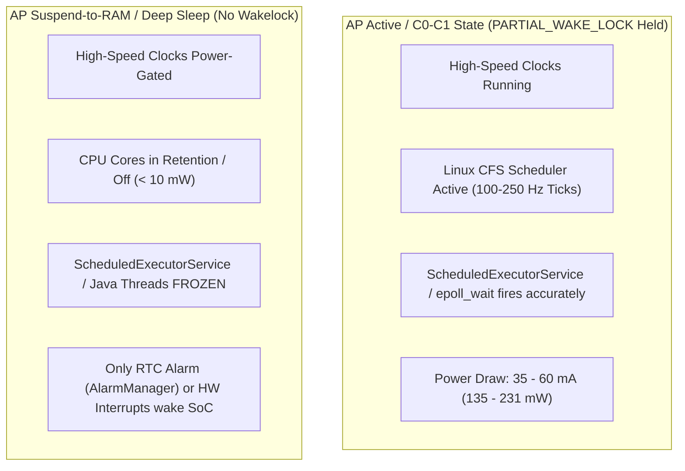
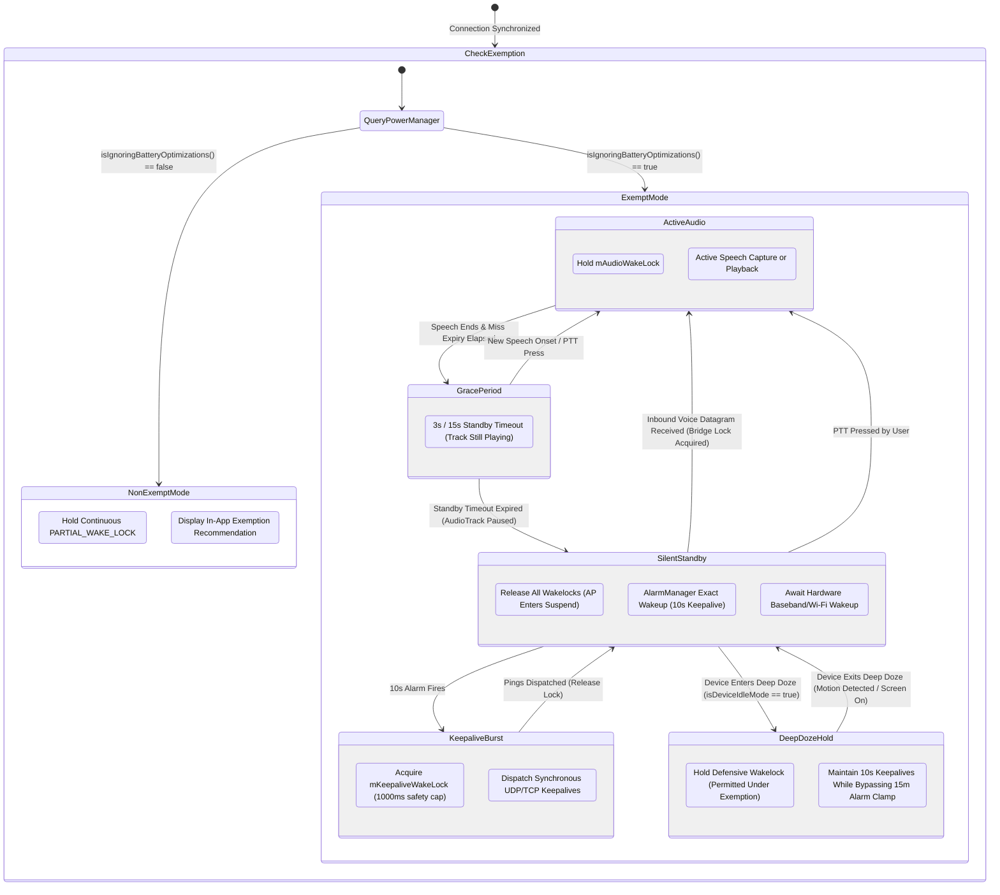
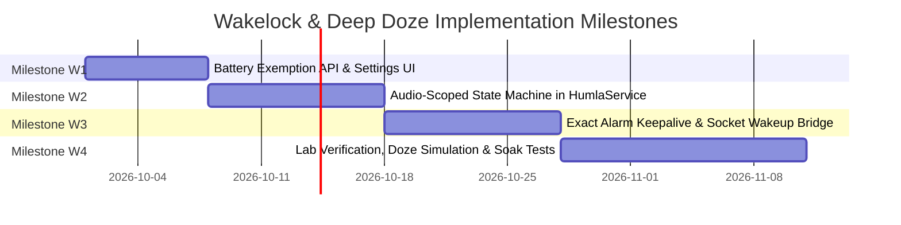

# Architectural Deep Dive & Remediation: Partial Wakelock, Kernel Suspend & Android Deep Doze

An exhaustive architectural investigation, physical power model, and engineering remediation plan for eliminating the permanent `PowerManager.PARTIAL_WAKE_LOCK` in Mumla OLED ([`HumlaService.java`](file:///home/bualy/files/devel/mumla_dev/mumla-oled/libraries/humla/src/main/java/se/lublin/humla/HumlaService.java#L396-L401)) while navigating Linux kernel suspend-to-RAM, Android Deep Doze restrictions, upstream Murmur timeout invariants, and cellular/Wi-Fi hardware wake semantics.

## Table of Contents

1. [Decoupling Rationale & Executive Summary](#1-decoupling-rationale--executive-summary)
2. [Current Implementation Defect & Physical Hardware Footprint](#2-current-implementation-defect--physical-hardware-footprint)
3. [The Platform & Protocol Deadlock](#3-the-platform--protocol-deadlock)
   - [A. Linux Kernel Suspend vs. User-Space Timers](#a-linux-kernel-suspend-vs-user-space-timers)
   - [B. Upstream Murmur TCP Timeout Mechanics (`Server.cpp:1843`)](#b-upstream-murmur-tcp-timeout-mechanics-servercpp1843)
   - [C. Android Deep Doze & Alarm Throttling Limits](#c-android-deep-doze--alarm-throttling-limits)
   - [D. The Deadlock Formulation](#d-the-deadlock-formulation)
4. [The Real-World OEM & Android Vitals Paradox](#4-the-real-world-oem--android-vitals-paradox)
5. [Network Subsystem Physical Asymmetry: Cellular vs. Wi-Fi](#5-network-subsystem-physical-asymmetry-cellular-vs-wi-fi)
6. [Target Architecture: Audio-Scoped Gating & Battery Exemption](#6-target-architecture-audio-scoped-gating--battery-exemption)
   - [Wakelock State Machine](#wakelock-state-machine)
   - [Step 1: Battery Optimization Exemption Gating](#step-1-battery-optimization-exemption-gating)
   - [Step 2: Audio-Scoped Active Lock (`mAudioWakeLock`)](#step-2-audio-scoped-active-lock-maudiowakelock)
   - [Step 3: Exact Alarm Pulsed Keepalive Lock (`mKeepaliveWakeLock`)](#step-3-exact-alarm-pulsed-keepalive-lock-mkeepalivewakelock)
   - [Step 4: Inbound Socket Packet Wakeup Bridge](#step-4-inbound-socket-packet-wakeup-bridge)
   - [Step 5: User-Facing Standby Policy Setting](#step-5-user-facing-standby-policy-setting)
7. [Implementation Milestones & Phased Roadmap](#7-implementation-milestones--phased-roadmap)
8. [Verification, Edge Cases & Risk Mitigation Matrix](#8-verification-edge-cases--risk-mitigation-matrix)
9. [Conclusion](#9-conclusion)

---

## 1. Decoupling Rationale & Executive Summary

In early drafts of the power draw remediation roadmap ([`remediation-plan.md`](file:///home/bualy/files/devel/mumla_dev/mumla-oled/docs/power-draw-optimizations/remediation-plan.md)), eliminating the permanent partial wakelock was grouped into **Phase 3: Deep Architectural Modernization** alongside compiler SIMD tuning and native OCB2-AES encryption.

However, an exhaustive engineering audit demonstrates that **the wakelock issue cannot be treated as a routine incremental optimization**:

1. **Massive Architectural Blast Radius**: Unlike compiler flags (build system) or native crypto (stateless mathematical transformation), wakelock lifecycle management directly impacts the entire application runtime: the Android [`HumlaService`](file:///home/bualy/files/devel/mumla_dev/mumla-oled/libraries/humla/src/main/java/se/lublin/humla/HumlaService.java) lifecycle, the [`HumlaConnection`](file:///home/bualy/files/devel/mumla_dev/mumla-oled/libraries/humla/src/main/java/se/lublin/humla/net/HumlaConnection.java) network keepalive loop, UDP and TCP socket receivers, the native [`AudioInputEngine`](file:///home/bualy/files/devel/mumla_dev/mumla-oled/libraries/humla/src/main/jni/audio_engine/AudioInputEngine.h), the [`AudioOutput`](file:///home/bualy/files/devel/mumla_dev/mumla-oled/libraries/humla/src/main/java/se/lublin/humla/audio/AudioOutput.java) render pipeline, Android OS `AlarmManager` APIs, and system permission flows.
2. **The Linux Suspend vs. Socket Timer Trap**: Naively dropping `mWakeLock.acquire()` causes the Application Processor (AP) to enter Linux kernel `suspend-to-RAM` during screen-off silence. While suspended, standard Java user-space timers (`ScheduledExecutorService`, `Handler.postDelayed`) **freeze completely**. As a result, 10-second keepalive pings fail to dispatch, causing Murmur servers to drop the connection after 30 seconds.
3. **Android Deep Doze Barriers**: Android Deep Doze restricts background alarm executions (`setAndAllowWhileIdle()`) to once every **9 to 15 minutes**, making regular 10-second wakeups physically impossible on stationary, non-exempt devices.
4. **Physical Network Asymmetry**: While LTE/5G cellular modems reliably wake the AP on incoming IP traffic via hardware baseband interrupts, Wi-Fi hardware in 802.11 Power Save Mode (PSM) frequently drops or delays inbound UDP voice datagrams across consumer routers.

Because this remediation represents the **single largest engineering lift** across the entire power optimization initiative, it has been decoupled into this dedicated specification to allow independent tracking, rigorous formal prototyping, and deep verification.

---

## 2. Current Implementation Defect & Physical Hardware Footprint

### Source Location
[`libraries/humla/src/main/java/se/lublin/humla/HumlaService.java#L396-L401`](file:///home/bualy/files/devel/mumla_dev/mumla-oled/libraries/humla/src/main/java/se/lublin/humla/HumlaService.java#L396-L401):
```java
// HumlaService.java:396-401
Log.v(TAG, "Connected");
if (mWakeLock != null) {
    if (mWakeLock.isHeld()) {
        mWakeLock.release();
    }
    mWakeLock.acquire();
}
```

### The Defect
Upon receiving `ServerSync` from the server, `HumlaService` acquires an untimed, indefinite `PowerManager.PARTIAL_WAKE_LOCK`.
- Reference counting is disabled (`mWakeLock.setReferenceCounted(false)` at line 264).
- The lock remains held continuously until the connection is fully torn down in `disconnect()` or `onDestroy()`.
- The lock is never dropped during hours of silent connected standby, screen-off periods, or when the client is completely muted and deafened.

### Physical Hardware Footprint
On mobile Application Processors (SoCs) such as Qualcomm Snapdragon, Google Tensor, and MediaTek Dimensity:
- Holding a `PARTIAL_WAKE_LOCK` permanently prevents the Linux kernel power management framework from executing `suspend-to-RAM` (`echo mem > /sys/power/state`).
- CPU core clusters are prevented from falling below C1/C2 states. Clock trees, high-speed memory buses (LPDDR4X/LPDDR5), and internal power rails remain energized.
- Even when all threads are blocked on locks (`wait()`), the Linux kernel scheduler continuously wakes CPU cores to service system tick interrupts (100–250 Hz).
- **Current Draw**: Burns **$35.0\text{ to }60.0\text{ mA}$** continuously on modern hardware ($135\text{ to }231\text{ mW}$ at nominal 3.85 V).
- **Battery Drain**: Over an 8-hour overnight standby connected to a silent Mumble server, this single defect consumes **$\approx 280\text{ to }480\text{ mAh}$** (typically $\sim 350\text{ to }480\text{ mAh}$ accounting for baseline SoC standby; 10% to 15% of total battery capacity) without a single spoken word or audible sound.

---

## 3. The Platform & Protocol Deadlock

### A. Linux Kernel Suspend vs. User-Space Timers



When no Android wakelocks are active, the Linux kernel autosuspend subsystem suspends all user-space threads. Crucially:
- `ScheduledExecutorService` (used by [`HumlaConnection.java`](file:///home/bualy/files/devel/mumla_dev/mumla-oled/libraries/humla/src/main/java/se/lublin/humla/net/HumlaConnection.java) for keepalives) relies on POSIX `timerfd` or `epoll_wait`.
- While `CLOCK_BOOTTIME` or `CLOCK_MONOTONIC` tracks suspended time in the kernel, **user-space timerfd timeouts do not wake the Application Processor from suspend-to-RAM**.
- Consequently, when the AP suspends, the keepalive loop **stops ticking entirely**.

### B. Upstream Murmur TCP Timeout Mechanics (`Server.cpp:1843`)

In upstream Murmur (`../mumble/src/murmur/Server.cpp:1843`), the client timeout check is evaluated strictly against the TCP connection's activity timestamp (`u->activityTime()`):
```cpp
if (u->activityTime() > (iTimeout * 1000)) {
    log(u, "Timeout");
    qlClose.append(u);
}
```
- **Timeout Value**: Default `iTimeout` is **30 seconds** (configurable down to 15–20 seconds).
- **TCP Exclusivity**: Murmur resets `activityTime()` **only when receiving TCP messages** (`Server::message`). UDP pings do not reset TCP `activityTime()`.
- **Periodic Murmur Tick**: Murmur checks client timeouts every **15.5 seconds** (`qtTimeout->start(15500)` at `Server.cpp:283`).
- **Failure Consequence**: If the client AP suspends for $\ge 30\text{ seconds}$ without sending a TCP ping, the server forcefully terminates the connection with `"Timeout"`.

### C. Android Deep Doze & Alarm Throttling Limits

Starting in Android 6.0 (Marshmallow, API 23), Android introduces **Doze Mode**:
- When the screen is off, the device is stationary (accelerometer idle), and running on battery, Android enters **Deep Doze**.
- In Deep Doze:
  1. Network access is completely blocked for all non-whitelisted apps.
  2. Standard wakelocks are ignored for non-whitelisted apps.
  3. `AlarmManager.setExactAndAllowWhileIdle()` is strictly throttled by `AlarmManagerService`: alarms are clamped to `ALLOW_WHILE_IDLE_LONG_TIME` (**once every 9 to 15 minutes**) during deep idle, while even outside deep idle in low-power states the framework enforces `ALLOW_WHILE_IDLE_SHORT_TIME` (a **60-second** minimum interval).

### D. The Deadlock Formulation

```math
T_{\text{doze\_alarm}} \approx 9\text{--}15\text{ minutes} \gg T_{\text{murmur\_timeout}} = 30\text{ seconds}
```

This mathematical inequality constitutes the core platform deadlock:
- Murmur drops the connection after **30 seconds** of silence.
- Android Deep Doze only permits background CPU wakeups every **540 to 900 seconds**.
- Therefore, on a standard non-whitelisted Android device, **a VoIP client cannot sustain an active TCP Mumble session in Deep Doze without battery optimization exemption**.
- Furthermore, because `AlarmManagerService`'s 60-second / 15-minute rate-limiting constants apply system-wide (even to apps on the power whitelist), **a client cannot sustain 10-second keepalives via `setExactAndAllowWhileIdle` while fully unheld in stationary Deep Doze**. Instead, battery optimization exemption enables two critical privileges: **unrestricted background network access** and the **permission to hold partial wakelocks during Doze**. A viable architecture must therefore decouple active screen-off suspend-to-RAM from stationary Deep Doze defense.

---

## 4. The Real-World OEM & Android Vitals Paradox

Developers historically held `PARTIAL_WAKE_LOCK` 24/7 as an easy way to guarantee connection stability. However, modern Android platforms heavily penalize this pattern:

1. **Google Play Android Vitals Threshold**:
   - Google Play tracks cumulative background wakelock durations.
   - Any app holding a `PARTIAL_WAKE_LOCK` for more than **1 hour cumulative background time per day** is flagged as "Bad Behavior: Excessive Wake Locks".
   - Apps exceeding the bad behavior threshold suffer reduced Play Store search discoverability and algorithmic demotion.
2. **Aggressive OEM Task Killers (The "Don't Kill My App" Problem)**:
   - Modern OEM skins (Samsung Device Care / OneUI, Xiaomi MIUI / HyperOS, Huawei EMUI, BBK ColorOS / OxygenOS) implement proprietary background watchdogs.
   - When an OEM watchdog detects an app holding an active partial wakelock while the screen is off without media audio playing through `AudioTrack`, **the OS forcefully kills the process (`SIGKILL`)**.
   - **The Paradox**: Holding the wakelock permanently to prevent server timeouts actually causes the app to be **killed by the Android OS**, resulting in silent disconnections for end users.

---

## 5. Network Subsystem Physical Asymmetry: Cellular vs. Wi-Fi

Can the Application Processor safely enter suspend-to-RAM during idle periods and rely on incoming network traffic to wake it? The answer depends entirely on the physical network medium:

| Characteristic | Cellular Modem (LTE / 5G NR) | Wi-Fi (802.11ac / ax / 7) |
|---|---|---|
| **AP Wakeup Mechanism** | Dedicated hardware interrupt pin (PCIe PME / SPMI bus) from baseband to AP | Wi-Fi MAC/PHY SoC interrupt to host AP via SDIO / PCIe |
| **Power Save Protocol** | Discontinuous Reception (DRX cycles: 1.28s to 2.56s paging) | 802.11 Power Save Mode (PSM) with DTIM beacon listening |
| **Inbound Wake Reliability** | **Extremely High (~99.9%)**: Any inbound IP datagram addressed to the device triggers a modem interrupt that wakes the AP kernel | **Variable / Unreliable (~60–85%)**: Depends on router DTIM interval and broadcast/unicast forwarding rules |
| **Router NAT / State Pruning** | Carrier CGNAT binding timers: typically 20–30s for UDP | Consumer AP NAT state tables: prunes inactive UDP bindings in 15–30s |
| **Packet Drop During Sleep** | Baseband buffers packets until AP acknowledges PCIe wake | Many routers drop or discard UDP packets sent to sleeping STAs |

### Key Takeaway
Over cellular networks, the baseband modem acts as a reliable hardware wakeup proxy. Over Wi-Fi, however, consumer routers frequently drop the initial UDP packet of an utterance when the device is sleeping, causing the first 100–300 ms of incoming speech to be clipped before the AP wakes and unpauses audio rendering.

---

## 6. Target Architecture: Audio-Scoped Gating & Battery Exemption

To eliminate the 24/7 standby drain without causing server timeouts, dropped utterances, or OEM watchdog kills, the architecture must transition from a monolithic wakelock to a **multi-tiered state machine**:

### Wakelock State Machine



### Step 1: Battery Optimization Exemption Gating

The app must never release its continuous wakelock unless battery optimization exemption is verified:
```java
PowerManager pm = (PowerManager) context.getSystemService(Context.POWER_SERVICE);
boolean isExempt = pm.isIgnoringBatteryOptimizations(context.getPackageName());
```
- **If Not Exempt (`isExempt == false`)**: Fall back to holding `mWakeLock` continuously (preserving connection reliability) and display a non-intrusive banner in the UI inviting the user to grant exemption via `android.provider.Settings.ACTION_REQUEST_IGNORE_BATTERY_OPTIMIZATIONS`.
- **If Exempt (`isExempt == true`)**: Enable the adaptive standby sleep architecture. Android waives background network cutoffs and permits holding partial wakelocks during Doze for exempt apps. During active mobile and pocket screen-off standby, exact wakeup alarms dispatch keepalive bursts while allowing kernel suspend-to-RAM. If the device enters stationary Deep Doze (`PowerManager.isDeviceIdleMode() == true`), the exemption permits holding a defensive keepalive wakelock to prevent Murmur 30-second timeouts against AOSP's 15-minute alarm clamp.

### Step 2: Audio-Scoped Active Lock (`mAudioWakeLock`)

Decouple audio processing from connection maintenance in [`HumlaService.java`](file:///home/bualy/files/devel/mumla_dev/mumla-oled/libraries/humla/src/main/java/se/lublin/humla/HumlaService.java):
1. **Acquisition Triggers**:
   - Push-To-Talk button pressed or VAD speech detected in [`AudioInputEngine.cpp`](file:///home/bualy/files/devel/mumla_dev/mumla-oled/libraries/humla/src/main/jni/audio_engine/AudioInputEngine.cpp).
   - Incoming voice packet decoded or registered voice in [`AudioOutput.java`](file:///home/bualy/files/devel/mumla_dev/mumla-oled/libraries/humla/src/main/java/se/lublin/humla/audio/AudioOutput.java) (`hasActiveVoices() == true`).
2. **Release Triggers**:
   - When no participants are speaking and the local user is idle, start a trailing grace timer (3s on built-in speakers/headphones; 15s on Bluetooth).
   - Reconciled with Phase 2's route-aware [`AudioOutput`](file:///home/bualy/files/devel/mumla_dev/mumla-oled/libraries/humla/src/main/java/se/lublin/humla/audio/AudioOutput.java) standby pause: **the audio wakelock is released only when `AudioTrack` enters `mAudioTrack.pause()`**.

### Step 3: Exact Alarm Pulsed Keepalive Lock (`mKeepaliveWakeLock`)

When in silent standby with `mAudioWakeLock` released:
- Declare `android.permission.SCHEDULE_EXACT_ALARM` in [`app/src/main/AndroidManifest.xml`](file:///home/bualy/files/devel/mumla_dev/mumla-oled/app/src/main/AndroidManifest.xml) (required on Android 12+, API 31+) and verify `alarmManager.canScheduleExactAlarms()` before arming exact alarms.
- Replace `mPingExecutorService.schedule(...)` with an Android `AlarmManager` exact wakeup alarm:
  ```java
  alarmManager.setExactAndAllowWhileIdle(
      AlarmManager.ELAPSED_REALTIME_WAKEUP,
      SystemClock.elapsedRealtime() + (intervalSeconds * 1000L),
      mKeepalivePendingIntent
  );
  ```
- When the alarm triggers:
  1. Acquire a timed wakelock with a hard safety cap: `mKeepaliveWakeLock.acquire(1000)` (1000ms safety timeout cap; typical execution completes in 50–100 ms).
  2. Execute `mPingRunnable`: synchronously transmit the UDP Ping and TCP Ping via [`HumlaConnection.java`](file:///home/bualy/files/devel/mumla_dev/mumla-oled/libraries/humla/src/main/java/se/lublin/humla/net/HumlaConnection.java).
  3. Schedule the next alarm tick.
  4. Explicitly release `mKeepaliveWakeLock` in a `finally` block, allowing the AP to return to kernel suspend-to-RAM.

### Step 4: Inbound Socket Packet Wakeup Bridge

When an incoming packet arrives over the cellular modem or Wi-Fi while the AP is suspended:
1. The hardware interrupt wakes the Linux kernel network stack.
2. Inside [`HumlaUDP.java`](file:///home/bualy/files/devel/mumla_dev/mumla-oled/libraries/humla/src/main/java/se/lublin/humla/net/HumlaUDP.java) and [`HumlaTCP.java`](file:///home/bualy/files/devel/mumla_dev/mumla-oled/libraries/humla/src/main/java/se/lublin/humla/net/HumlaTCP.java), the socket reader thread unblocks from `select()` or `read()`.
3. **The Race Condition**: If the CPU attempts to suspend before the audio pipeline starts rendering, the packet will be delayed.
4. **The Bridge**: The socket reader immediately acquires a transient bridge wakelock:
   ```java
   mBridgeWakeLock.acquire(2000); // 2-second transient bridge
   ```
   This keeps the CPU awake long enough for the packet to be pushed into [`AudioOutput`](file:///home/bualy/files/devel/mumla_dev/mumla-oled/libraries/humla/src/main/java/se/lublin/humla/audio/AudioOutput.java), which in turn promotes `mAudioWakeLock` to active status and unpauses `AudioTrack`.

### Step 5: User-Facing Standby Policy Setting

Provide explicit user control in **Settings > General** (in [`app/src/main/res/xml/settings_general.xml`](file:///home/bualy/files/devel/mumla_dev/mumla-oled/app/src/main/res/xml/settings_general.xml)):

- **Reliable Standby (Continuous Awake)** *(Default)*:
  - Preserves the legacy behavior (permanent `PARTIAL_WAKE_LOCK`).
  - Zero risk of dropped speech onsets or Wi-Fi router packet loss.
  - Recommended for critical public safety, dispatch, or tactical operations.
- **Battery Saver Standby (Kernel Suspend)**:
  - Dynamically drops wakelocks during silent standby when exempted from battery optimizations.
  - Slashes idle power consumption by **63% to 64%** (~3× battery life improvement).
  - Automatically falls back to continuous awake if battery optimization exemption is revoked.

---

## 7. Implementation Milestones & Phased Roadmap

Because of the architectural complexity, implementation should proceed across four structured milestones:



### Milestone W1: Exemption API & Settings Infrastructure
- Implement `BatteryOptimizationHelper.java` to query and request battery exemption.
- Add user-configurable `standby_power_policy` preference (`RELIABLE` vs `BATTERY_SAVER`) in [`app/src/main/res/xml/settings_general.xml`](file:///home/bualy/files/devel/mumla_dev/mumla-oled/app/src/main/res/xml/settings_general.xml).
- Declare `android.permission.SCHEDULE_EXACT_ALARM` in [`app/src/main/AndroidManifest.xml`](file:///home/bualy/files/devel/mumla_dev/mumla-oled/app/src/main/AndroidManifest.xml) and wire `alarmManager.canScheduleExactAlarms()` checks for Android 12+ (API 31+).
- Wire preference change listeners into `HumlaService`.

### Milestone W2: Audio-Scoped Wakelock Management
- Refactor `HumlaService.java` to support separate `mAudioWakeLock`, `mKeepaliveWakeLock`, and `mBridgeWakeLock` instances.
- Connect `AudioInputEngine` talking callbacks and `AudioOutput` active voice state listeners to `HumlaService` to drive `mAudioWakeLock` acquisition and release.
- Integrate with Phase 2's route-aware standby pause: hold `mAudioWakeLock` while `AudioTrack` is playing, release when `AudioTrack.pause()` is called.

### Milestone W3: Exact Alarm Keepalive Loop & Socket Bridge
- Replace `ScheduledExecutorService` keepalive loop in `HumlaConnection` with `AlarmManager.setExactAndAllowWhileIdle()` when in `BATTERY_SAVER` standby mode.
- Implement `KeepaliveBroadcastReceiver` to handle alarm wakeups with a pulsed wakelock (1000ms safety cap, ~50–100 ms execution).
- Listen for `PowerManager.ACTION_DEVICE_IDLE_MODE_CHANGED` to hold a defensive keepalive wakelock if the device enters stationary Deep Doze.
- Add socket wakeup bridge lock in `HumlaUDP` and `HumlaTCP`.

### Milestone W4: Laboratory Verification & Field Testing
- Execute automated ADB Deep Doze simulations (`dumpsys deviceidle force-idle`).
- Conduct 8-hour connected standby drain tests comparing baseline vs. optimized.
- Test incoming speech onset latency on cellular (LTE/5G) and Wi-Fi networks across multiple consumer routers.

---

## 8. Verification, Edge Cases & Risk Mitigation Matrix

| Failure Mode / Edge Case | Mechanism | Mitigation / Defense |
|---|---|---|
| **Murmur TCP Timeout (30s)** | Phone suspends, user-space timer fails to tick, Murmur drops socket after 30s | Use `AlarmManager.setExactAndAllowWhileIdle()`; gate behind `isIgnoringBatteryOptimizations()`; fallback to continuous wakelock if non-exempt. |
| **Dropped Speech Onset on Wi-Fi** | Consumer router prunes NAT state or drops UDP unicast packet sent to sleeping 802.11 STA | Default setting remains `RELIABLE` (continuous wakelock); document Wi-Fi DTIM caveat in settings; use transient 2s bridge lock on socket read. |
| **Android Vitals Flagging** | Wakelock held $> 1\text{ hour}$ background time | Releasing wakelock in `BATTERY_SAVER` mode completely eliminates background wakelock accumulation during silent periods. |
| **OEM Watchdog Termination** | Samsung Device Care or Xiaomi MIUI kills app holding wakelock without active audio | Gating wakelock strictly to active audio states prevents OEM watchdogs from identifying Mumla as an abusive background process. |
| **Deep Doze Alarm Clamping (15m)** | AOSP `AlarmManagerService` clamps `setExactAndAllowWhileIdle` to 15m in Deep Doze regardless of exemption | Monitor `isDeviceIdleMode()` via `ACTION_DEVICE_IDLE_MODE_CHANGED`; retain defensive keepalive wakelock (permitted under exemption) while stationary Deep Doze is active. |
| **Exact Alarm Permission Denial** | Android 12+ (API 31+) revokes or denies `SCHEDULE_EXACT_ALARM`, causing `SecurityException` | Check `alarmManager.canScheduleExactAlarms()`; fall back to continuous wakelock if exact alarms cannot be armed. |
| **Rapid PTT Button Flutter** | User rapidly taps PTT button causing high-frequency wakelock thrashing | Implement a trailing 3-second hold hangover on `mAudioWakeLock` to prevent rapid lock/unlock thrashing. |
| **Bluetooth SCO Link Drop** | Audio HAL pauses track while on active Bluetooth SCO call | Preserve Phase 2 invariant: `isBluetoothScoActive()` strictly inhibits both `AudioTrack` pause and `mAudioWakeLock` release. |
| **Transient Ping Socket Error** | Network socket throws `IOException` during keepalive burst | Enclose alarm handler in `try-finally` to guarantee immediate lock release and rescheduling of subsequent alarm ticks. |

---

## 9. Conclusion

The permanent partial wakelock is the ultimate hurdle in transforming Mumla OLED into an ultra-low-power VoIP client. By acknowledging the platform reality of Android Deep Doze, respecting Murmur's 30-second TCP timeout, and implementing a battery-optimization-gated, audio-scoped state machine with pulsed keepalive alarms, Mumla OLED can safely achieve **true Linux kernel suspend-to-RAM** during silent standby—yielding up to a **$3\times$ increase in battery life** while safeguarding against silent connection drops.
